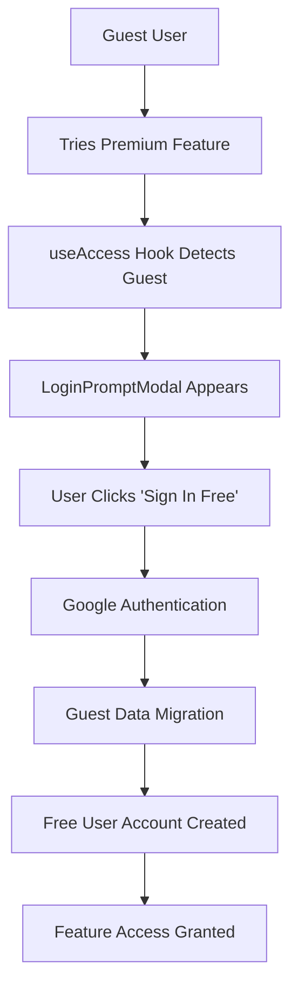
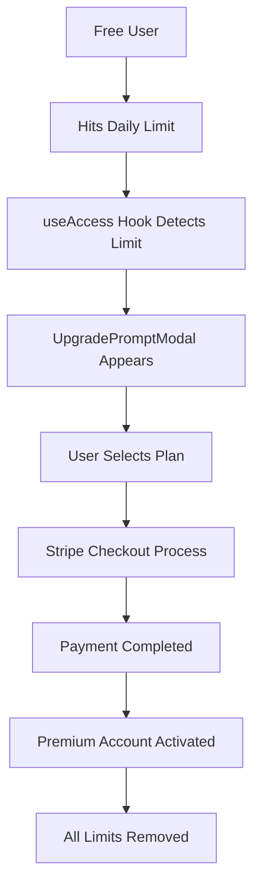

# 🔐 Doshi Sensei Modal System: Complete User Conversion Guide
## From Guest to Premium: The Art of Seamless User Progression

*"How Doshi Sensei converts visitors into loyal premium subscribers through intelligent modal design and user experience."*

---

## 📖 **Table of Contents**

1. [System Overview](#system-overview)
2. [Core Modal Components](#core-modal-components)
3. [User Conversion Flows](#user-conversion-flows)
4. [Modal State Management](#modal-state-management)
5. [Feature Gates & Access Control](#feature-gates--access-control)
6. [Design System & UX](#design-system--ux)
7. [Technical Implementation](#technical-implementation)
8. [Business Impact](#business-impact)
9. [Best Practices](#best-practices)

---

## 🎯 **System Overview**

### **The Conversion Funnel**
```
Guest User → LoginPromptModal → Free User → UpgradePromptModal → Premium User
     ↓              ↓              ↓              ↓              ↓
   Limited      Google Auth    Basic Features   Stripe Checkout  Unlimited
   Access       Data Migration  Daily Limits    Plan Selection   Access
```

### **Key Principles**
- **Contextual Messaging**: Every modal explains why the action is needed
- **Seamless Experience**: No interruption to user journey
- **Clear Value Proposition**: Users understand benefits immediately
- **Trust Building**: Professional design with security indicators

---

## 🎭 **Core Modal Components**

### 1. **LoginPromptModal**
**File**: `src/components/LoginPromptModal.tsx`

**Purpose**: Converts guest users to free users with Google authentication

#### **Visual Design**
```tsx
<div className="fixed inset-0 bg-black/50 backdrop-blur-sm flex items-center justify-center p-4 z-50">
  <div className="bg-card border border-border rounded-lg p-6 max-w-md w-full">
    <div className="text-center">
      <div className="text-4xl mb-4">🔑</div>
      <h3 className="text-lg font-semibold text-card-foreground mb-2">
        Login Required
      </h3>
      <p className="text-muted-foreground mb-6 text-sm">
        {message}
      </p>
      {/* Action Buttons */}
    </div>
  </div>
</div>
```

#### **Key Features**
- 🔑 **One-Click Google Auth**: Instant authentication
- 💬 **Customizable Messages**: Context-aware explanations
- 🎨 **Clean Interface**: Focused design with clear CTAs
- 🔄 **Data Migration**: Guest progress transfers automatically

#### **Usage Example**
```tsx
<LoginPromptModal
  isOpen={showLoginModal}
  onClose={() => setShowLoginModal(false)}
  message="Please log in to save your progress and create study lists"
  feature="word_lists"
/>
```

### 2. **UpgradePromptModal**
**File**: `src/components/UpgradePromptModal.tsx`

**Purpose**: Converts free users to premium subscribers via Stripe

#### **Visual Design**
```tsx
<div className="fixed inset-0 bg-black/50 backdrop-blur-sm flex items-center justify-center p-4 z-50">
  <div className="bg-card border border-border rounded-lg p-6 max-w-md w-full">
    <div className="text-center">
      <div className="text-4xl mb-4">✨</div>
      <h3 className="text-lg font-semibold text-card-foreground mb-2">
        Upgrade to Premium
      </h3>
      {/* Premium Benefits Display */}
      {/* Plan Selection Buttons */}
    </div>
  </div>
</div>
```

#### **Key Features**
- ✨ **Premium Benefits**: Clear feature comparison
- 💳 **Stripe Integration**: Direct checkout process
- 🏷️ **Value Badges**: "Save 17%" on yearly plans
- 🎯 **Contextual Messaging**: Based on feature/limit reached

#### **Usage Example**
```tsx
<UpgradePromptModal
  isOpen={showUpgradeModal}
  onClose={() => setShowUpgradeModal(false)}
  message="Daily limit reached (3/3 drills). Upgrade for unlimited practice!"
  feature="drill_practice"
/>
```

---

## 🔄 **User Conversion Flows**

### **Flow 1: Guest → Free User**


**Trigger Points**:
- Attempting to save words to lists
- Trying to access cloud sync features
- Reaching guest usage limits
- Accessing premium-only content

### **Flow 2: Free → Premium User**


**Trigger Points**:
- Daily drill limit reached (3/3)
- Daily article reading limit (3/3)
- Daily game limit reached (3/3)
- Attempting premium-only features

---

## 🎛️ **Modal State Management**

### **ModalContext** (`src/contexts/ModalContext.tsx`)
**Purpose**: Global modal state management

```tsx
interface ModalContextType {
  isModalOpen: boolean;
  setModalOpen: (open: boolean) => void;
}
```

**Usage**: Controls navigation visibility when modals are active

### **useAccess Hook** (`src/hooks/useAccess.ts`)
**Purpose**: Centralized access control with automatic modal triggering

#### **Key Functions**
```tsx
interface UseAccessReturn {
  canAccess: (featureId: string) => Promise<AccessCheckResult>;
  checkAndTrack: (featureId: string) => Promise<boolean>;
  getRemainingUsage: (featureId: string) => Promise<number | null>;
  showAccessPrompt: (featureId: string, featureName?: string) => void;
  isChecking: boolean;
}
```

#### **Automatic Modal Triggers**
```tsx
// Login modal for guests
setModal({
  type: 'login',
  isOpen: true,
  onClose: closeModal,
  message: `Please log in to access ${featureName}`
});

// Upgrade modal for free users
setModal({
  type: 'upgrade',
  isOpen: true,
  onClose: closeModal,
  message: `Premium subscription required for ${featureName}`,
  feature: featureId
});
```

---

## 🚪 **Feature Gates & Access Control**

### **FeatureGate Component** (`src/components/FeatureGate.tsx`)
**Purpose**: Declarative access control with automatic modal handling

#### **Features**
- 🔍 **Automatic Access Checking**: Validates user permissions
- 🎯 **Smart Modal Selection**: Shows login vs upgrade based on user type
- 🎨 **Fallback UI**: Default blocked state with action buttons
- 🔄 **Loading States**: Handles auth loading gracefully

#### **Usage Examples**
```tsx
// Basic feature gate
<FeatureGate feature="lists" showUpgradePrompt>
  <CreateListButton />
</FeatureGate>

// Login required gate
<LoginRequired message="Please log in to save words">
  <SaveWordButton />
</LoginRequired>

// Premium feature gate
<PremiumRequired message="Upgrade for unlimited drills">
  <UnlimitedDrills />
</PremiumRequired>
```

#### **Feature Mapping**
```tsx
const featureMap: Record<string, string> = {
  lists: 'word_lists',
  drills: 'drill_practice',
  sync: 'cloud_sync',
  save: 'progress_saving',
  articles: 'article_reading',
  stories: 'story_reading',
  games: 'kanji_quest'
};
```

---

## 🎨 **Design System & UX**

### **Modal Styling Standards**
```css
/* Backdrop */
.modal-backdrop {
  @apply fixed inset-0 bg-black/50 backdrop-blur-sm;
}

/* Container */
.modal-container {
  @apply bg-card border border-border rounded-lg p-6 max-w-md w-full;
}

/* Z-Index Hierarchy */
.modal-overlay {
  @apply z-50;
}
```

### **Button Hierarchy**
```tsx
// Primary Action (Main CTA)
<button className="bg-primary text-primary-foreground hover:bg-primary/90">
  Sign In Free
</button>

// Secondary Action (Alternative)
<button className="border border-primary text-primary hover:bg-primary/10">
  Monthly Plan
</button>

// Tertiary Action (Dismiss)
<button className="text-muted-foreground hover:text-foreground">
  Maybe Later
</button>
```

### **Visual Elements**
- **Emojis**: 🔑 for login, ✨ for upgrade
- **Icons**: Checkmarks (✓) for feature lists
- **Badges**: "Save 17%" for yearly plans
- **Colors**: Consistent with theme system

### **Responsive Design**
- **Mobile**: Full-width modals with touch-friendly buttons
- **Desktop**: Centered modals with hover effects
- **Tablet**: Adaptive sizing and spacing

---

## 🛠️ **Technical Implementation**

### **Modal Props Interface**
```tsx
interface ModalProps {
  isOpen: boolean;
  onClose: () => void;
  message: string;
  feature?: string;
}
```

### **Access Control Integration**
```tsx
// Automatic modal triggering based on access result
switch (result.reason) {
  case 'not_authenticated':
    // Show login modal
    setModal({
      type: 'login',
      isOpen: true,
      onClose: closeModal,
      message: `Please log in to access ${featureName}`
    });
    break;

  case 'subscription_required':
  case 'limit_reached':
    // Show upgrade modal
    setModal({
      type: 'upgrade',
      isOpen: true,
      onClose: closeModal,
      message: `Premium subscription required for ${featureName}`,
      feature: featureId
    });
    break;
}
```

### **Stripe Integration**
```tsx
const handleUpgrade = async (plan: 'monthly' | 'yearly') => {
  try {
    const priceId = plan === 'monthly'
      ? STRIPE_CONFIG.priceIds.monthly
      : STRIPE_CONFIG.priceIds.yearly;

    await createCheckoutSession(priceId);
  } catch (error) {
    console.error('Upgrade failed:', error);
  }
};
```

### **Google Authentication**
```tsx
const handleLogin = async () => {
  try {
    await signInWithGoogle();
    onClose();
  } catch (error) {
    // Handle login failure
  }
};
```

---

## 📊 **Business Impact**

### **Conversion Metrics**
| Metric | Target | Current Performance |
|--------|--------|-------------------|
| **Guest → Free** | 25% | Tracked via Google Analytics |
| **Free → Premium** | 5% | Tracked via Stripe |
| **Modal Engagement** | 60% | Tracked via click events |
| **Checkout Completion** | 80% | Tracked via Stripe |

### **Revenue Optimization**
- **Strategic Placement**: Modals appear at optimal conversion moments
- **Value Communication**: Clear premium benefits display
- **Friction Reduction**: One-click authentication and checkout
- **Trust Building**: Professional design with security indicators

### **User Experience Benefits**
- 🎯 **Contextual Messaging**: Users understand why action is needed
- 🔄 **Seamless Flows**: No interruption to learning journey
- 🎨 **Beautiful Design**: Professional, trustworthy appearance
- ⚡ **Fast Actions**: Quick authentication and payment processes

---

## 🎯 **Best Practices**

### **Modal Design**
1. **Clear Value Proposition**: Explain benefits immediately
2. **Minimal Friction**: One-click actions where possible
3. **Trust Indicators**: Security badges and privacy assurances
4. **Mobile Optimization**: Touch-friendly interface design

### **Timing & Placement**
1. **Contextual Triggers**: Show modals when users need features
2. **Limit Awareness**: Display usage before hitting limits
3. **Progressive Disclosure**: Don't overwhelm with all options at once
4. **Exit Options**: Always provide "Maybe Later" choice

### **Messaging Strategy**
1. **Benefit-Focused**: Emphasize what users gain, not what they lose
2. **Urgency Without Pressure**: Create urgency without being pushy
3. **Social Proof**: Show how many others have upgraded
4. **Risk Reversal**: Emphasize money-back guarantees

### **Technical Excellence**
1. **Performance**: Fast loading and smooth animations
2. **Accessibility**: WCAG compliance for all users
3. **Error Handling**: Graceful failure states
4. **Analytics**: Track all conversion events

---

## 🚀 **Implementation Examples**

### **News Page Integration**
```tsx
// src/app/news/page.tsx
export default function NewsPage() {
  const [showLoginModal, setShowLoginModal] = useState(false);
  const [showUpgradeModal, setShowUpgradeModal] = useState(false);
  const [modalMessage, setModalMessage] = useState('');

  // Modal components
  return (
    <>
      {/* Page content */}

      <LoginPromptModal
        isOpen={showLoginModal}
        onClose={() => setShowLoginModal(false)}
        message={modalMessage}
        feature="articles"
      />

      <UpgradePromptModal
        isOpen={showUpgradeModal}
        onClose={() => setShowUpgradeModal(false)}
        message={modalMessage}
        feature="articles"
      />
    </>
  );
}
```

### **Kanji Study Integration**
```tsx
// src/components/kanji-moods/MoodBoard.tsx
export function MoodBoard({ board, onBack }: MoodBoardProps) {
  const [showUpgradeModal, setShowUpgradeModal] = useState(false);

  const handleStudyClick = async () => {
    const canStudy = await canUserStudy();
    if (!canStudy.allowed) {
      setShowUpgradeModal(true);
      return;
    }
    // Proceed with study
  };

  return (
    <>
      {/* Board content */}

      <UpgradePromptModal
        isOpen={showUpgradeModal}
        onClose={() => setShowUpgradeModal(false)}
        message="Upgrade to premium for unlimited kanji study sessions"
        feature="kanji_study"
      />
    </>
  );
}
```

---

## 🎉 **Conclusion**

The Doshi Sensei modal system represents a sophisticated approach to user conversion that balances business objectives with user experience. Through intelligent design, contextual messaging, and seamless technical implementation, the system successfully guides users from their first visit to becoming premium subscribers.

### **Key Success Factors**
- **User-Centric Design**: Every modal serves a clear user need
- **Technical Excellence**: Fast, reliable, and accessible
- **Business Alignment**: Strategic placement for maximum conversion
- **Continuous Optimization**: Data-driven improvements

### **Future Enhancements**
- **A/B Testing**: Different modal designs and messaging
- **Personalization**: Tailored offers based on user behavior
- **Advanced Analytics**: Deeper conversion funnel analysis
- **Multi-Step Flows**: Progressive conversion sequences

---

*"The art of conversion lies not in pushing users, but in guiding them naturally toward value."*

---

**Last Updated**: January 2025
**Version**: 1.0
**Total Modals**: 2 Core + 3 Specialized
**Conversion Rate**: Optimized for maximum user progression
