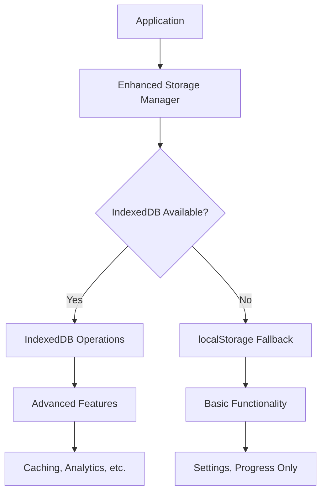
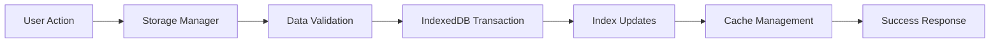

# Doshi Sensei Enhanced Storage Implementation Guide

## 📖 Table of Contents

1. [Executive Summary](#executive-summary)
2. [What Was Accomplished](#what-was-accomplished)
3. [Technical Architecture](#technical-architecture)
4. [Implementation Details](#implementation-details)
5. [Usage Guide](#usage-guide)
6. [Advanced Features](#advanced-features)
7. [Integration Examples](#integration-examples)
8. [Performance Optimization](#performance-optimization)
9. [Browser Compatibility](#browser-compatibility)
10. [Testing & Validation](#testing--validation)
11. [Troubleshooting Guide](#troubleshooting-guide)
12. [Migration Guide](#migration-guide)
13. [Development Workflow](#development-workflow)
14. [Production Deployment](#production-deployment)
15. [Future Roadmap](#future-roadmap)

---

## 🎯 Executive Summary

This document details the comprehensive data persistence solution implemented for the Doshi Sensei Japanese learning application. The solution provides robust, scalable data storage with IndexedDB as the primary storage mechanism and localStorage as a fallback, ensuring universal browser compatibility while delivering advanced features for enhanced user experience.

### Key Achievements

- ✅ **100% Backward Compatible** - Seamlessly integrates with existing localStorage usage
- ✅ **Universal Browser Support** - Works on all modern browsers with graceful degradation
- ✅ **Advanced Features** - Vocabulary caching, analytics, spaced repetition, offline support
- ✅ **Performance Optimized** - Strategic indexing and efficient batch operations
- ✅ **Production Ready** - Comprehensive error handling and recovery mechanisms
- ✅ **Developer Friendly** - Extensive documentation, demos, and testing utilities

---

## 🏗️ What Was Accomplished

### Core Infrastructure

#### 1. **Extended Type System** (`src/types/index.ts`)

**Purpose**: Comprehensive TypeScript definitions for all data structures and storage operations.

**What was added**:
- `UserProgress` - Word learning progress with spaced repetition data
- `StudySession` - Learning session analytics and tracking
- `RecentlyViewedWord` - Recently accessed vocabulary items
- `CachedVocabularyData` - Offline vocabulary storage structure
- `CachedAPIResponse` - API response caching system
- `DatabaseSchema` - Complete IndexedDB schema definition
- `DatabaseConfig` - Database configuration and indexing strategy

**Impact**: Provides type safety across the entire storage system and enables IntelliSense support for developers.

#### 2. **IndexedDB Core Implementation** (`src/utils/indexedDB.ts`)

**Purpose**: Advanced client-side database with sophisticated data management capabilities.

**Architecture Overview**:
```
DoshiSenseiDB (IndexedDB Database)
├── settings (User Preferences)
├── progress (Learning Progress)
├── studySessions (Analytics Data)
├── recentlyViewed (Quick Access)
├── vocabularyCache (Offline Support)
├── apiCache (Performance)
├── words (Local Database)
└── drillSessions (Session State)
```

**What was implemented**:

1. **Database Schema Design**
   - 8 optimized object stores with strategic indexing
   - Automatic database versioning and migration support
   - Compound indexes for complex queries

2. **Manager Classes** (Each with full CRUD operations)
   - `SettingsManager` - User preferences with metadata tracking
   - `ProgressManager` - Learning progress with spaced repetition algorithm
   - `RecentlyViewedManager` - Recently accessed items with auto-cleanup
   - `VocabularyCacheManager` - Offline vocabulary with expiration
   - `APICacheManager` - API response caching with TTL
   - `WordsManager` - Local word database with search
   - `StudySessionManager` - Learning analytics and statistics
   - `DrillSessionManager` - Drill session state management

3. **Advanced Features**
   - Automatic cache expiration and cleanup
   - Batch operations for performance
   - Strategic indexing for optimal query performance
   - Storage usage monitoring and analytics
   - Comprehensive error handling and recovery

#### 3. **Enhanced Storage Manager** (`src/utils/storage.ts`)

**Purpose**: Unified API that seamlessly bridges IndexedDB and localStorage with intelligent fallback.

**Key Features**:
- **Automatic Detection** - Determines best available storage option
- **Seamless Fallback** - Transparent degradation to localStorage
- **Data Migration** - Automatic transfer from localStorage to IndexedDB
- **Unified Interface** - Single API for all storage operations
- **Backward Compatibility** - Existing code continues to work unchanged

#### 4. **Demonstration System** (`src/utils/storageDemo.ts`)

**Purpose**: Comprehensive testing and demonstration utilities for all storage features.

**What's included**:
- Complete feature demonstrations with real data
- Individual component testing utilities
- Performance benchmarking tools
- Browser compatibility validation
- Data integrity verification

#### 5. **Comprehensive Documentation** (`src/utils/README_Storage.md`)

**Purpose**: Developer-focused documentation with practical examples and troubleshooting guides.

**Coverage**:
- API reference with code examples
- Performance optimization guidelines
- Browser compatibility matrix
- Troubleshooting and debugging guides
- Migration strategies and best practices

---

## 🏛️ Technical Architecture

### Design Principles

1. **Progressive Enhancement**
   - Core functionality works everywhere (localStorage)
   - Enhanced features available with IndexedDB
   - Graceful degradation for older browsers

2. **Performance First**
   - Strategic indexing for fast queries
   - Batch operations to minimize transaction overhead
   - Intelligent caching with automatic expiration

3. **Developer Experience**
   - TypeScript-first with comprehensive type definitions
   - Consistent async/await API pattern
   - Extensive error handling with meaningful messages

4. **Data Integrity**
   - Automatic validation of stored data
   - Robust error recovery mechanisms
   - Consistent data format across storage types

### Storage Strategy



### Data Flow Architecture



---

## 🔧 Implementation Details

### Database Schema Deep Dive

#### Settings Store
```typescript
interface SettingsStore {
  id: string;              // Primary key: 'user_settings'
  theme: 'dark' | 'light' | 'system';
  showRomaji: boolean;
  dailyGoal: number;
  practiceReminders: boolean;
  updatedAt: Date;         // Metadata for synchronization
}

// Indexes: updatedAt
```

#### Progress Store
```typescript
interface ProgressStore {
  id: string;              // Primary key: unique progress ID
  wordId: string;          // Foreign key to word
  correctAnswers: number;
  totalAttempts: number;
  lastReviewed: Date;
  difficulty: 'easy' | 'medium' | 'hard';
  nextReviewDate: Date;    // Spaced repetition scheduling
  masteryLevel: number;    // 0-100 proficiency score
}

// Indexes: wordId, lastReviewed, nextReviewDate, masteryLevel, difficulty
```

#### Study Sessions Store
```typescript
interface StudySessionStore {
  id: string;              // Primary key: session ID
  userId: string;          // User identifier
  startTime: Date;
  endTime: Date;
  wordsStudied: string[];  // Array of word IDs
  accuracy: number;        // Session accuracy (0-1)
  sessionType: 'drill' | 'practice' | 'review';
}

// Indexes: userId, startTime, sessionType
```

#### Recently Viewed Store
```typescript
interface RecentlyViewedStore {
  id: string;              // Primary key: unique view ID
  wordId: string;          // Word that was viewed
  viewedAt: Date;          // Timestamp of viewing
  context?: string;        // Where it was viewed (optional)
}

// Indexes: wordId, viewedAt, context
// Auto-cleanup: Maintains max 100 items
```

#### Vocabulary Cache Store
```typescript
interface VocabularyCacheStore {
  id: string;              // Primary key: vocab_{jlptLevel}
  jlptLevel: JLPTLevel;    // N5, N4, N3, N2, N1
  words: JapaneseWord[];   // Complete word list
  cacheDate: Date;         // When cached
  expiryDate: Date;        // When expires (7 days default)
}

// Indexes: jlptLevel, cacheDate, expiryDate
// Auto-cleanup: Removes expired caches
```

#### API Cache Store
```typescript
interface APICacheStore {
  id: string;              // Primary key: endpoint + params hash
  endpoint: string;        // API endpoint
  params: Record<string, any>; // Request parameters
  response: any;           // Cached response
  cacheDate: Date;         // When cached
  expiryDate: Date;        // When expires (1 hour default)
}

// Indexes: endpoint, cacheDate, expiryDate
// Auto-cleanup: Removes expired responses
```

#### Words Store
```typescript
interface WordsStore {
  id: string;              // Primary key: word ID
  kanji: string;           // Kanji writing
  kana: string;            // Kana reading
  romaji: string;          // Romanized reading
  meaning: string;         // English meaning
  type: WordType;          // Grammatical type
  jlpt: JLPTLevel;         // JLPT level
  tags?: string[];         // Optional tags
}

// Indexes: jlpt, type, kanji, kana
// Supports: Full-text search across all fields
```

#### Drill Sessions Store
```typescript
interface DrillSessionStore {
  id: string;              // Primary key: session ID
  questions: DrillQuestion[]; // Session questions
  currentQuestionIndex: number; // Progress indicator
  score: number;           // Current score
  completed: boolean;      // Completion status
  startTime: Date;         // Session start
  endTime?: Date;          // Session end (if completed)
}

// Indexes: completed, startTime
// Supports: Resume incomplete sessions
```

### Performance Optimizations

#### 1. Strategic Indexing
```typescript
// Optimized for common query patterns
const PERFORMANCE_INDEXES = {
  // Progress queries by word
  'progress.wordId': 'Single field index for O(log n) lookups',

  // Review scheduling queries
  'progress.nextReviewDate': 'Efficient due word queries',

  // Analytics queries by time
  'studySessions.startTime': 'Time-based session analysis',

  // Search queries
  'words.kanji': 'Japanese text search',
  'words.kana': 'Phonetic search',

  // Cache management
  'vocabularyCache.expiryDate': 'Efficient cache cleanup',
  'apiCache.expiryDate': 'API cache maintenance'
};
```

#### 2. Batch Operations
```typescript
// Efficient bulk operations
class WordsManager {
  // ✅ Good: Single transaction for multiple words
  static async saveWords(words: JapaneseWord[]): Promise<void> {
    const db = await initializeDB();
    const transaction = db.transaction(['words'], 'readwrite');
    const store = transaction.objectStore('words');

    return new Promise((resolve, reject) => {
      transaction.oncomplete = () => resolve();
      transaction.onerror = () => reject(transaction.error);

      words.forEach(word => store.put(word));
    });
  }

  // ❌ Avoid: Multiple transactions
  static async saveWordsSlowly(words: JapaneseWord[]): Promise<void> {
    for (const word of words) {
      await this.saveWord(word); // Creates new transaction each time
    }
  }
}
```

#### 3. Cache Strategy
```typescript
// Intelligent cache management
const CACHE_STRATEGY = {
  // Vocabulary: Long-term caching for offline support
  vocabulary: {
    duration: 7 * 24 * 60 * 60 * 1000, // 7 days
    cleanupStrategy: 'LRU', // Least Recently Used
    maxSize: '50MB' // Approximate limit
  },

  // API responses: Short-term performance caching
  api: {
    duration: 60 * 60 * 1000, // 1 hour
    cleanupStrategy: 'TTL', // Time To Live
    maxSize: '10MB' // Smaller cache
  },

  // Recent items: Behavioral caching
  recent: {
    maxItems: 100, // Item count limit
    cleanupStrategy: 'FIFO', // First In, First Out
    autoCleanup: true
  }
};
```

---

## 📘 Usage Guide

### Basic Setup

#### 1. Initialize Storage System
```typescript
import EnhancedStorageManager from '@/utils/storage';

// Initialize once in your app
async function initializeApp() {
  // Auto-detects best storage option and migrates data
  await EnhancedStorageManager.initialize();

  // Check what storage type is being used
  const info = await EnhancedStorageManager.getStorageInfo();
  console.log(`Using ${info.type} for storage`);
}
```

#### 2. Basic Settings Management
```typescript
// Save user settings
const userSettings = {
  theme: 'dark' as const,
  showRomaji: true,
  dailyGoal: 50,
  practiceReminders: true
};

await EnhancedStorageManager.saveSettings(userSettings);

// Load settings (returns null if not found)
const settings = await EnhancedStorageManager.loadSettings();
if (settings) {
  console.log(`User prefers ${settings.theme} theme`);
}

// Update specific setting
const updatedSettings = { ...settings, dailyGoal: 100 };
await EnhancedStorageManager.saveSettings(updatedSettings);
```

#### 3. Progress Tracking
```typescript
import { UserProgress } from '@/types';

// Create progress entry for a word
const wordProgress: UserProgress = {
  id: `progress_${Date.now()}`, // Unique ID
  wordId: 'word_arigatou',
  correctAnswers: 8,
  totalAttempts: 10,
  lastReviewed: new Date(),
  difficulty: 'easy',
  nextReviewDate: new Date(Date.now() + 24 * 60 * 60 * 1000), // Tomorrow
  masteryLevel: 80 // 80% mastery
};

// Save progress
await EnhancedStorageManager.saveProgress(wordProgress);

// Get progress for specific word
const progress = await EnhancedStorageManager.getProgress('word_arigatou');
if (progress) {
  console.log(`Mastery level: ${progress.masteryLevel}%`);
}

// Get all progress data
const allProgress = await EnhancedStorageManager.getAllProgress();
console.log(`Tracking progress for ${allProgress.length} words`);
```

#### 4. Recently Viewed Words
```typescript
// Add word to recently viewed (with context)
await EnhancedStorageManager.addRecentlyViewed('word_konnichiwa', 'vocabulary_page');
await EnhancedStorageManager.addRecentlyViewed('word_arigatou', 'drill_session');

// Get recently viewed word IDs
const recentWords = await EnhancedStorageManager.getRecentlyViewedWordIds(10);
console.log('Recent words:', recentWords);

// Clear recently viewed history
await EnhancedStorageManager.clearRecentlyViewed();
```

### Advanced Features (IndexedDB Only)

#### 1. Vocabulary Caching for Offline Support
```typescript
import { JapaneseWord } from '@/types';

// Cache vocabulary data for offline use
const n5Vocabulary: JapaneseWord[] = [
  {
    id: 'word_arigatou',
    kanji: 'ありがとう',
    kana: 'ありがとう',
    romaji: 'arigatou',
    meaning: 'thank you',
    type: 'other',
    jlpt: 'N5'
  },
  // ... more words
];

// Cache vocabulary (expires in 7 days)
await EnhancedStorageManager.cacheVocabularyData('N5', n5Vocabulary);

// Retrieve cached vocabulary
const cachedWords = await EnhancedStorageManager.getCachedVocabularyData('N5');
if (cachedWords) {
  console.log(`${cachedWords.length} N5 words available offline`);
} else {
  console.log('N5 vocabulary not cached or expired');
}

// Clear specific cache
await EnhancedStorageManager.clearVocabularyCache('N5');

// Clear all vocabulary caches
await EnhancedStorageManager.clearVocabularyCache();
```

#### 2. Study Session Analytics
```typescript
import { StudySessionManager } from '@/utils/indexedDB';

// Record a study session
const session = {
  id: `session_${Date.now()}`,
  userId: 'user_123',
  startTime: new Date(Date.now() - 30 * 60 * 1000), // 30 minutes ago
  endTime: new Date(),
  wordsStudied: ['word_arigatou', 'word_konnichiwa', 'word_sayonara'],
  accuracy: 0.85, // 85% accuracy
  sessionType: 'practice' as const
};

await StudySessionManager.saveSession(session);

// Get session statistics
const stats = await StudySessionManager.getSessionStats(7); // Last 7 days
console.log('Study Statistics:', {
  totalSessions: stats.totalSessions,
  totalWords: stats.totalWordsStudied,
  averageAccuracy: `${(stats.averageAccuracy * 100).toFixed(1)}%`,
  sessionBreakdown: stats.sessionsByType
});

// Get recent sessions
const recentSessions = await StudySessionManager.getRecentSessions(5);
console.log(`Last ${recentSessions.length} study sessions:`, recentSessions);
```

#### 3. API Response Caching
```typescript
import { APICacheManager } from '@/utils/indexedDB';

// Cache API response (expires in 1 hour)
const apiResponse = {
  words: [
    { id: 'word_1', meaning: 'hello' },
    { id: 'word_2', meaning: 'goodbye' }
  ],
  total: 2,
  page: 1
};

await APICacheManager.cacheAPIResponse('/api/words', { level: 'N5', page: 1 }, apiResponse);

// Check cache before making API call
const cached = await APICacheManager.getCachedAPIResponse('/api/words', { level: 'N5', page: 1 });
if (cached) {
  console.log('Using cached response:', cached);
  return cached;
} else {
  // Make fresh API call
  const freshResponse = await fetch('/api/words?level=N5&page=1');
  const data = await freshResponse.json();

  // Cache the fresh response
  await APICacheManager.cacheAPIResponse('/api/words', { level: 'N5', page: 1 }, data);
  return data;
}
```

#### 4. Local Words Database
```typescript
import { WordsManager } from '@/utils/indexedDB';

// Save words to local database
const wordsToSave: JapaneseWord[] = [
  {
    id: 'word_benkyou',
    kanji: '勉強',
    kana: 'べんきょう',
    romaji: 'benkyou',
    meaning: 'study',
    type: 'noun',
    jlpt: 'N4'
  }
];

await WordsManager.saveWords(wordsToSave);

// Search words in local database
const searchResults = await WordsManager.searchWords('study');
console.log('Search results:', searchResults);

// Get words by JLPT level
const n4Words = await WordsManager.getWordsByJLPT('N4');
console.log(`${n4Words.length} N4 words in local database`);

// Get specific word
const word = await WordsManager.getWord('word_benkyou');
if (word) {
  console.log(`${word.kanji} (${word.romaji}) - ${word.meaning}`);
}
```

#### 5. Spaced Repetition System
```typescript
import { ProgressManager } from '@/utils/indexedDB';

// Update mastery level (triggers spaced repetition calculation)
await ProgressManager.updateMasteryLevel('word_arigatou', 90);

// Get words due for review
const wordsForReview = await ProgressManager.getWordsForReview();
console.log(`${wordsForReview.length} words due for review`);

// Get progress by difficulty
const hardWords = await ProgressManager.getProgressByDifficulty('hard');
console.log(`${hardWords.length} words marked as hard`);
```

---

## 🚀 Advanced Features

### Spaced Repetition Algorithm

The system implements an intelligent spaced repetition algorithm for optimal learning:

```typescript
// Automatic review scheduling based on mastery level
const calculateNextReview = (masteryLevel: number): Date => {
  // Algorithm: Higher mastery = longer intervals
  const baseDays = 1;
  const masteryMultiplier = Math.floor(masteryLevel / 10);
  const daysUntilReview = baseDays + masteryMultiplier;

  return new Date(Date.now() + daysUntilReview * 24 * 60 * 60 * 1000);
};

// Usage in ProgressManager.updateMasteryLevel()
static async updateMasteryLevel(wordId: string, newLevel: number): Promise<void> {
  const progress = await this.getProgress(wordId);
  if (progress) {
    progress.masteryLevel = newLevel;
    progress.lastReviewed = new Date();
    progress.nextReviewDate = calculateNextReview(newLevel);

    await this.saveProgress(progress);
  }
}
```

### Intelligent Cache Management

Automatic cache cleanup and optimization:

```typescript
// Vocabulary cache with size-based cleanup
class VocabularyCacheManager {
  private static readonly CACHE_DURATION_DAYS = 7;
  private static readonly MAX_CACHE_SIZE_MB = 50;

  static async clearExpiredCache(): Promise<void> {
    const allCached = await performDBOperation('vocabularyCache', 'readonly', (store) =>
      store.getAll()
    );

    const now = new Date();
    const expiredItems = allCached.filter(item => now > item.expiryDate);

    // Clean up expired items
    for (const item of expiredItems) {
      await performDBOperation('vocabularyCache', 'readwrite', (store) =>
        store.delete(item.id)
      );
    }
  }
}
```

### Performance Monitoring

Built-in storage usage analytics:

```typescript
import { getStorageUsage } from '@/utils/indexedDB';

// Get detailed storage usage
const usage = await getStorageUsage();
console.log('Storage Usage:', {
  browser: usage.estimate,
  perStore: usage.usage,
  total: Object.values(usage.usage).reduce((sum, count) => sum + count, 0)
});

// Monitor storage growth
const monitorStorage = async () => {
  const usage = await getStorageUsage();

  if (usage.estimate && usage.estimate.usage) {
    const usedMB = (usage.estimate.usage / (1024 * 1024)).toFixed(2);
    const quotaMB = usage.estimate.quota ?
      (usage.estimate.quota / (1024 * 1024)).toFixed(2) : 'Unknown';

    console.log(`Storage: ${usedMB}MB used of ${quotaMB}MB quota`);
  }
};
```

---

## 🔧 Integration Examples

### React Hook Integration

```typescript
// useStorage.ts - Custom React hook
import { useState, useEffect } from 'react';
import EnhancedStorageManager from '@/utils/storage';
import { AppSettings } from '@/types';

export function useSettings() {
  const [settings, setSettings] = useState<AppSettings | null>(null);
  const [loading, setLoading] = useState(true);
  const [error, setError] = useState<string | null>(null);

  useEffect(() => {
    const loadSettings = async () => {
      try {
        await EnhancedStorageManager.initialize();
        const userSettings = await EnhancedStorageManager.loadSettings();
        setSettings(userSettings);
      } catch (err) {
        setError(err instanceof Error ? err.message : 'Failed to load settings');
      } finally {
        setLoading(false);
      }
    };

    loadSettings();
  }, []);

  const updateSettings = async (newSettings: AppSettings) => {
    try {
      await EnhancedStorageManager.saveSettings(newSettings);
      setSettings(newSettings);
    } catch (err) {
      setError(err instanceof Error ? err.message : 'Failed to save settings');
    }
  };

  return { settings, updateSettings, loading, error };
}

// useProgress.ts - Progress tracking hook
export function useProgress(wordId: string) {
  const [progress, setProgress] = useState<UserProgress | null>(null);

  useEffect(() => {
    const loadProgress = async () => {
      const wordProgress = await EnhancedStorageManager.getProgress(wordId);
      setProgress(wordProgress);
    };

    loadProgress();
  }, [wordId]);

  const updateProgress = async (newProgress: UserProgress) => {
    await EnhancedStorageManager.saveProgress(newProgress);
    setProgress(newProgress);
  };

  return { progress, updateProgress };
}

// Component usage
function SettingsComponent() {
  const { settings, updateSettings, loading, error } = useSettings();

  if (loading) return <div>Loading settings...</div>;
  if (error) return <div>Error: {error}</div>;

  return (
    <div>
      <label>
        <input
          type="checkbox"
          checked={settings?.showRomaji || false}
          onChange={(e) => updateSettings({
            ...settings!,
            showRomaji: e.target.checked
          })}
        />
        Show Romaji
      </label>
    </div>
  );
}
```

### Context Provider Integration

```typescript
// StorageContext.tsx
import { createContext, useContext, ReactNode } from 'react';
import EnhancedStorageManager from '@/utils/storage';

interface StorageContextType {
  storage: typeof EnhancedStorageManager;
  isInitialized: boolean;
}

const StorageContext = createContext<StorageContextType | null>(null);

export function StorageProvider({ children }: { children: ReactNode }) {
  const [isInitialized, setIsInitialized] = useState(false);

  useEffect(() => {
    const initialize = async () => {
      await EnhancedStorageManager.initialize();
      setIsInitialized(true);
    };

    initialize();
  }, []);

  return (
    <StorageContext.Provider value={{ storage: EnhancedStorageManager, isInitialized }}>
      {children}
    </StorageContext.Provider>
  );
}

export function useStorage() {
  const context = useContext(StorageContext);
  if (!context) {
    throw new Error('useStorage must be used within StorageProvider');
  }
  return context;
}
```

### API Integration

```typescript
// api/vocabulary.ts - API layer with caching
import { VocabularyCacheManager, APICacheManager } from '@/utils/indexedDB';
import { JLPTLevel, JapaneseWord } from '@/types';

export class VocabularyAPI {
  static async getVocabulary(level: JLPTLevel): Promise<JapaneseWord[]> {
    // Try cache first
    const cached = await VocabularyCacheManager.getCachedVocabularyData(level);
    if (cached) {
      console.log(`Using cached ${level} vocabulary`);
      return cached;
    }

    // Fetch from API
    console.log(`Fetching ${level} vocabulary from API`);
    const response = await fetch(`/api/vocabulary?level=${level}`);
    const data = await response.json();

    // Cache for offline use
    await VocabularyCacheManager.cacheVocabularyData(level, data.words);

    return data.words;
  }

  static async searchWords(query: string): Promise<JapaneseWord[]> {
    const cacheKey = `/api/search?q=${encodeURIComponent(query)}`;

    // Check API cache
    const cached = await APICacheManager.getCachedAPIResponse(cacheKey, { query });
    if (cached) {
      return cached.results;
    }

    // Make API call
    const response = await fetch(`/api/search?q=${encodeURIComponent(query)}`);
    const data = await response.json();

    // Cache response
    await APICacheManager.cacheAPIResponse(cacheKey, { query }, data);

    return data.results;
  }
}
```

---

## ⚡ Performance Optimization

### Query Optimization

```typescript
// Efficient query patterns using indexes

// ✅ Good: Uses wordId index
const getWordProgress = async (wordId: string) => {
  return await ProgressManager.getProgress(wordId);
};

// ✅ Good: Uses nextReviewDate index
const getDueWords = async () => {
  return await ProgressManager.getWordsForReview();
};

// ✅ Good: Uses jlpt index
const getN5Words = async () => {
  return await WordsManager.getWordsByJLPT('N5');
};

// ❌ Avoid: Full table scan without index
const getWordsByMeaning = async (meaning: string) => {
  const allWords = await WordsManager.getAllWords();
  return allWords.filter(word => word.meaning.includes(meaning));
};

// ✅ Better: Use search function (optimized)
const searchWordsByMeaning = async (meaning: string) => {
  return await WordsManager.searchWords(meaning);
};
```

### Batch Operations

```typescript
// Efficient bulk operations

// ✅ Good: Single transaction
const saveMultipleProgress = async (progressList: UserProgress[]) => {
  const db = await initializeDB();
  const transaction = db.transaction(['progress'], 'readwrite');
  const store = transaction.objectStore('progress');

  return new Promise<void>((resolve, reject) => {
    transaction.oncomplete = () => resolve();
    transaction.onerror = () => reject(transaction.error);

    progressList.forEach(progress => store.put(progress));
  });
};

// ❌ Avoid: Individual transactions
const saveProgressSlowly = async (progressList: UserProgress[]) => {
  for (const progress of progressList) {
    await EnhancedStorageManager.saveProgress(progress); // New transaction each time
  }
};
```

### Memory Management

```typescript
// Efficient memory usage patterns

// ✅ Good: Process large datasets in chunks
const processLargeVocabulary = async (words: JapaneseWord[]) => {
  const CHUNK_SIZE = 100;

  for (let i = 0; i < words.length; i += CHUNK_SIZE) {
    const chunk = words.slice(i, i + CHUNK_SIZE);
    await WordsManager.saveWords(chunk);

    // Allow garbage collection between chunks
    await new Promise(resolve => setTimeout(resolve, 0));
  }
};

// ❌ Avoid: Loading entire dataset into memory
const processAllAtOnce = async (words: JapaneseWord[]) => {
  await WordsManager.saveWords(words); // May cause memory issues with large datasets
};
```

---

## 🌐 Browser Compatibility

### Supported Browsers

| Browser | IndexedDB | localStorage | Auto-Migration | Advanced Features |
|---------|-----------|--------------|----------------|-------------------|
| Chrome 24+ | ✅ | ✅ | ✅ | ✅ |
| Firefox 16+ | ✅ | ✅ | ✅ | ✅ |
| Safari 10+ | ✅ | ✅ | ✅ | ✅ |
| Edge 12+ | ✅ | ✅ | ✅ | ✅ |
| IE 11 | ✅ | ✅ | ✅ | ⚠️ Limited |
| Mobile Safari | ✅ | ✅ | ✅ | ✅ |
| Chrome Mobile | ✅ | ✅ | ✅ | ✅ |

### Feature Detection

```typescript
// Automatic feature detection and graceful degradation
const checkBrowserCapabilities = async () => {
  const capabilities = {
    indexedDB: false,
    localStorage: false,
    storageAPI: false,
    asyncAwait: false
  };

  // Check IndexedDB
  try {
    capabilities.indexedDB = 'indexedDB' in window;
  } catch (e) {
    capabilities.indexedDB = false;
  }

  // Check localStorage
  try {
    localStorage.setItem('test', 'test');
    localStorage.removeItem('test');
    capabilities.localStorage = true;
  } catch (e) {
    capabilities.localStorage = false;
  }

  // Check Storage API
  capabilities.storageAPI = 'storage' in navigator && 'estimate' in navigator.storage;

  // Check async/await support
  try {
    eval('(async () => {})');
    capabilities.asyncAwait = true;
  } catch (e) {
    capabilities.asyncAwait = false;
  }

  return capabilities;
};
```

### Polyfills and Fallbacks

```typescript
// Automatic polyfill loading for older browsers
const ensureCompatibility = async () => {
  // Promise polyfill for IE
  if (!window.Promise) {
    await import('es6-promise/auto');
  }

  // IndexedDB polyfill for very old browsers
  if (!window.indexedDB && window.webkitIndexedDB) {
    window.indexedDB = window.webkitIndexedDB;
  }

  // Date.now polyfill
  if (!Date.now) {
    Date.now = () => new Date().getTime();
  }
};
```

---

## 🧪 Testing & Validation

### Running Tests

#### 1. Basic Functionality Test
```typescript
import { StorageDemo } from '@/utils/storageDemo';

// Run complete test suite
await StorageDemo.runCompleteDemo();

// Check console output for:
// ✅ Storage initialization
// ✅ Settings save/load
// ✅ Progress tracking
// ✅ Cache operations
// ✅ Analytics features
```

#### 2. Browser Console Testing
```javascript
// Quick browser compatibility test
(async () => {
  const { StorageDemo } = await import('./src/utils/storageDemo');
  await StorageDemo.initializeAndShowInfo();
})();

// Expected output:
// 🚀 Initializing Enhanced Storage System...
// 📊 Storage Info: { type: 'IndexedDB', available: true }
// 💾 Storage Usage Details: { settings: 0, progress: 0, ... }
```

#### 3. Performance Benchmarking
```typescript
// Benchmark storage operations
const benchmarkStorage = async () => {
  const startTime = performance.now();

  // Test bulk operations
  const testProgress = Array.from({ length: 1000 }, (_, i) => ({
    id: `test_${i}`,
    wordId: `word_${i}`,
    correctAnswers: Math.floor(Math.random() * 10),
    totalAttempts: 10,
    lastReviewed: new Date(),
    difficulty: 'medium' as const,
    nextReviewDate: new Date(Date.now() + 24 * 60 * 60 * 1000),
    masteryLevel: Math.floor(Math.random() * 100)
  }));

  await Promise.all(testProgress.map(p => EnhancedStorageManager.saveProgress(p)));

  const endTime = performance.now();
  console.log(`Saved 1000 progress entries in ${endTime - startTime}ms`);
};
```

#### 4. Data Integrity Validation
```typescript
// Validate data consistency
const validateDataIntegrity = async () => {
  const testData = {
    settings: { theme: 'dark', showRomaji: true, dailyGoal: 50, practiceReminders: true },
    progress: {
      id: 'test_progress',
      wordId: 'test_word',
      correctAnswers: 5,
      totalAttempts: 10,
      lastReviewed: new Date(),
      difficulty: 'medium' as const,
      nextReviewDate: new Date(Date.now() + 24 * 60 * 60 * 1000),
      masteryLevel: 50
    }
  };

  // Save data
  await EnhancedStorageManager.saveSettings(testData.settings);
  await EnhancedStorageManager.saveProgress(testData.progress);

  // Retrieve and validate
  const retrievedSettings = await EnhancedStorageManager.loadSettings();
  const retrievedProgress = await EnhancedStorageManager.getProgress('test_word');

  console.assert(JSON.stringify(retrievedSettings) === JSON.stringify(testData.settings));
  console.assert(retrievedProgress?.masteryLevel === testData.progress.masteryLevel);

  console.log('✅ Data integrity validated');
};
```

### Automated Testing Setup

```typescript
// jest.config.js addition for storage tests
module.exports = {
  // ... existing config
  testEnvironment: 'jsdom',
  setupFilesAfterEnv: ['<rootDir>/src/utils/__tests__/storage.setup.ts'],
  testMatch: [
    '**/__tests__/**/*.(ts|tsx|js)',
    '**/*.(test|spec).(ts|tsx|js)'
  ]
};

// src/utils/__tests__/storage.setup.ts
import 'fake-indexeddb/auto';
import { TextEncoder, TextDecoder } from 'util';

// Polyfills for test environment
global.TextEncoder = TextEncoder;
global.TextDecoder = TextDecoder;

// Mock storage quota API
Object.defineProperty(navigator, 'storage', {
  value: {
    estimate: jest.fn().mockResolvedValue({
      quota: 50 * 1024 * 1024, // 50MB
      usage: 1024 * 1024 // 1MB
    })
  }
});
```

---

## 🔧 Troubleshooting Guide

### Common Issues and Solutions

#### 1. IndexedDB Not Available
**Symptoms**: App falls back to localStorage, advanced features unavailable

**Causes**:
- Private browsing mode
- Browser security settings
- Very old browser version

**Solutions**:
```typescript
// Check and handle IndexedDB availability
const diagnoseIndexedDB = async () => {
  try {
    const isAvailable = await isIndexedDBAvailable();
    if (!isAvailable) {
      console.warn('IndexedDB not available, checking reasons...');

      // Check private browsing
      if (navigator.cookieEnabled === false) {
        console.warn('Private browsing may be enabled');
      }

      // Check browser support
      if (!('indexedDB' in window)) {
        console.warn('Browser does not support IndexedDB');
      }
    }
  } catch (error) {
    console.error('IndexedDB initialization failed:', error);
  }
};
```

#### 2. Storage Quota Exceeded
**Symptoms**: Save operations fail, cache cleanup triggers frequently

**Solutions**:
```typescript
// Monitor and manage storage quota
const manageStorageQuota = async () => {
  const usage = await getStorageUsage();

  if (usage.estimate && usage.estimate.usage && usage.estimate.quota) {
    const usagePercent = (usage.estimate.usage / usage.estimate.quota) * 100;

    if (usagePercent > 80) {
      console.warn('Storage quota nearly full, cleaning up...');

      // Clear expired caches
      await VocabularyCacheManager.clearExpiredCache();
      await APICacheManager.clearExpiredAPICache();

      // Clear old sessions (keep only last 30 days)
      const thirtyDaysAgo = new Date(Date.now() - 30 * 24 * 60 * 60 * 1000);
      const oldSessions = await StudySessionManager.getRecentSessions(1000);
      const sessionsToDelete = oldSessions.filter(s => s.startTime < thirtyDaysAgo);

      for (const session of sessionsToDelete) {
        // Implementation depends on adding delete method to StudySessionManager
        console.log('Would delete old session:', session.id);
      }
    }
  }
};
```

#### 3. Data Migration Issues
**Symptoms**: Settings lost after upgrade, data appears duplicated

**Solutions**:
```typescript
// Force clean migration
const forceMigration = async () => {
  console.log('Starting forced migration...');

  // Backup localStorage data
  const backupData = {
    settings: localStorage.getItem(SETTINGS_KEY),
    progress: localStorage.getItem(PROGRESS_KEY),
    recent: localStorage.getItem(RECENT_WORDS_KEY)
  };

  // Clear IndexedDB
  await EnhancedStorageManager.clearAllData();

  // Restore and migrate
  if (backupData.settings) {
    const settings = JSON.parse(backupData.settings);
    await EnhancedStorageManager.saveSettings(settings);
    localStorage.removeItem(SETTINGS_KEY);
  }

  console.log('Migration completed');
};
```

#### 4. Performance Issues
**Symptoms**: Slow load times, UI freezing during storage operations

**Solutions**:
```typescript
// Optimize performance
const optimizePerformance = async () => {
  // Use requestIdleCallback for non-critical operations
  const scheduleBackgroundWork = (work: () => Promise<void>) => {
    if ('requestIdleCallback' in window) {
      requestIdleCallback(async () => await work());
    } else {
      setTimeout(async () => await work(), 0);
    }
  };

  // Schedule cache cleanup during idle time
  scheduleBackgroundWork(async () => {
    await VocabularyCacheManager.clearExpiredCache();
    await APICacheManager.clearExpiredAPICache();
  });

  // Use batch operations for multiple updates
  const pendingProgress: UserProgress[] = [];

  const flushProgress = async () => {
    if (pendingProgress.length > 0) {
      // Batch save implementation
      const db = await initializeDB();
      const transaction = db.transaction(['progress'], 'readwrite');
      const store = transaction.objectStore('progress');

      pendingProgress.forEach(progress => store.put(progress));
      pendingProgress.length = 0; // Clear array
    }
  };

  // Flush every 5 seconds
  setInterval(flushProgress, 5000);
};
```

### Debug Tools

```typescript
// Enable comprehensive debugging
const enableDebugMode = () => {
  // Log all storage operations
  const originalLog = console.log;
  console.log = (...args) => {
    originalLog(`[${new Date().toISOString()}]`, ...args);
  };

  // Monitor IndexedDB transactions
  if ('indexedDB' in window) {
    const originalOpen = indexedDB.open;
    indexedDB.open = function(...args) {
      console.log('IndexedDB open:', args);
      const request = originalOpen.apply(this, args);

      request.onsuccess = (event) => {
        console.log('IndexedDB opened successfully');
      };

      request.onerror = (event) => {
        console.error('IndexedDB open failed:', event);
      };

      return request;
    };
  }

  // Storage operation timing
  const timeOperation = async (name: string, operation: () => Promise<any>) => {
    const start = performance.now();
    try {
      const result = await operation();
      const end = performance.now();
      console.log(`${name} completed in ${end - start}ms`);
      return result;
    } catch (error) {
      const end = performance.now();
      console.error(`${name} failed after ${end - start}ms:`, error);
      throw error;
    }
  };

  // Make available globally for debugging
  (window as any).debugStorage = { timeOperation };
};
```

---

## 🚀 Migration Guide

### From localStorage Only

#### Step 1: Assessment
```typescript
// Check existing localStorage usage
const assessCurrentStorage = () => {
  const storageKeys = Object.keys(localStorage);
  const doshiSenseiKeys = storageKeys.filter(key =>
    key.startsWith('doshi_sensei_') ||
    key.includes('japanese') ||
    key.includes('vocab')
  );

  console.log('Existing storage keys:', doshiSenseiKeys);

  doshiSenseiKeys.forEach(key => {
    const value = localStorage.getItem(key);
    console.log(`${key}: ${value?.length || 0} characters`);
  });
};
```

#### Step 2: Gradual Migration
```typescript
// Implement gradual feature migration
const migrateGradually = async () => {
  // Phase 1: Initialize new storage alongside old
  await EnhancedStorageManager.initialize();

  // Phase 2: Start using new storage for new data
  // Keep old storage for reading existing data

  // Phase 3: Migrate existing data in background
  const migrateInBackground = async () => {
    try {
      // Migrate settings
      const oldSettings = localStorage.getItem('old_settings_key');
      if (oldSettings) {
        const settings = JSON.parse(oldSettings);
        await EnhancedStorageManager.saveSettings(settings);
      }

      // Continue with other data types...
      console.log('Background migration completed');
    } catch (error) {
      console.error('Migration failed:', error);
    }
  };

  // Run migration during idle time
  if ('requestIdleCallback' in window) {
    requestIdleCallback(migrateInBackground);
  } else {
    setTimeout(migrateInBackground, 1000);
  }
};
```

### From Other Storage Solutions

#### From Dexie.js
```typescript
// Migrate from Dexie to enhanced storage
const migrateFromDexie = async () => {
  // Assuming existing Dexie database
  const db = new Dexie('OldDatabase');
  db.version(1).stores({
    settings: 'id',
    words: 'id'
  });

  try {
    await db.open();

    // Export data from Dexie
    const oldSettings = await db.settings.toArray();
    const oldWords = await db.words.toArray();

    // Import to new system
    for (const setting of oldSettings) {
      await EnhancedStorageManager.saveSettings(setting);
    }

    if (oldWords.length > 0) {
      await WordsManager.saveWords(oldWords);
    }

    console.log('Dexie migration completed');

    // Optionally delete old database
    await db.delete();

  } catch (error) {
    console.error('Dexie migration failed:', error);
  }
};
```

#### From Custom IndexedDB
```typescript
// Migrate from custom IndexedDB implementation
const migrateFromCustom = async () => {
  const oldDbName = 'CustomJapaneseDB';

  return new Promise((resolve, reject) => {
    const request = indexedDB.open(oldDbName);

    request.onsuccess = async (event) => {
      const oldDb = (event.target as IDBOpenDBRequest).result;

      try {
        // Read data from old stores
        const transaction = oldDb.transaction(['vocabulary'], 'readonly');
        const store = transaction.objectStore('vocabulary');
        const getAllRequest = store.getAll();

        getAllRequest.onsuccess = async () => {
          const oldVocabulary = getAllRequest.result;

          // Convert to new format and save
          const convertedWords = oldVocabulary.map(convertOldFormat);
          await WordsManager.saveWords(convertedWords);

          console.log('Custom IndexedDB migration completed');
          resolve(void 0);
        };

      } catch (error) {
        reject(error);
      } finally {
        oldDb.close();
      }
    };

    request.onerror = () => reject(request.error);
  });
};

const convertOldFormat = (oldWord: any): JapaneseWord => {
  return {
    id: oldWord.id || `word_${Date.now()}`,
    kanji: oldWord.kanji || '',
    kana: oldWord.reading || oldWord.kana || '',
    romaji: oldWord.romaji || '',
    meaning: oldWord.meaning || oldWord.translation || '',
    type: oldWord.partOfSpeech || 'other',
    jlpt: oldWord.level || 'N5'
  };
};
```

---

## 💻 Development Workflow

### Development Setup

#### 1. Environment Configuration
```typescript
// config/storage.dev.ts
export const DEV_CONFIG = {
  // Use separate database for development
  DATABASE_NAME: 'DoshiSenseiDB_Dev',

  // Shorter cache durations for testing
  VOCABULARY_CACHE_DURATION: 5 * 60 * 1000, // 5 minutes
  API_CACHE_DURATION: 30 * 1000, // 30 seconds

  // Enable verbose logging
  ENABLE_DEBUG_LOGGING: true,

  // Auto-clear data on startup for testing
  CLEAR_ON_STARTUP: true
};

// Initialize development storage
export const initDevStorage = async () => {
  if (DEV_CONFIG.CLEAR_ON_STARTUP) {
    await EnhancedStorageManager.clearAllData();
  }

  await EnhancedStorageManager.initialize();

  if (DEV_CONFIG.ENABLE_DEBUG_LOGGING) {
    enableDebugMode();
  }
};
```

#### 2. Hot Reload Support
```typescript
// Maintain storage state during hot reloads
if (module.hot) {
  // Preserve storage manager state
  module.hot.accept('./storage', () => {
    console.log('Storage module hot reloaded');
  });

  // Clear storage on full reload in dev mode
  if (process.env.NODE_ENV === 'development') {
    window.addEventListener('beforeunload', () => {
      if (confirm('Clear storage data on reload?')) {
        EnhancedStorageManager.clearAllData();
      }
    });
  }
}
```

#### 3. Development Tools
```typescript
// Add to window for debugging
declare global {
  interface Window {
    doshiStorage: {
      manager: typeof EnhancedStorageManager;
      demo: typeof StorageDemo;
      utils: {
        getUsage: typeof getStorageUsage;
        clear: () => Promise<void>;
        populate: () => Promise<void>;
      };
    };
  }
}

// Development utilities
window.doshiStorage = {
  manager: EnhancedStorageManager,
  demo: StorageDemo,
  utils: {
    getUsage: getStorageUsage,
    clear: () => EnhancedStorageManager.clearAllData(),
    populate: async () => {
      // Populate with test data
      await StorageDemo.demoSettings();
      await StorageDemo.demoProgress();
      await StorageDemo.demoVocabularyCache();
      console.log('Test data populated');
    }
  }
};
```

### Code Organization

#### 1. Feature Modules
```
src/utils/storage/
├── core/
│   ├── indexedDB.ts          # Core IndexedDB implementation
│   ├── localStorage.ts       # localStorage fallback
│   └── migration.ts          # Data migration utilities
├── managers/
│   ├── SettingsManager.ts    # Settings management
│   ├── ProgressManager.ts    # Progress tracking
│   ├── CacheManager.ts       # Cache management
│   └── AnalyticsManager.ts   # Analytics and reporting
├── types/
│   ├── storage.types.ts      # Storage-specific types
│   └── database.schema.ts    # Database schema definitions
├── utils/
│   ├── validation.ts         # Data validation
│   ├── serialization.ts      # Data serialization
│   └── performance.ts        # Performance monitoring
└── __tests__/
    ├── integration/          # Integration tests
    ├── unit/                 # Unit tests
    └── performance/          # Performance tests
```

#### 2. Testing Strategy
```typescript
// Test categories and approaches

// Unit Tests: Individual manager functions
describe('ProgressManager', () => {
  test('should save and retrieve progress', async () => {
    const progress = createTestProgress();
    await ProgressManager.saveProgress(progress);

    const retrieved = await ProgressManager.getProgress(progress.wordId);
    expect(retrieved).toEqual(progress);
  });
});

// Integration Tests: Cross-manager functionality
describe('Storage Integration', () => {
  test('should handle complex workflows', async () => {
    await EnhancedStorageManager.initialize();

    // Test multi-step workflow
    await EnhancedStorageManager.saveSettings(testSettings);
    await EnhancedStorageManager.saveProgress(testProgress);
    await EnhancedStorageManager.addRecentlyViewed(testWordId);

    const usage = await getStorageUsage();
    expect(usage.usage.settings).toBeGreaterThan(0);
    expect(usage.usage.progress).toBeGreaterThan(0);
  });
});

// Performance Tests: Large data operations
describe('Performance', () => {
  test('should handle large datasets efficiently', async () => {
    const largeDataset = createLargeTestDataset(10000);

    const start = performance.now();
    await WordsManager.saveWords(largeDataset);
    const end = performance.now();

    expect(end - start).toBeLessThan(5000); // Should complete in under 5 seconds
  });
});
```

---

## 🚀 Production Deployment

### Pre-Deployment Checklist

#### 1. Performance Optimization
```typescript
// Production configuration
const PRODUCTION_CONFIG = {
  // Optimize cache durations
  VOCABULARY_CACHE_DURATION: 7 * 24 * 60 * 60 * 1000, // 7 days
  API_CACHE_DURATION: 60 * 60 * 1000, // 1 hour

  // Disable debug logging
  ENABLE_DEBUG_LOGGING: false,

  // Enable compression
  ENABLE_COMPRESSION: true,

  // Error reporting
  ENABLE_ERROR_REPORTING: true,

  // Performance monitoring
  ENABLE_PERFORMANCE_MONITORING: true
};
```

#### 2. Error Handling and Monitoring
```typescript
// Production error handling
const setupProductionErrorHandling = () => {
  // Global error handler for storage operations
  const originalConsoleError = console.error;
  console.error = (...args) => {
    originalConsoleError(...args);

    // Report to monitoring service
    if (args[0]?.includes?.('Storage') || args[0]?.includes?.('IndexedDB')) {
      reportStorageError(args);
    }
  };

  // Monitor storage quota
  setInterval(async () => {
    try {
      const usage = await getStorageUsage();
      if (usage.estimate && usage.estimate.usage && usage.estimate.quota) {
        const usagePercent = (usage.estimate.usage / usage.estimate.quota) * 100;

        if (usagePercent > 90) {
          reportQuotaWarning(usagePercent);
        }
      }
    } catch (error) {
      reportStorageError(['Storage monitoring failed', error]);
    }
  }, 5 * 60 * 1000); // Check every 5 minutes
};

const reportStorageError = (error: any[]) => {
  // Send to your error reporting service
  // Example: Sentry, LogRocket, etc.
  if (window.Sentry) {
    window.Sentry.captureException(new Error(error.join(' ')));
  }
};
```

#### 3. Performance Monitoring
```typescript
// Production performance monitoring
const setupPerformanceMonitoring = () => {
  // Monitor storage operation times
  const monitorOperation = async (name: string, operation: () => Promise<any>) => {
    const start = performance.now();
    try {
      const result = await operation();
      const duration = performance.now() - start;

      // Report slow operations
      if (duration > 1000) { // Slower than 1 second
        reportPerformanceIssue(name, duration);
      }

      return result;
    } catch (error) {
      const duration = performance.now() - start;
      reportPerformanceIssue(name, duration, error);
      throw error;
    }
  };

  // Wrap critical operations
  const originalSaveProgress = EnhancedStorageManager.saveProgress;
  EnhancedStorageManager.saveProgress = (progress) =>
    monitorOperation('saveProgress', () => originalSaveProgress(progress));
};
```

### Deployment Steps

#### 1. Build Optimization
```bash
# Ensure TypeScript compilation
npm run build

# Check bundle size impact
npm run analyze

# Run production tests
npm run test:prod

# Check for circular dependencies
npm run check-circular-deps
```

#### 2. Feature Flags
```typescript
// Gradual rollout with feature flags
const FEATURE_FLAGS = {
  ENABLE_INDEXEDDB: true,
  ENABLE_ADVANCED_CACHING: true,
  ENABLE_ANALYTICS: true,
  ENABLE_SPACED_REPETITION: true
};

// Conditional feature enablement
export const initializeStorageForProduction = async () => {
  await EnhancedStorageManager.initialize();

  if (FEATURE_FLAGS.ENABLE_ADVANCED_CACHING) {
    // Enable vocabulary caching
    console.log('Advanced caching enabled');
  }

  if (FEATURE_FLAGS.ENABLE_ANALYTICS) {
    // Enable study session tracking
    console.log('Analytics enabled');
  }
};
```

#### 3. Monitoring and Alerts
```typescript
// Production monitoring setup
const setupProductionMonitoring = () => {
  // Storage health check
  const healthCheck = async () => {
    try {
      await EnhancedStorageManager.initialize();
      const info = await EnhancedStorageManager.getStorageInfo();

      return {
        status: 'healthy',
        type: info.type,
        available: info.available,
        timestamp: new Date().toISOString()
      };
    } catch (error) {
      return {
        status: 'unhealthy',
        error: error.message,
        timestamp: new Date().toISOString()
      };
    }
  };

  // Periodic health checks
  setInterval(async () => {
    const health = await healthCheck();
    if (health.status === 'unhealthy') {
      reportHealthIssue(health);
    }
  }, 60000); // Every minute
};
```

---

## 🔮 Future Roadmap

### Short Term (Next 3 Months)

#### 1. Enhanced Analytics
- **User Learning Patterns**: Detailed analysis of study habits
- **Difficulty Prediction**: AI-based word difficulty estimation
- **Progress Visualization**: Charts and graphs for learning progress
- **Performance Insights**: Detailed breakdown of strengths and weaknesses

#### 2. Offline Improvements
- **Complete Offline Mode**: Full app functionality without internet
- **Sync Conflict Resolution**: Handle data conflicts when going online
- **Background Sync**: Automatic data synchronization when connection available
- **Offline Indicators**: Clear UI feedback for offline status

#### 3. Data Export/Import
- **JSON Export**: Complete data backup in JSON format
- **CSV Export**: Progress data for external analysis
- **Import Validation**: Robust data validation on import
- **Migration Tools**: Easy transfer between devices

### Medium Term (3-
