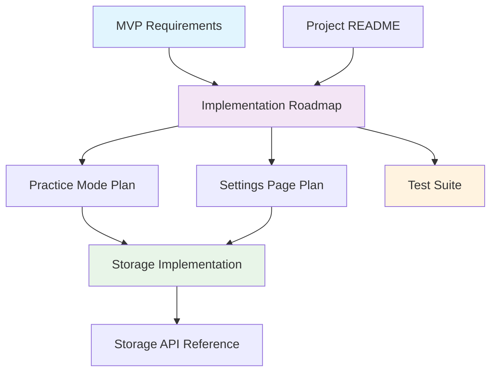

# 📚 Doshi Sensei Documentation Index

Welcome to the complete documentation collection for **Doshi Sensei** - a Next.js application for learning Japanese verb and adjective conjugations. This index organizes all project documentation for easy navigation and reference.

---

## 📖 Table of Contents

- [Project Overview](#-project-overview)
- [Implementation & Architecture](#-implementation--architecture)
- [Development & Testing](#-development--testing)
- [Storage & Data Management](#-storage--data-management)
- [Getting Started](#-getting-started)

---

## 🎯 Project Overview

### [MVP Requirements](./mvp_prompt_japanese_conjugation_app.md)
**Core specification and project requirements**

- 🎯 **Primary Purpose**: MVP specification for Japanese conjugation learning app
- 📋 **Core Features**: Browse vocabulary, view conjugations, drill mode practice
- 🛠️ **Technical Stack**: Next.js, offline-first, no backend required
- 📱 **User Flows**: Vocabulary → Conjugation → Drill workflows
- 📊 **Data Structure**: Japanese word format and API integrations

*Essential reading for understanding project goals and requirements.*

### [Project README](./README.md)
**Basic Next.js project information**

- 🚀 **Getting Started**: Development server setup and basic commands
- 📚 **Next.js Resources**: Links to documentation and learning materials
- 🌐 **Deployment**: Vercel deployment instructions
- 🔧 **Development**: Basic project structure and font optimization

*Standard Next.js documentation for project setup.*

---

## 🏗️ Implementation & Architecture

### [Implementation Roadmap](./doshi_sensei_implementation_roadmap.md)
**Complete project implementation strategy and timeline**

- 📅 **5-Phase Plan**: Practice Mode → Settings → Integration → Statistics → Polish
- ⏱️ **Timeline**: 24-40 days total development estimate
- 🎯 **Current Status**: Home, Vocabulary, and Drill modes implemented
- 🔄 **Priority Order**: Based on MVP requirements and feature dependencies
- 🚀 **Future Features**: Post-MVP enhancements and scalability considerations

*Master planning document for project development phases.*

### [Practice Mode Implementation](./practice_mode_implementation_plan.md)
**Detailed implementation plan for Practice Mode feature**

- 📚 **Core Feature**: Detailed conjugation viewing and study interface
- 🏗️ **6-Phase Development**: Page setup → Display → Selection → Rules → Integration → Polish
- 🧩 **Components**: Word selector, conjugation table, rule explanations
- ⏱️ **Timeline**: 8-13 days estimated development time
- 🔗 **Integration**: Connects vocabulary browsing with drill practice

*Comprehensive guide for implementing the Practice Mode feature.*

### [Settings Page Implementation](./settings_page_implementation_plan.md)
**Complete settings system implementation guide**

- ⚙️ **User Customization**: Theme, language, display preferences, goals
- 🏗️ **6-Phase Development**: Setup → State → Theme → Preferences → Data → Polish
- 💾 **Storage Integration**: Settings context and local storage persistence
- 🎨 **Theme System**: Dark/light mode with system detection
- ⏱️ **Timeline**: 6-10 days estimated development time

*Detailed implementation plan for user settings and customization.*

---

## 🧪 Development & Testing

### [Test Suite Documentation](./tests_README.md)
**Comprehensive testing strategy and implementation**

- 🧪 **Test Coverage**: 95%+ statement coverage across all features
- 📁 **Test Structure**: Unit, component, and integration test organization
- 🎯 **127 Conjugation Forms**: Complete Japanese conjugation testing
- 🔧 **Configuration**: Jest, Testing Library, TypeScript integration
- 📊 **Metrics**: 85+ test cases covering core functionality
- 🚀 **CI/CD**: Automated testing and coverage reporting

*Complete guide to the project's testing infrastructure and practices.*

---

## 💾 Storage & Data Management

### [Storage Implementation Guide](./DOSHI_SENSEI_STORAGE_IMPLEMENTATION.md)
**Comprehensive storage architecture and implementation**

- 🗄️ **Dual Storage**: IndexedDB primary with localStorage fallback
- 📊 **8 Data Stores**: Settings, progress, sessions, cache, vocabulary
- 🚀 **Advanced Features**: Spaced repetition, analytics, offline support
- 🔄 **Auto-Migration**: Seamless upgrade from localStorage to IndexedDB
- ⚡ **Performance**: Strategic indexing and batch operations
- 📈 **Analytics**: Storage usage monitoring and optimization

*Complete technical documentation for the storage system architecture.*

### [Storage System Reference](./README_Storage.md)
**Developer-focused storage API documentation**

- 🛠️ **API Reference**: Complete method documentation with examples
- 🚀 **Quick Start**: Basic usage patterns and common operations
- 🔧 **Advanced Features**: Caching, analytics, and optimization
- 🌐 **Browser Support**: Compatibility matrix and fallback strategies
- 🐛 **Troubleshooting**: Common issues and debugging guide
- 📝 **Migration**: Upgrade strategies and data handling

*Practical guide for developers using the storage system.*

---

## 🚀 Getting Started

### For New Developers

1. **Start Here**: [MVP Requirements](./mvp_prompt_japanese_conjugation_app.md) - Understand the project vision
2. **Setup**: [Project README](./README.md) - Get the development environment running
3. **Architecture**: [Implementation Roadmap](./doshi_sensei_implementation_roadmap.md) - Understand the project structure
4. **Testing**: [Test Suite Documentation](./tests_README.md) - Learn the testing approach

### For Feature Development

1. **Practice Mode**: [Practice Mode Implementation](./practice_mode_implementation_plan.md)
2. **Settings**: [Settings Page Implementation](./settings_page_implementation_plan.md)
3. **Storage**: [Storage System Reference](./README_Storage.md)

### For System Architecture

1. **Complete Overview**: [Storage Implementation Guide](./DOSHI_SENSEI_STORAGE_IMPLEMENTATION.md)
2. **Development Strategy**: [Implementation Roadmap](./doshi_sensei_implementation_roadmap.md)
3. **Quality Assurance**: [Test Suite Documentation](./tests_README.md)

---

## 📊 Documentation Statistics

| Category | Documents | Total Size | Key Features |
|----------|-----------|------------|--------------|
| **Project Overview** | 2 docs | ~15KB | Requirements, setup |
| **Implementation** | 3 docs | ~45KB | Roadmap, feature plans |
| **Development** | 1 doc | ~25KB | Testing, CI/CD |
| **Storage** | 2 docs | ~85KB | Architecture, API reference |
| **Total** | **8 docs** | **~170KB** | **Complete project coverage** |

---

## 🔗 Document Relationships

---

## 📝 Maintenance & Updates

### Document Ownership

- **MVP Requirements**: Project stakeholders
- **Implementation Plans**: Development team leads
- **Storage Documentation**: Backend/infrastructure team
- **Test Documentation**: QA and development teams

### Update Schedule

- **Weekly**: Implementation progress updates
- **Sprint Reviews**: Feature completion documentation
- **Major Releases**: Architecture and API documentation
- **As Needed**: Troubleshooting and FAQ updates

---

## 🤝 Contributing to Documentation

### Documentation Standards

1. **Clarity**: Write for developers at all experience levels
2. **Examples**: Include practical code examples and usage patterns
3. **Structure**: Use consistent markdown formatting and organization
4. **Updates**: Keep documentation in sync with code changes
5. **Cross-References**: Link related documents and sections

### Adding New Documentation

1. Create new `.md` file in the `docs/` directory
2. Add entry to this index with appropriate categorization
3. Include clear purpose statement and key features
4. Add cross-references to related documents
5. Update the document relationship diagram if needed

---

*Last updated: January 2025 | Doshi Sensei v1.0*
