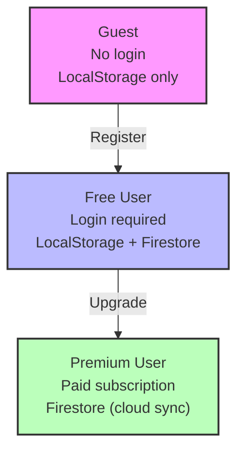
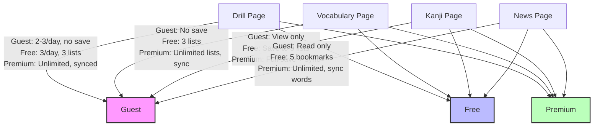
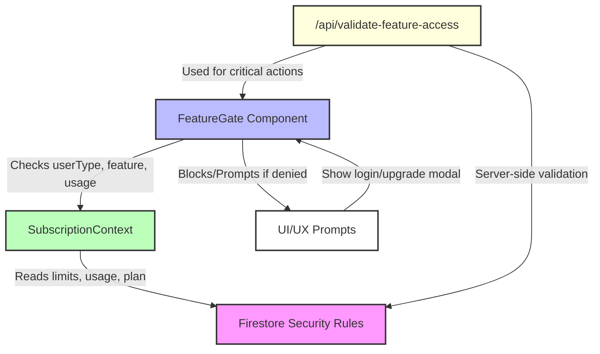
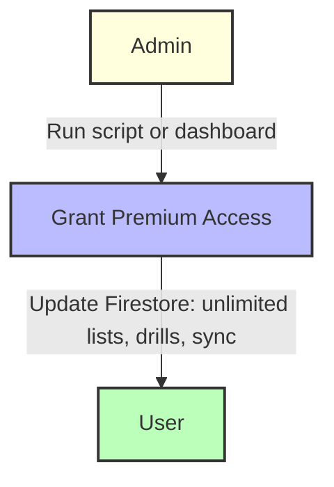

# Doshi Sensei User Entitlements

## User Types & Progression

---

## Feature Matrix

| Feature                | Guest      | Free         | Premium      |
|------------------------|------------|--------------|--------------|
| Word Lists             | 0 (view)   | 3            | Unlimited    |
| Drills per Day         | 3          | 3            | Unlimited    |
| Kanji Quest/Day        | 3          | 3            | Unlimited    |
| Stories/Day            | 3          | 3            | Unlimited    |
| Articles/Day           | 3          | 3            | Unlimited    |
| Bookmarks (Articles)   | 0          | 5            | Unlimited    |
| **Games:**             |            |              |              |
| - Kana Drop Game/Day   | 3          | 3            | Unlimited    |
| - Pokemon Kanji Quest/Day | 3      | 3            | Unlimited    |
| - Other Games/Day      | 3          | 3            | Unlimited    |
| Save Progress          | ❌         | ✅ (local)    | ✅ (cloud)   |
| Cloud Sync             | ❌         | ❌           | ✅           |
| Advanced Analytics     | ❌         | ❌           | ✅           |
| Priority Support       | ❌         | ❌           | ✅           |

---

## Feature Breakdown by Page

---

## Usage Limits (Visual)

```mermaid
flowchart TD
    Guest["Guest"]
    Free["Free"]
    Premium["Premium"]
    Guest --> GLists["Lists: 0"]
Guest --> GDrills["Drills/day: 3"]
Guest --> GSave["Save: ❌"]
Guest --> GSync["Sync: ❌"]
Guest --> GBookmarks["Bookmarks: 0"]
Guest --> GGames["Games/day: 3"]
Free --> FLists["Lists: 3"]
Free --> FDrills["Drills/day: 3"]
Free --> FSave["Save: ✅ (local)"]
Free --> FSync["Sync: ❌"]
Free --> FBookmarks["Bookmarks: 5"]
Free --> FGames["Games/day: 3"]
Premium --> PLists["Lists: ∞"]
Premium --> PDrills["Drills/day: ∞"]
Premium --> PSave["Save: ✅ (cloud)"]
Premium --> PSync["Sync: ✅"]
Premium --> PBookmarks["Bookmarks: ∞"]
Premium --> PGames["Games/day: ∞"]
    style Guest fill:#f9f,stroke:#333,stroke-width:2px
    style Free fill:#bbf,stroke:#333,stroke-width:2px
    style Premium fill:#bfb,stroke:#333,stroke-width:2px
```

---

## How Entitlements Are Enforced

- **Frontend:**
  - `FeatureGate` and hooks like `useFreemiumLimits` check user type, plan, and usage before allowing actions.
  - If a user hits a limit, the UI shows a login or upgrade prompt.
- **Backend:**
  - Firestore security rules enforce limits at the data layer.
  - Critical actions (like incrementing usage) are validated server-side via API endpoints.

---

## Admin Entitlements

- Admins can grant premium access to any user (via script or dashboard).
- Premium grants provide unlimited lists, drills, and enable cloud sync.

---

## Security & Best Practices

- **Firestore rules**: Only allow users to access their own data; only premium users get unlimited features and sync.
- **Server-side validation**: All critical feature checks are validated on the backend.
- **Upgrade/Conversion UX**: Users are gently nudged to register or upgrade when they hit limits.

---

**For more technical details or code snippets, see the relevant files in `src/contexts/SubscriptionContext.tsx`, `src/components/FeatureGate.tsx`, and `src/types/subscription.ts`.**
