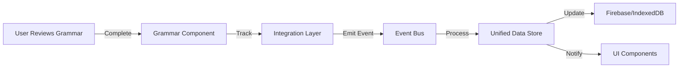

# Adding New Connectors to Review Hub

## Overview
This guide explains how to add new data source connectors and track new activities in the Review Hub system.

## Architecture Overview

```
Review Hub
    ├── Event Bus (publishes events)
    ├── Unified Data Store (manages data)
    └── Source Connectors (fetch from features)
        ├── Kanji Mastery
        ├── Textbook Vocabulary
        ├── Flashcards
        ├── Study Lists
        ├── Drill Practice
        └── [Your New Connector]
```

## Important: Data Storage Architecture

### Where Data Lives
Each feature maintains its **own Firebase collection**. The Review Hub does **NOT** store data - it only aggregates from these collections:

```
Firebase Structure:
users/
  └── {userId}/
      ├── textbookVocabularyProgress/  ← Textbook vocab data
      ├── kanjiProgress/               ← Kanji data
      ├── grammarPracticeProgress/     ← Your new feature data
      └── [other collections...]
```

### Data Flow
1. **Feature stores data** → Own collection (e.g., `grammarPracticeProgress`)
2. **Connector reads data** → From that collection
3. **Review Hub displays** → Aggregated view from all connectors
4. **User completes review** → Data saves back to original collection

### Key Principle
The Review Hub is a **viewer/aggregator**, not a storage location. This ensures:
- Clean separation of concerns
- Features remain independent
- Easy to add/remove features
- Better performance (parallel queries)

## Step-by-Step Guide

### 1. Define Your Review Source

Add your source to `/src/services/review-events/types.ts`:

```typescript
export enum ReviewSource {
  // ... existing sources ...
  GRAMMAR_PRACTICE = 'grammar_practice',  // Add your new source
}
```

### 2. Configure Storage in UnifiedStorageLayer

Add to `/src/services/storage/UnifiedStorageLayer.ts`:

```typescript
const STORAGE_CONFIG: Record<string, StorageConfig> = {
  // ... existing configs ...
  
  'grammar_practice_progress': {
    namespace: 'grammar_practice',
    storageType: 'indexeddb',
    syncStrategy: 'realtime',
    firebaseCollection: 'grammarPracticeProgress'
  },
  
  'grammar_practice_sessions': {
    namespace: 'grammar_practice',
    storageType: 'indexeddb',
    syncStrategy: 'periodic',
    syncInterval: 300000, // 5 minutes
    firebaseCollection: 'grammarPracticeSessions'
  }
}
```

### 3. Create the Connector Function

Add to `/src/services/review-store/source-connectors.ts`:

```typescript
/**
 * Connector for Grammar Practice items
 */
export async function getGrammarPracticeItems(
  params: SourceConnectorParams
): Promise<UnifiedReviewItem[]> {
  try {
    if (!params.userId) return [];
    
    // Query your data source (Firebase, IndexedDB, etc.)
    const grammarRef = collection(db, 'users', params.userId, 'grammarExercises');
    const q = query(
      grammarRef,
      where('nextReview', '<=', new Date()),
      orderBy('nextReview', 'asc'),
      limit(params.limit || 50)
    );
    
    const snapshot = await getDocs(q);
    
    return snapshot.docs.map(doc => {
      const data = doc.data();
      return {
        // Unique ID for this item
        id: `grammar-${doc.id}`,
        sourceId: doc.id,
        sourceType: ReviewSource.GRAMMAR_PRACTICE,
        userId: params.userId,
        
        // Content type and details
        contentType: 'grammar' as ContentType,
        content: {
          primary: data.pattern,        // e.g., "てform + います"
          secondary: data.meaning,      // e.g., "Present progressive"
          reading: data.example,        // e.g., "食べています"
          metadata: {
            level: data.jlptLevel,
            category: data.category
          }
        },
        
        // Scheduling info (spaced repetition)
        scheduling: {
          algorithm: AlgorithmType.FSRS,
          dueDate: data.nextReview?.toDate() || new Date(),
          nextReviewAt: data.nextReview?.toDate() || new Date(),
          interval: data.interval || 1,
          easeFactor: data.easeFactor || 2.5,
          repetitions: data.repetitions || 0,
          lapses: data.lapses || 0,
          state: ReviewState.LEARNING,
          lastReviewedAt: data.lastReview?.toDate()
        },
        
        // Metadata
        metadata: {
          createdAt: data.createdAt?.toDate() || new Date(),
          updatedAt: data.updatedAt?.toDate() || new Date(),
          lastReviewedAt: data.lastReview?.toDate(),
          lastReviewSource: ReviewSource.GRAMMAR_PRACTICE,
          tags: [`level:${data.jlptLevel}`, `type:${data.category}`],
          properties: {
            difficulty: data.difficulty,
            hints: data.hints
          }
        },
        
        // Sync status
        sync: {
          version: 1,
          lastSyncedAt: new Date(),
          localChanges: false,
          remoteChanges: false,
          conflictStatus: 'none'
        }
      };
    });
  } catch (error) {
    console.error('Error fetching Grammar Practice items:', error);
    return [];
  }
}
```

### 4. Register in UnifiedDataStore

Update `/src/services/review-store/UnifiedDataStore.ts` in the `getSourceDueItems` method:

```typescript
private async getSourceDueItems(
  source: ReviewSource,
  params: GetDueItemsParams
): Promise<UnifiedReviewItem[]> {
  const connectorParams = {
    userId: params.userId,
    contentTypes: params.contentTypes,
    limit: params.limit,
    offset: params.offset,
    includeOverdue: params.includeOverdue
  };
  
  switch (source) {
    case ReviewSource.KANJI_MASTERY:
      return await getKanjiMasteryItems(connectorParams);
      
    case ReviewSource.TEXTBOOK_VOCAB:
      return await getTextbookVocabularyItems(connectorParams);
      
    // ADD YOUR NEW SOURCE HERE
    case ReviewSource.GRAMMAR_PRACTICE:
      return await getGrammarPracticeItems(connectorParams);
      
    // ... other sources ...
    
    default:
      return [];
  }
}
```

### 5. Create Feature Integration

Create `/src/services/grammar-practice/review-hub-integration.ts`:

```typescript
import { getEventBus } from '../review-events/EventBus';
import { ReviewEventType, ReviewSource, EventPriority } from '../review-events/types';

export class GrammarPracticeIntegration {
  private eventBus = getEventBus();
  
  /**
   * Track when a grammar exercise is completed
   */
  async trackReview(exerciseId: string, quality: number, userId: string) {
    await this.eventBus.emit({
      type: ReviewEventType.ITEM_REVIEWED,
      source: ReviewSource.GRAMMAR_PRACTICE,
      userId,
      data: {
        itemId: exerciseId,
        itemType: 'grammar',
        quality,
        timestamp: new Date()
      },
      priority: EventPriority.NORMAL
    });
  }
  
  /**
   * Track when new grammar content is added
   */
  async trackNewContent(pattern: string, userId: string) {
    await this.eventBus.emit({
      type: ReviewEventType.ITEM_ADDED,
      source: ReviewSource.GRAMMAR_PRACTICE,
      userId,
      data: {
        pattern,
        timestamp: new Date()
      },
      priority: EventPriority.LOW
    });
  }
  
  /**
   * Track study session
   */
  async trackSession(sessionData: any, userId: string) {
    await this.eventBus.emit({
      type: ReviewEventType.SESSION_COMPLETED,
      source: ReviewSource.GRAMMAR_PRACTICE,
      userId,
      data: sessionData,
      priority: EventPriority.NORMAL
    });
  }
}

export const grammarIntegration = new GrammarPracticeIntegration();
```

## Tracking New Activities

### 1. Define Custom Events (Optional)

If the existing events don't cover your needs, add new ones:

```typescript
// In types.ts
export enum ReviewEventType {
  // ... existing events ...
  GRAMMAR_RULE_MASTERED = 'grammar.rule_mastered',
  PRACTICE_STREAK_ACHIEVED = 'practice.streak_achieved',
}
```

### 2. Emit Events from Your Feature

```typescript
// In your grammar practice component
import { grammarIntegration } from '@/services/grammar-practice/review-hub-integration';

// When user completes an exercise
const handleExerciseComplete = async (exerciseId: string, score: number) => {
  // Calculate quality (1-5 scale for spaced repetition)
  const quality = Math.ceil(score / 20); // Convert 0-100 to 1-5
  
  // Track the review
  await grammarIntegration.trackReview(exerciseId, quality, userId);
  
  // Update UI, etc.
};
```

### 3. Subscribe to Events (Optional)

Listen for events from other sources:

```typescript
// In your component or service
useEffect(() => {
  const eventBus = getEventBus();
  
  const unsubscribe = eventBus.subscribe(
    ReviewEventType.LIMIT_REACHED,
    (event) => {
      if (event.source === ReviewSource.GRAMMAR_PRACTICE) {
        // Show upgrade prompt
        showUpgradeModal();
      }
    }
  );
  
  return () => unsubscribe();
}, []);
```

## Data Flow Example



## Testing Your Connector

Add to the test suite:

```javascript
// In test-review-hub-detailed.js
test('Connectors', 'Grammar Practice connector', () => {
  const { getGrammarPracticeItems } = require('./src/services/review-store/source-connectors');
  
  assert(getGrammarPracticeItems, 'Grammar connector exists');
  assert(typeof getGrammarPracticeItems === 'function', 'Is a function');
  
  return 'Grammar Practice connector validated';
});
```

## Best Practices

1. **Consistent Data Format**: Always return `UnifiedReviewItem` format
2. **Error Handling**: Return empty array on errors, don't throw
3. **Performance**: Use proper Firebase indexes for queries
4. **Limits**: Respect the `limit` parameter in queries
5. **Timestamps**: Always include proper Date objects
6. **Unique IDs**: Prefix IDs with source name (e.g., `grammar-${id}`)
7. **Dual Storage**: Use UnifiedStorageLayer for automatic Firebase + IndexedDB sync
8. **Firebase First**: Connectors should read from Firebase first (for premium users), then fall back to IndexedDB

## Common Patterns

### Pattern 1: Simple Due Items
```typescript
// For basic spaced repetition items
const dueItems = data.filter(item => 
  new Date(item.nextReview) <= new Date()
);
```

### Pattern 2: Session-Based Items
```typescript
// For daily practice items (not spaced repetition)
const today = new Date();
today.setHours(0, 0, 0, 0);
const needsPractice = lastPracticed < today;
```

### Pattern 3: Progressive Difficulty
```typescript
// For adaptive learning
const difficulty = calculateDifficulty(userLevel, itemLevel);
const isReady = difficulty <= userMaxDifficulty;
```

## Troubleshooting

### Issue: Connector not being called
- Check it's added to `getAllSourceDueItems`
- Verify the ReviewSource enum is added
- Ensure proper Firebase permissions

### Issue: Events not firing
- Check EventBus initialization
- Verify userId is passed correctly
- Look for console errors

### Issue: Data not syncing
- Check Firebase rules
- Verify sync.conflictStatus
- Review SyncEngine logs

## Next Steps

1. Create your data source/collection
2. Implement the connector function
3. Add integration layer
4. Test with the Review Hub UI
5. Monitor events in Performance Monitor

## Example Implementation Timeline

- **15 mins**: Add ReviewSource enum and types
- **30 mins**: Create connector function
- **20 mins**: Create integration layer
- **15 mins**: Add tests
- **20 mins**: Integration testing

Total: ~1.5 hours for a new connector

## Quick Reference Checklist

When adding a new feature to Review Hub:

- [ ] Add ReviewSource enum in `/src/services/review-events/types.ts`
- [ ] Add storage config in `/src/services/storage/UnifiedStorageLayer.ts`
- [ ] Create connector function in `/src/services/review-store/source-connectors.ts`
- [ ] Register connector in UnifiedDataStore's `getSourceDueItems` method
- [ ] Create integration layer in `/src/services/[feature-name]/review-hub-integration.ts`
- [ ] Ensure data saves to feature's own Firebase collection (NOT review_hub)
- [ ] Test connector returns proper `UnifiedReviewItem` format
- [ ] Verify dual storage (Firebase + IndexedDB) works
- [ ] Add Firebase indexes if needed for queries
- [ ] Test with both premium and free user accounts