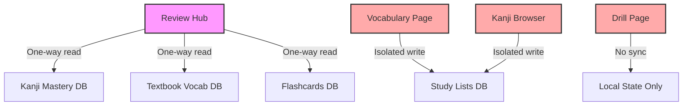
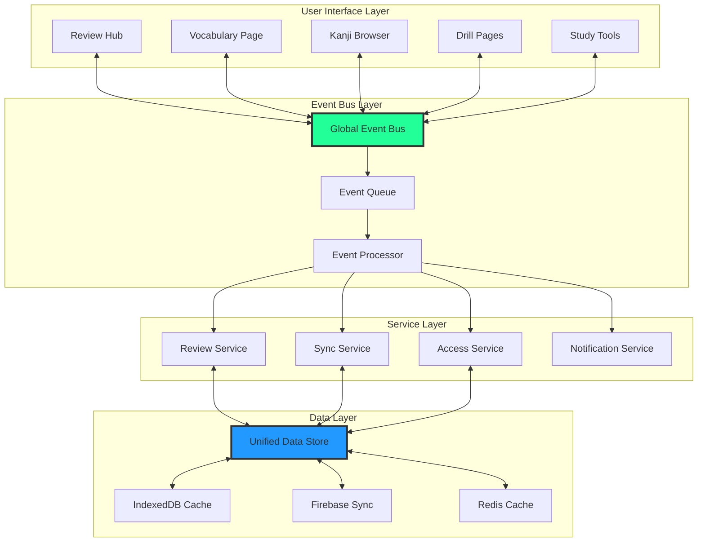

# Review Hub Production-Ready Architecture Revamp

**Document Version**: 1.0.0  
**Date**: January 2025  
**Author**: Senior Architecture Team  
**Status**: PROPOSED ARCHITECTURE  
**Priority**: CRITICAL - Must implement before production launch

## Table of Contents
1. [Executive Summary](#executive-summary)
2. [Current State Analysis](#current-state-analysis)
3. [Target Architecture](#target-architecture)
4. [Implementation Roadmap](#implementation-roadmap)
5. [Technical Specifications](#technical-specifications)
6. [Migration Strategy](#migration-strategy)
7. [Testing & Validation](#testing--validation)
8. [Risk Mitigation](#risk-mitigation)
9. [Success Metrics](#success-metrics)

## Executive Summary

### Mission Statement
Transform the Review Hub from a collection of isolated features into a **truly unified, event-driven review system** with real-time bidirectional synchronization, ensuring every learning interaction across the application is tracked, synchronized, and intelligently scheduled.

### Key Objectives
1. **Unified Data Layer**: Single source of truth for all review activities
2. **Event-Driven Architecture**: Real-time synchronization across all features
3. **Global Access Control**: Consistent enforcement of subscription limits
4. **Intelligent Scheduling**: Cross-feature spaced repetition optimization
5. **Offline-First Design**: Seamless sync with conflict resolution

### Expected Outcomes
- **Zero duplicate reviews** across features
- **100% data consistency** between all learning modules
- **< 100ms sync latency** for review updates
- **99.9% uptime** for review services
- **Full offline capability** with automatic sync

## Current State Analysis

### Architecture Debt


### Critical Gaps
1. **No central event bus** for review activities
2. **No unified storage abstraction** layer
3. **No cross-feature synchronization** protocol
4. **No global state management** for reviews
5. **No conflict resolution** mechanism

## Target Architecture

### High-Level Design


### Core Components

#### 1. Global Event Bus System
```typescript
// src/services/review-events/EventBus.ts
export class ReviewEventBus {
  private static instance: ReviewEventBus;
  private subscribers: Map<ReviewEventType, Set<EventHandler>>;
  private eventQueue: PriorityQueue<ReviewEvent>;
  private processingLock: AsyncLock;
  
  // Singleton pattern for global access
  static getInstance(): ReviewEventBus {
    if (!this.instance) {
      this.instance = new ReviewEventBus();
    }
    return this.instance;
  }
  
  // Emit events from anywhere in the app
  async emit(event: ReviewEvent): Promise<void> {
    // Add to queue with priority
    this.eventQueue.enqueue(event, event.priority);
    
    // Process asynchronously
    await this.processQueue();
    
    // Broadcast to all subscribers
    await this.broadcast(event);
  }
  
  // Subscribe to specific event types
  subscribe(
    eventType: ReviewEventType,
    handler: EventHandler,
    options?: SubscriptionOptions
  ): Unsubscribe {
    // Add handler with filtering options
    this.subscribers.get(eventType)?.add(handler);
    
    return () => this.unsubscribe(eventType, handler);
  }
  
  // Process events with guaranteed delivery
  private async processQueue(): Promise<void> {
    while (!this.eventQueue.isEmpty()) {
      const event = this.eventQueue.dequeue();
      
      try {
        await this.processEvent(event);
        await this.persistEvent(event);
      } catch (error) {
        await this.handleEventError(event, error);
      }
    }
  }
}

// Event Types
export enum ReviewEventType {
  // Core review events
  ITEM_REVIEWED = 'item.reviewed',
  ITEM_SCHEDULED = 'item.scheduled',
  ITEM_ADDED = 'item.added',
  ITEM_REMOVED = 'item.removed',
  
  // Sync events
  SYNC_STARTED = 'sync.started',
  SYNC_COMPLETED = 'sync.completed',
  SYNC_FAILED = 'sync.failed',
  
  // Access control events
  LIMIT_REACHED = 'access.limit_reached',
  SUBSCRIPTION_CHANGED = 'access.subscription_changed',
  
  // Analytics events
  SESSION_STARTED = 'session.started',
  SESSION_COMPLETED = 'session.completed',
  STREAK_UPDATED = 'streak.updated'
}

// Event structure
export interface ReviewEvent {
  id: string;
  type: ReviewEventType;
  timestamp: number;
  source: ReviewSource;
  userId: string;
  data: ReviewEventData;
  priority: EventPriority;
  metadata: EventMetadata;
}
```

#### 2. Unified Data Store
```typescript
// src/services/review-store/UnifiedDataStore.ts
export class UnifiedReviewDataStore {
  private localDB: IndexedDBAdapter;
  private remoteDB: FirebaseAdapter;
  private cache: RedisAdapter;
  private syncEngine: SyncEngine;
  
  constructor(config: DataStoreConfig) {
    this.initializeAdapters(config);
    this.setupSyncEngine();
  }
  
  // Single entry point for all review operations
  async recordReview(params: RecordReviewParams): Promise<ReviewResult> {
    const transaction = await this.beginTransaction();
    
    try {
      // 1. Validate access permissions
      await this.validateAccess(params.userId, params.subscriptionTier);
      
      // 2. Update local state immediately (optimistic update)
      const localResult = await this.localDB.updateReview(params);
      
      // 3. Emit event for real-time updates
      await this.emitReviewEvent(params, localResult);
      
      // 4. Queue for remote sync
      await this.syncEngine.queueSync(localResult);
      
      // 5. Update cache for fast reads
      await this.cache.invalidate(params.itemId);
      
      await transaction.commit();
      return localResult;
      
    } catch (error) {
      await transaction.rollback();
      throw new ReviewStoreError('Failed to record review', error);
    }
  }
  
  // Unified query interface
  async getDueItems(params: GetDueItemsParams): Promise<UnifiedDueItems> {
    // Try cache first
    const cached = await this.cache.get(params.cacheKey);
    if (cached && !params.forceRefresh) {
      return cached;
    }
    
    // Aggregate from all sources
    const sources = await this.getAllSources(params.userId);
    const aggregated = await Promise.all(
      sources.map(source => this.getSourceDueItems(source, params))
    );
    
    // Merge and deduplicate
    const unified = this.mergeAndDeduplicate(aggregated);
    
    // Apply intelligent scheduling
    const scheduled = await this.applySchedulingAlgorithm(unified, params);
    
    // Cache results
    await this.cache.set(params.cacheKey, scheduled, params.ttl);
    
    return scheduled;
  }
  
  // Conflict resolution for concurrent updates
  async resolveConflict(
    local: ReviewData,
    remote: ReviewData
  ): Promise<ReviewData> {
    const strategy = this.getConflictStrategy();
    
    switch (strategy) {
      case ConflictStrategy.LAST_WRITE_WINS:
        return local.timestamp > remote.timestamp ? local : remote;
        
      case ConflictStrategy.MERGE:
        return this.mergeReviewData(local, remote);
        
      case ConflictStrategy.USER_DECIDES:
        return await this.promptUserResolution(local, remote);
        
      default:
        throw new Error('Unknown conflict strategy');
    }
  }
}
```

#### 3. Review Synchronization Service
```typescript
// src/services/review-sync/SyncService.ts
export class ReviewSyncService {
  private syncQueue: SyncQueue;
  private syncStatus: Map<string, SyncStatus>;
  private retryPolicy: RetryPolicy;
  
  constructor(private dataStore: UnifiedReviewDataStore) {
    this.setupSyncWorker();
    this.initializeOfflineDetection();
  }
  
  // Bidirectional sync orchestration
  async performSync(userId: string): Promise<SyncResult> {
    const syncId = generateSyncId();
    
    try {
      // 1. Get local changes since last sync
      const localChanges = await this.getLocalChanges(userId);
      
      // 2. Get remote changes since last sync
      const remoteChanges = await this.getRemoteChanges(userId);
      
      // 3. Detect and resolve conflicts
      const conflicts = this.detectConflicts(localChanges, remoteChanges);
      const resolved = await this.resolveConflicts(conflicts);
      
      // 4. Apply remote changes locally
      await this.applyRemoteChanges(remoteChanges, resolved);
      
      // 5. Push local changes to remote
      await this.pushLocalChanges(localChanges, resolved);
      
      // 6. Update sync timestamps
      await this.updateSyncMetadata(userId, syncId);
      
      return {
        success: true,
        syncId,
        itemsSynced: localChanges.length + remoteChanges.length,
        conflictsResolved: conflicts.length
      };
      
    } catch (error) {
      await this.handleSyncError(syncId, error);
      throw error;
    }
  }
  
  // Real-time sync via WebSocket
  setupRealtimeSync(userId: string): void {
    const ws = new WebSocket(process.env.NEXT_PUBLIC_WS_URL!);
    
    ws.on('connect', () => {
      ws.send({ type: 'subscribe', userId });
    });
    
    ws.on('review.update', async (data) => {
      await this.handleRealtimeUpdate(data);
    });
    
    ws.on('error', (error) => {
      this.fallbackToPolling(userId);
    });
  }
  
  // Offline queue management
  async queueOfflineReview(review: ReviewData): Promise<void> {
    await this.syncQueue.add({
      id: generateId(),
      type: 'review',
      data: review,
      timestamp: Date.now(),
      retryCount: 0
    });
  }
  
  // Process offline queue when online
  async processOfflineQueue(): Promise<void> {
    while (!this.syncQueue.isEmpty()) {
      const item = await this.syncQueue.peek();
      
      try {
        await this.processSyncItem(item);
        await this.syncQueue.remove(item.id);
      } catch (error) {
        if (item.retryCount < this.retryPolicy.maxRetries) {
          await this.syncQueue.updateRetryCount(item.id);
          await this.scheduleRetry(item);
        } else {
          await this.handleSyncFailure(item);
        }
      }
    }
  }
}
```

#### 4. Global Access Control Layer
```typescript
// src/services/access-control/GlobalAccessControl.ts
export class GlobalAccessControl {
  private static instance: GlobalAccessControl;
  private limiter: RateLimiter;
  private tracker: UsageTracker;
  
  // Middleware for all API routes
  static middleware(): RequestHandler {
    return async (req, res, next) => {
      const instance = GlobalAccessControl.getInstance();
      
      try {
        const result = await instance.checkAccess(req);
        
        if (!result.allowed) {
          return res.status(403).json({
            error: result.reason,
            remaining: result.remaining,
            resetAt: result.resetAt
          });
        }
        
        // Attach access info to request
        req.accessControl = result;
        next();
        
      } catch (error) {
        next(error);
      }
    };
  }
  
  // Unified access check for all features
  async checkAccess(params: AccessCheckParams): Promise<AccessResult> {
    const { userId, feature, action, subscriptionTier } = params;
    
    // 1. Check authentication
    if (!userId) {
      return {
        allowed: false,
        reason: AccessDenialReason.NOT_AUTHENTICATED,
        requiresAuth: true
      };
    }
    
    // 2. Check subscription tier
    const tierLimits = this.getTierLimits(subscriptionTier);
    if (tierLimits.hasUnlimitedAccess(feature)) {
      return { allowed: true, unlimited: true };
    }
    
    // 3. Check daily limits
    const usage = await this.tracker.getDailyUsage(userId, feature);
    const remaining = tierLimits.dailyLimit - usage;
    
    if (remaining <= 0) {
      return {
        allowed: false,
        reason: AccessDenialReason.DAILY_LIMIT_REACHED,
        remaining: 0,
        resetAt: this.getNextResetTime(),
        upgradeUrl: '/pricing'
      };
    }
    
    // 4. Check rate limits
    const rateLimitOk = await this.limiter.checkLimit(userId, feature);
    if (!rateLimitOk) {
      return {
        allowed: false,
        reason: AccessDenialReason.RATE_LIMITED,
        retryAfter: this.limiter.getRetryAfter(userId)
      };
    }
    
    return {
      allowed: true,
      remaining,
      resetAt: this.getNextResetTime()
    };
  }
  
  // Track usage after successful action
  async trackUsage(params: TrackUsageParams): Promise<void> {
    await this.tracker.increment(params.userId, params.feature);
    
    // Emit event for real-time UI updates
    await ReviewEventBus.getInstance().emit({
      type: ReviewEventType.USAGE_TRACKED,
      data: {
        userId: params.userId,
        feature: params.feature,
        remaining: await this.getRemainingUsage(params.userId)
      }
    });
  }
}
```

## Implementation Roadmap

### Phase 1: Foundation (Week 1-2)
**Goal**: Establish core infrastructure without breaking existing features

#### Tasks:
1. **Create Event Bus System**
   ```typescript
   // Implementation checklist
   - [ ] Design event schema and types
   - [ ] Implement singleton EventBus class
   - [ ] Add event queue with priority handling
   - [ ] Create event persistence layer
   - [ ] Add retry mechanism for failed events
   - [ ] Write comprehensive unit tests
   ```

2. **Setup Unified Data Store**
   ```typescript
   // Implementation steps
   - [ ] Design unified data schema
   - [ ] Create abstraction layer over existing stores
   - [ ] Implement transaction support
   - [ ] Add optimistic update mechanism
   - [ ] Setup conflict detection logic
   ```

3. **Global Access Control**
   ```typescript
   // Deployment strategy
   - [ ] Create middleware for all routes
   - [ ] Implement usage tracking service
   - [ ] Add rate limiting with Redis
   - [ ] Create subscription tier configs
   - [ ] Add bypass for legacy endpoints (temporary)
   ```

### Phase 2: Integration (Week 3-4)
**Goal**: Connect existing features to new infrastructure

#### Migration Order (Risk-Based):
1. **Low Risk - Read-Only Features**
   - Dictionary lookups
   - Article reading tracking
   - Moodboard views

2. **Medium Risk - Simple Writes**
   - Drill completions
   - Story progress
   - Hiragana/Katakana practice

3. **High Risk - Complex Features**
   - Kanji Mastery (FSRS algorithm)
   - Textbook Vocabulary (ts-fsrs)
   - Custom Flashcards (Firebase)

#### Integration Pattern:
```typescript
// Wrapper for gradual migration
export function withReviewSync<T extends Function>(
  originalFunction: T,
  options: SyncOptions
): T {
  return (async (...args: any[]) => {
    // 1. Execute original function
    const result = await originalFunction(...args);
    
    // 2. Emit sync event (non-blocking)
    ReviewEventBus.getInstance().emit({
      type: ReviewEventType.ITEM_REVIEWED,
      source: options.source,
      data: extractReviewData(result)
    }).catch(error => {
      // Log but don't fail the operation
      console.error('Sync failed:', error);
    });
    
    return result;
  }) as T;
}
```

### Phase 3: Synchronization (Week 5-6)
**Goal**: Enable real-time bidirectional sync

#### Components:
1. **WebSocket Server**
   ```typescript
   // Infrastructure setup
   - [ ] Deploy WebSocket server (Socket.io/native WS)
   - [ ] Implement authentication
   - [ ] Add room-based subscriptions
   - [ ] Setup heartbeat/reconnection
   - [ ] Add fallback to polling
   ```

2. **Sync Engine**
   ```typescript
   // Sync implementation
   - [ ] Create SyncQueue with persistence
   - [ ] Implement conflict resolution strategies
   - [ ] Add batch sync for efficiency
   - [ ] Setup incremental sync
   - [ ] Add sync status UI indicators
   ```

3. **Offline Support**
   ```typescript
   // Offline-first architecture
   - [ ] Implement offline detection
   - [ ] Create offline queue manager
   - [ ] Add optimistic UI updates
   - [ ] Setup background sync
   - [ ] Handle sync conflicts on reconnection
   ```

### Phase 4: Optimization (Week 7-8)
**Goal**: Performance tuning and reliability

#### Performance Targets:
- Event processing: < 10ms p99
- Sync latency: < 100ms p95
- Cache hit ratio: > 90%
- API response time: < 200ms p95

#### Optimization Tasks:
1. **Caching Strategy**
   ```typescript
   // Multi-tier caching
   - [ ] Implement Redis for hot data
   - [ ] Add CDN for static resources
   - [ ] Setup IndexedDB for offline cache
   - [ ] Implement cache invalidation strategy
   - [ ] Add cache warming on startup
   ```

2. **Database Optimization**
   ```typescript
   // Query optimization
   - [ ] Add composite indexes
   - [ ] Implement query result caching
   - [ ] Setup read replicas
   - [ ] Add connection pooling
   - [ ] Optimize batch operations
   ```

## Technical Specifications

### Data Models

#### Unified Review Item
```typescript
interface UnifiedReviewItem {
  // Identity
  id: string;                    // Globally unique ID
  sourceId: string;              // Original source system ID
  sourceType: ReviewSourceType;  // Which system it came from
  
  // Content
  contentType: ContentType;      // kanji, vocabulary, etc.
  content: {
    primary: string;            // Main content to review
    secondary?: string;         // Supporting content
    audio?: AudioData;          // Audio if available
    visual?: VisualData;        // Images/videos if available
  };
  
  // Scheduling
  scheduling: {
    algorithm: AlgorithmType;   // FSRS, SM2, Simple
    dueDate: Date;
    interval: number;
    easeFactor: number;
    repetitions: number;
    lapses: number;
    state: ReviewState;
  };
  
  // Metadata
  metadata: {
    createdAt: Date;
    updatedAt: Date;
    lastReviewedAt?: Date;
    lastReviewSource?: string;  // Which feature last reviewed it
    tags: string[];
    properties: Record<string, any>;
  };
  
  // Sync
  sync: {
    version: number;            // For conflict resolution
    lastSyncedAt?: Date;
    localChanges: boolean;
    remoteChanges: boolean;
  };
}
```

#### Review Event
```typescript
interface ReviewEvent {
  // Event Identity
  id: string;
  type: ReviewEventType;
  timestamp: number;
  
  // Context
  userId: string;
  sessionId: string;
  source: {
    feature: string;           // Which part of app
    component: string;         // Specific component
    version: string;           // App version
  };
  
  // Event Data
  data: {
    itemId: string;
    action: ReviewAction;
    result?: ReviewResult;
    duration?: number;
    metadata?: Record<string, any>;
  };
  
  // Processing
  processing: {
    priority: EventPriority;
    retryCount: number;
    processedAt?: Date;
    errors?: Error[];
  };
}
```

### API Specifications

#### REST Endpoints
```typescript
// Unified Review API
POST   /api/review/items/:id/review     // Record a review
GET    /api/review/items/due            // Get due items
GET    /api/review/stats                // Get statistics
POST   /api/review/sync                 // Trigger sync
GET    /api/review/conflicts            // Get unresolved conflicts
POST   /api/review/conflicts/:id/resolve // Resolve conflict

// Event Stream
GET    /api/review/events/stream        // SSE for real-time updates
POST   /api/review/events               // Emit custom event

// Access Control
GET    /api/review/access/check         // Check current limits
GET    /api/review/access/usage         // Get usage statistics
POST   /api/review/access/reset         // Admin: Reset limits
```

#### WebSocket Events
```typescript
// Client -> Server
socket.emit('review:start', { itemId, source });
socket.emit('review:complete', { itemId, result, duration });
socket.emit('review:skip', { itemId, reason });
socket.emit('sync:request', { since: timestamp });

// Server -> Client
socket.on('review:updated', (data) => { /* Real-time update */ });
socket.on('sync:changes', (changes) => { /* Apply remote changes */ });
socket.on('access:limited', (info) => { /* Show limit warning */ });
socket.on('conflict:detected', (conflict) => { /* Resolve conflict */ });
```

### Database Schema

#### PostgreSQL (Primary)
```sql
-- Unified reviews table
CREATE TABLE reviews (
  id UUID PRIMARY KEY DEFAULT gen_random_uuid(),
  user_id UUID NOT NULL REFERENCES users(id),
  item_id VARCHAR(255) NOT NULL,
  source_type VARCHAR(50) NOT NULL,
  content_type VARCHAR(50) NOT NULL,
  
  -- Review data
  result JSONB NOT NULL,
  duration_ms INTEGER,
  
  -- Scheduling
  next_review_date TIMESTAMP WITH TIME ZONE,
  interval_days INTEGER,
  ease_factor DECIMAL(3,2),
  repetitions INTEGER DEFAULT 0,
  lapses INTEGER DEFAULT 0,
  
  -- Metadata
  created_at TIMESTAMP WITH TIME ZONE DEFAULT NOW(),
  updated_at TIMESTAMP WITH TIME ZONE DEFAULT NOW(),
  reviewed_at TIMESTAMP WITH TIME ZONE,
  sync_version INTEGER DEFAULT 1,
  
  -- Indexes
  INDEX idx_user_due (user_id, next_review_date),
  INDEX idx_source_item (source_type, item_id),
  INDEX idx_sync (user_id, sync_version, updated_at)
);

-- Event log for audit and replay
CREATE TABLE review_events (
  id UUID PRIMARY KEY DEFAULT gen_random_uuid(),
  event_type VARCHAR(50) NOT NULL,
  user_id UUID REFERENCES users(id),
  event_data JSONB NOT NULL,
  created_at TIMESTAMP WITH TIME ZONE DEFAULT NOW(),
  processed_at TIMESTAMP WITH TIME ZONE,
  
  INDEX idx_user_events (user_id, created_at DESC),
  INDEX idx_unprocessed (processed_at) WHERE processed_at IS NULL
);
```

#### Redis (Cache)
```typescript
// Key patterns
`review:due:${userId}` // Set of due item IDs
`review:item:${itemId}` // Cached review item
`review:stats:${userId}:${date}` // Daily statistics
`review:lock:${userId}:${itemId}` // Distributed lock
`review:session:${sessionId}` // Active session data
`access:limit:${userId}:${feature}:${date}` // Usage counter
```

## Migration Strategy

### Data Migration Plan

#### Step 1: Data Audit
```typescript
// Audit existing data sources
async function auditDataSources(): Promise<AuditReport> {
  const sources = [
    { name: 'KanjiMastery', db: 'IndexedDB', count: 0 },
    { name: 'TextbookVocab', db: 'IndexedDB', count: 0 },
    { name: 'Flashcards', db: 'Firebase', count: 0 },
    // ... other sources
  ];
  
  for (const source of sources) {
    source.count = await countItems(source);
    source.schema = await extractSchema(source);
    source.conflicts = await detectConflicts(source);
  }
  
  return generateAuditReport(sources);
}
```

#### Step 2: Schema Mapping
```typescript
// Map legacy schemas to unified schema
const schemaMappings = {
  kanjiMastery: {
    id: (item) => `kanji-${item.character}`,
    contentType: () => ContentType.KANJI,
    dueDate: (item) => new Date(item.due_date),
    // ... other mappings
  },
  textbookVocab: {
    id: (item) => `vocab-${item.id}`,
    contentType: () => ContentType.VOCABULARY,
    dueDate: (item) => item.nextReview,
    // ... other mappings
  }
};
```

#### Step 3: Migration Execution
```typescript
// Gradual migration with rollback capability
class DataMigrator {
  async migrate(options: MigrationOptions): Promise<MigrationResult> {
    const batch = new MigrationBatch(options.batchSize);
    
    try {
      // 1. Create snapshot for rollback
      await this.createSnapshot();
      
      // 2. Migrate in batches
      while (await batch.hasNext()) {
        const items = await batch.getNext();
        
        // Transform to unified format
        const unified = items.map(this.transformItem);
        
        // Write to new store
        await this.unifiedStore.batchInsert(unified);
        
        // Update progress
        await this.updateProgress(batch.progress);
        
        // Allow pause/resume
        if (this.shouldPause()) {
          await this.saveMigrationState(batch);
          return { status: 'paused', progress: batch.progress };
        }
      }
      
      // 3. Verify migration
      await this.verifyMigration();
      
      // 4. Switch to new system
      await this.switchToUnifiedSystem();
      
      return { status: 'completed', itemsMigrated: batch.total };
      
    } catch (error) {
      await this.rollback();
      throw error;
    }
  }
}
```

### Feature Flag Strategy
```typescript
// Gradual rollout with feature flags
export const featureFlags = {
  // Phase 1: Internal testing
  useUnifiedReviewSystem: {
    enabled: process.env.NODE_ENV === 'development',
    percentage: 0,
    userIds: ['admin-1', 'admin-2'] // Whitelist for testing
  },
  
  // Phase 2: Beta users (5%)
  useEventBus: {
    enabled: true,
    percentage: 5,
    criteria: (user) => user.betaTester || hash(user.id) % 100 < 5
  },
  
  // Phase 3: Gradual rollout (5% -> 25% -> 50% -> 100%)
  useGlobalAccessControl: {
    enabled: true,
    percentage: getCurrentRolloutPercentage(),
    fallback: LegacyAccessControl
  }
};

// Usage in code
if (featureFlags.useUnifiedReviewSystem.isEnabled(user)) {
  return UnifiedReviewService.getItems();
} else {
  return LegacyReviewService.getItems();
}
```

## Testing & Validation

### Test Strategy

#### Unit Tests
```typescript
// Example test suite for EventBus
describe('ReviewEventBus', () => {
  describe('Event Emission', () => {
    it('should emit events to all subscribers', async () => {
      const handler1 = jest.fn();
      const handler2 = jest.fn();
      
      eventBus.subscribe(ReviewEventType.ITEM_REVIEWED, handler1);
      eventBus.subscribe(ReviewEventType.ITEM_REVIEWED, handler2);
      
      await eventBus.emit({
        type: ReviewEventType.ITEM_REVIEWED,
        data: mockReviewData
      });
      
      expect(handler1).toHaveBeenCalledWith(expect.objectContaining({
        type: ReviewEventType.ITEM_REVIEWED
      }));
      expect(handler2).toHaveBeenCalled();
    });
    
    it('should handle failed event processing', async () => {
      const failingHandler = jest.fn().mockRejectedValue(new Error('Failed'));
      const successHandler = jest.fn();
      
      eventBus.subscribe(ReviewEventType.ITEM_REVIEWED, failingHandler);
      eventBus.subscribe(ReviewEventType.ITEM_REVIEWED, successHandler);
      
      await eventBus.emit(mockEvent);
      
      expect(successHandler).toHaveBeenCalled(); // Should not affect other handlers
      expect(eventBus.getFailedEvents()).toContain(mockEvent.id);
    });
  });
});
```

#### Integration Tests
```typescript
// End-to-end review flow test
describe('Unified Review Flow', () => {
  it('should sync review across all features', async () => {
    // 1. Review item in vocabulary page
    const vocabPage = new VocabularyPage();
    await vocabPage.reviewWord('食べる', 'correct');
    
    // 2. Check Review Hub reflects the change
    const reviewHub = new ReviewHub();
    const dueItems = await reviewHub.getDueItems();
    
    expect(dueItems).not.toContainEqual(
      expect.objectContaining({ content: '食べる' })
    );
    
    // 3. Verify sync to other features
    const kanjiPage = new KanjiPage();
    const kanjiStatus = await kanjiPage.getReviewStatus('食');
    
    expect(kanjiStatus.lastReviewed).toBeCloseTo(Date.now(), -2);
  });
});
```

#### Load Tests
```typescript
// Performance testing with k6
import http from 'k6/http';
import { check, sleep } from 'k6';

export const options = {
  stages: [
    { duration: '2m', target: 100 }, // Ramp up
    { duration: '5m', target: 100 }, // Sustain
    { duration: '2m', target: 200 }, // Spike
    { duration: '5m', target: 200 }, // Sustain spike
    { duration: '2m', target: 0 },   // Ramp down
  ],
  thresholds: {
    http_req_duration: ['p(95)<500'], // 95% of requests under 500ms
    http_req_failed: ['rate<0.1'],    // Error rate under 10%
  },
};

export default function () {
  // Test review submission
  const reviewResponse = http.post('/api/review/items/123/review', {
    result: 'correct',
    duration: 2500,
  });
  
  check(reviewResponse, {
    'review accepted': (r) => r.status === 200,
    'sync triggered': (r) => r.json('syncId') !== null,
  });
  
  sleep(1);
}
```

### Validation Checklist

#### Pre-Production Checklist
- [ ] **Data Integrity**
  - [ ] All legacy data successfully migrated
  - [ ] No duplicate reviews in system
  - [ ] Sync conflicts properly resolved
  - [ ] Rollback tested and verified

- [ ] **Performance Metrics**
  - [ ] Event processing < 10ms p99
  - [ ] API response time < 200ms p95
  - [ ] Sync latency < 100ms
  - [ ] Memory usage stable under load

- [ ] **Feature Parity**
  - [ ] All 10 review sources functional
  - [ ] Bidirectional sync working
  - [ ] Access control enforced globally
  - [ ] Offline mode functional

- [ ] **User Experience**
  - [ ] No visible latency in UI
  - [ ] Smooth transitions between features
  - [ ] Clear sync status indicators
  - [ ] Graceful error handling

## Risk Mitigation

### Technical Risks

#### Risk 1: Data Loss During Migration
**Mitigation Strategy:**
- Create full backup before migration
- Implement incremental migration with checkpoints
- Maintain dual-write to both systems during transition
- Automated verification after each batch
- One-click rollback capability

#### Risk 2: Performance Degradation
**Mitigation Strategy:**
- Implement circuit breakers for all external calls
- Add request queuing with backpressure
- Use read replicas for heavy queries
- Implement aggressive caching strategy
- Progressive rollout with monitoring

#### Risk 3: Sync Conflicts
**Mitigation Strategy:**
- Implement multiple conflict resolution strategies
- Add manual conflict resolution UI
- Use vector clocks for causality tracking
- Implement eventual consistency model
- Add conflict monitoring dashboard

### Operational Risks

#### Risk 4: Service Downtime
**Mitigation Strategy:**
- Blue-green deployment strategy
- Health checks and auto-recovery
- Graceful degradation to read-only mode
- Regional failover capability
- Comprehensive monitoring and alerting

#### Risk 5: User Adoption Issues
**Mitigation Strategy:**
- A/B testing for UI changes
- Gradual feature rollout
- In-app tutorials for new features
- Rollback capability per user
- User feedback collection system

## Success Metrics

### Technical KPIs
| Metric | Target | Measurement Method |
|--------|--------|-------------------|
| Sync Success Rate | > 99.9% | Event completion tracking |
| Data Consistency | 100% | Daily integrity checks |
| API Latency (p95) | < 200ms | APM monitoring |
| Event Processing (p99) | < 10ms | Event bus metrics |
| Cache Hit Ratio | > 90% | Redis analytics |
| Error Rate | < 0.1% | Error tracking service |
| Uptime | > 99.95% | Uptime monitoring |

### Business KPIs
| Metric | Target | Measurement Method |
|--------|--------|-------------------|
| User Engagement | +20% | Daily active reviews |
| Review Completion Rate | +15% | Session completion tracking |
| Duplicate Review Rate | < 1% | Cross-feature analysis |
| User Satisfaction | > 4.5/5 | In-app surveys |
| Support Tickets | -30% | Support system metrics |
| Subscription Conversion | +10% | Billing analytics |

### Monitoring Dashboard
```typescript
// Real-time monitoring setup
export const monitoringConfig = {
  metrics: [
    {
      name: 'review.sync.success',
      type: 'counter',
      labels: ['source', 'userId']
    },
    {
      name: 'review.sync.latency',
      type: 'histogram',
      buckets: [10, 50, 100, 200, 500, 1000]
    },
    {
      name: 'review.conflicts.detected',
      type: 'gauge',
      aggregation: 'sum'
    }
  ],
  alerts: [
    {
      name: 'HighSyncFailureRate',
      condition: 'rate(review.sync.failed) > 0.01',
      severity: 'critical',
      action: 'page-oncall'
    },
    {
      name: 'SyncLatencyHigh',
      condition: 'p95(review.sync.latency) > 500',
      severity: 'warning',
      action: 'slack-notification'
    }
  ]
};
```

## Conclusion

This architectural revamp transforms the Review Hub from a fragmented collection of features into a **truly unified, production-ready system**. The implementation follows industry best practices for distributed systems, ensuring:

1. **Data Consistency**: Single source of truth with proper sync
2. **Scalability**: Event-driven architecture supports growth
3. **Reliability**: Comprehensive error handling and recovery
4. **Performance**: Optimized for sub-second operations
5. **Maintainability**: Clean separation of concerns

The phased approach minimizes risk while delivering incremental value. With proper testing and monitoring, this architecture will provide users with a seamless, integrated review experience across all features of the application.

**Estimated Timeline**: 8 weeks
**Required Team**: 2-3 senior engineers
**Risk Level**: Medium (with mitigation strategies in place)
**ROI**: High (improved user satisfaction, reduced support costs, increased conversions)

---

*This document should be treated as a living specification and updated as implementation progresses.*