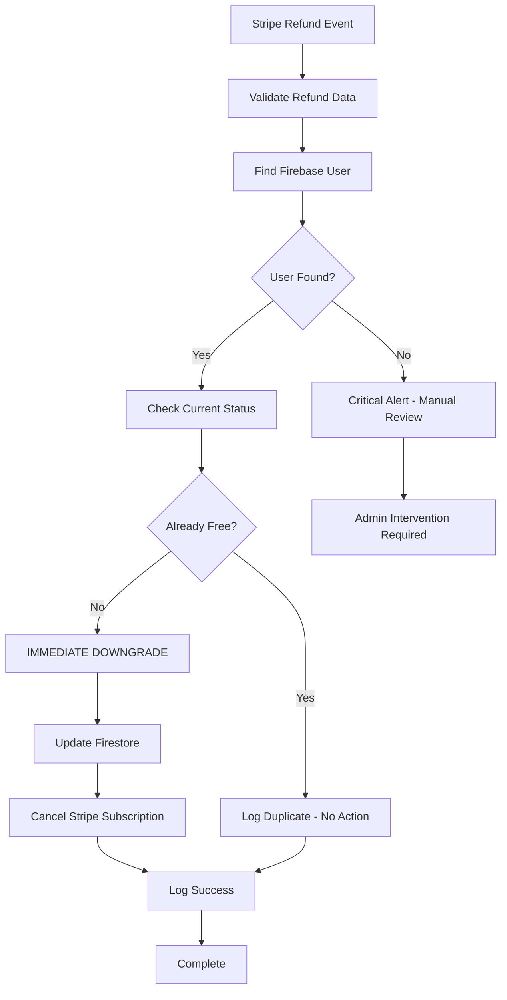

# Refund Policy & Implementation

## Overview

This document outlines the business refund policy for Doshi Sensei and its technical implementation in the Stripe webhook system.

## Business Policy

### Core Refund Rules

1. **IMMEDIATE DOWNGRADE**: Any refund (partial or full) results in immediate cancellation of premium access
2. **NO GRACE PERIOD**: Unlike regular cancellations, refunds provide no grace period
3. **PERMANENT REVOCATION**: Access is revoked immediately upon refund processing
4. **AUDIT TRAIL**: All refund events are logged for compliance and monitoring

### Refund Types Handled

| Refund Type | User Access | Business Logic |
|------------|-------------|----------------|
| **Full Refund** | Immediately revoked | Downgrade to free plan |
| **Partial Refund** | Immediately revoked | Downgrade to free plan |
| **Duplicate Refund** | No change (already free) | Log for audit only |

### Key Differences from Cancellation

| Aspect | Regular Cancellation | Refund |
|--------|---------------------|---------|
| Grace Period | Until end of billing period | None - immediate |
| Access Revocation | At period end | Immediate |
| Policy Reason | User choice | Financial dispute |
| Business Impact | Lower - retained some value | Higher - lost revenue |

## Technical Implementation

### Webhook Processing Flow



### User Lookup Strategies

The system uses multiple fallback strategies to find the user:

1. **Customer Metadata** (Primary)
   - Looks for `firebaseUID` in Stripe customer metadata
   - Most reliable method for established customers

2. **Subscription Metadata** (Fallback #1)
   - Retrieves invoice → subscription → metadata
   - Used when customer metadata is missing

3. **Email Lookup** (Fallback #2)
   - Matches Stripe customer email to Firestore user
   - Last resort method

4. **Critical Alert** (Failure Case)
   - Creates high-priority alert for manual intervention
   - Prevents revenue loss from unrevoked access

### Data Structure Changes

When a refund is processed, the user's subscription record is updated to:

```typescript
{
  // Core status
  plan: 'free',
  status: 'canceled',
  cancelReason: 'refunded',
  
  // Refund tracking
  refundedAt: Timestamp,
  refundAmount: number,
  refundChargeId: string,
  refundType: 'full' | 'partial',
  
  // Clear premium fields
  stripeSubscriptionId: null,
  stripeCustomerId: null,
  stripePriceId: null,
  currentPeriodEnd: null,
  cancelAtPeriodEnd: false,
  
  // Audit trail
  metadata: {
    source: 'refund_webhook',
    previousPlan: string,
    previousStatus: string,
    refundProcessedAt: Timestamp,
    userLookupMethod: string,
    refundId: string,
    // ... additional audit fields
  }
}
```

## Error Handling & Edge Cases

### Critical Alerts

The system creates alerts in `critical_alerts` collection for:

1. **User Not Found**: Refund processed but no user account found
2. **Processing Error**: Technical failure during refund processing
3. **Manual Review Required**: Complex cases needing human intervention

### Edge Cases Handled

| Case | Behavior | Rationale |
|------|----------|-----------|
| User already free | Log only, no change | Avoid unnecessary updates |
| Subscription not found | Clear user data anyway | Ensure access revocation |
| Partial refund | Same as full refund | Strict policy - any refund = cancellation |
| Multiple refunds | Process each individually | Each refund event matters |
| Processing error | Create alert | Prevent access retention |

## Monitoring & Compliance

### Audit Logs

All refund events are stored in multiple collections:

1. **`refund_audit_logs`**: Dedicated refund tracking
2. **`audit_logs`**: General audit for critical events  
3. **`subscription_history`**: User-specific history
4. **`critical_alerts`**: Manual intervention needed

### Key Metrics to Monitor

- Refund processing success rate
- Time from refund to access revocation
- Critical alerts requiring manual intervention
- User lookup failure rate

### Compliance Features

- **Immutable Audit Trail**: All events timestamped and logged
- **Refund ID Tracking**: Unique identifier for each refund event
- **User Lookup Method**: Track how user was identified
- **Environment Context**: Development vs production tracking

## Testing Recommendations

### Test Scenarios

1. **Happy Path**
   - Process full refund for active premium user
   - Verify immediate downgrade
   - Check subscription history

2. **Edge Cases**
   - Refund for already-free user
   - Refund with missing customer metadata
   - Partial refund processing
   - Multiple refunds for same user

3. **Error Conditions**
   - User not found in any lookup method
   - Firestore write failure
   - Stripe API errors during subscription cancellation

### Test Data Setup

```bash
# Create test customers with proper metadata
stripe customers create \
  --email="test@example.com" \
  --metadata[firebaseUID]="test-user-id"

# Create refund for testing
stripe refunds create \
  --charge="ch_test_charge_id" \
  --amount=1000
```

## Security Considerations

1. **Access Revocation**: Immediate to prevent unauthorized usage
2. **Audit Trail**: Complete logging for financial compliance
3. **Error Handling**: Fail-safe approach - when in doubt, revoke access
4. **Manual Review**: Critical alerts ensure human oversight

## Future Enhancements

1. **Notification System**: Email users about refund processing
2. **Admin Dashboard**: Real-time refund monitoring
3. **Analytics**: Refund rate tracking and analysis
4. **Appeal Process**: System for handling refund disputes

---

**Last Updated**: 2025-01-25
**Implementation**: `/functions/src/index.ts` - `handleChargeRefunded()`
**Monitoring**: Firebase Console - `critical_alerts` and `refund_audit_logs`