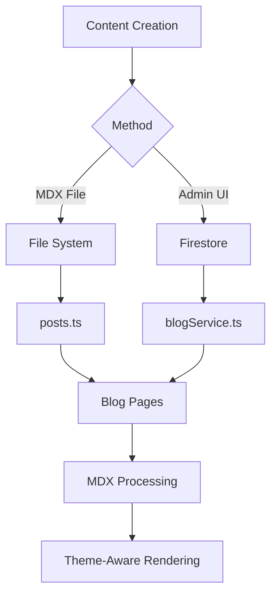

# Blog System Technical Architecture

## Overview

The Dōshi Sensei blog system is a hybrid content management system that supports both file-based MDX content and database-stored posts through Firestore. This dual approach provides flexibility for content creators while maintaining strong SEO capabilities and theme consistency.

## Architecture Components

### 1. Data Sources (Hybrid Approach)

#### File-Based (MDX)
- **Location**: `/content/posts/`
- **Format**: `.mdx` files with frontmatter
- **Processing**: Compile-time static generation
- **Use Case**: Developer-friendly, version-controlled content

#### Database (Firestore)
- **Collection**: `blogPosts`
- **Processing**: Runtime fetching with caching
- **Use Case**: Admin-created content with rich editing

### 2. Core Libraries

```json
{
  "gray-matter": "Frontmatter parsing",
  "next-mdx-remote": "MDX rendering",
  "remark-gfm": "GitHub Flavored Markdown",
  "rehype-slug": "Heading IDs",
  "rehype-autolink-headings": "Heading anchors",
  "rehype-prism-plus": "Syntax highlighting",
  "reading-time": "Calculate reading duration"
}
```

### 3. File Structure

```
src/
├── app/
│   ├── blog/
│   │   ├── page.tsx              # Blog index
│   │   └── [slug]/
│   │       └── page.tsx          # Individual posts
│   └── admin/
│       └── blog/
│           ├── page.tsx          # Admin management
│           ├── new/
│           │   └── page.tsx      # Create post
│           └── [id]/
│               └── edit/
│                   └── page.tsx  # Edit post
├── components/
│   ├── blog/
│   │   └── MdxClient.tsx        # MDX renderer
│   └── admin/
│       └── BlogEditor.tsx       # Post editor
├── lib/
│   └── blog/
│       ├── posts.ts             # File-based operations
│       └── mdx.ts               # MDX processing
├── services/
│   ├── blogService.ts          # Firestore operations
│   └── imageUploadService.ts   # Image handling
└── content/
    └── posts/                   # MDX files
```

### 4. Data Flow



### 5. SEO Implementation

#### Static Generation
- Pre-rendered at build time for MDX files
- `generateStaticParams()` for dynamic routes
- Revalidation every 60 seconds

#### Metadata Generation
```typescript
- Dynamic metadata based on post content
- Open Graph tags
- Twitter cards
- JSON-LD structured data
- Canonical URLs
```

#### URL Structure
- Clean URLs: `/blog/[slug]`
- No date prefixes in URLs (better for SEO)
- Automatic slug generation from titles

### 6. Theme Integration

The blog system fully integrates with the existing theme system:

```typescript
// Uses CSS variables from theme
- bg-background
- text-foreground
- border-border
- bg-card
- bg-muted
- text-primary
```

Components automatically adapt to light/dark mode and color schemes.

### 7. MDX Components

Custom components available in MDX:

```jsx
<Callout type="info|warning|success|error">
  Alert boxes with theme-aware styling
</Callout>

<Ruby rt="ふりがな">
  漢字
</Ruby>

<YouTube id="video-id" />
```

### 8. Security

#### Firestore Rules
```javascript
// Blog posts collection
match /blogPosts/{postId} {
  // Public read for published/scheduled posts
  allow read: if resource == null || 
    resource.data.status == 'published' || 
    (resource.data.status == 'scheduled' && 
     resource.data.publishDate <= request.time) ||
    isAdmin();
  
  // Admin-only write
  allow create, update, delete: if isAdmin();
}
```

#### Image Upload
- Firebase Storage with authentication
- Automatic filename sanitization
- Metadata tracking

### 9. Performance Optimizations

1. **Static Generation**: MDX files pre-rendered at build
2. **ISR**: Incremental Static Regeneration (60s)
3. **Image Optimization**: Next.js Image component
4. **Code Splitting**: Dynamic imports for editor
5. **Lazy Loading**: MDX components loaded on demand

### 10. Publishing Workflow

#### Draft → Published
1. Create post (status: draft)
2. Preview and edit
3. Set status to published
4. Immediate availability

#### Scheduled Publishing
1. Set status to scheduled
2. Set future publishDate
3. Automatic publishing when date passes
4. Can be triggered manually via `publishScheduledPosts()`

### 11. Admin Features

- **CRUD Operations**: Full create, read, update, delete
- **Rich Editor**: Markdown with live preview
- **Image Management**: Direct upload to Firebase Storage
- **SEO Fields**: Custom meta tags and descriptions
- **Tag System**: Categorization and related posts
- **View Tracking**: Analytics per post

### 12. File-Based Content

#### Naming Convention
```
YYYY-MM-DD-slug-name.mdx  # Date prefix optional
slug-name.mdx              # Simple naming works too
```

#### Frontmatter Schema
```yaml
title: string (required)
slug: string (auto-generated if missing)
date: YYYY-MM-DD
tags: string[]
excerpt: string
status: draft|published|scheduled
publishDate: YYYY-MM-DD
author: string
cover: URL
seoTitle: string
seoDescription: string
ogImage: URL
canonical: URL
```

### 13. Database Schema

```typescript
interface BlogPost {
  id: string;
  title: string;
  slug: string;
  content: string;
  excerpt: string;
  author: string;
  authorImage?: string;
  cover?: string;
  tags: string[];
  status: 'draft' | 'published' | 'scheduled';
  publishDate: Timestamp;
  createdAt: Timestamp;
  updatedAt: Timestamp;
  seoTitle?: string;
  seoDescription?: string;
  ogImage?: string;
  canonical?: string;
  readingTime?: string;
  views?: number;
}
```

### 14. Future Enhancements

1. **Content Sync**: Sync MDX files to Firestore
2. **Categories**: Hierarchical categorization
3. **Comments**: User engagement system
4. **Search**: Full-text search with Algolia
5. **RSS Feed**: Automated feed generation
6. **Newsletter**: Email subscription integration
7. **Analytics**: Enhanced tracking with GA4
8. **CDN**: CloudFlare for images
9. **Webhooks**: Notify external services on publish
10. **API**: Public API for blog content

### 15. Development Guidelines

#### Adding New MDX Components
1. Define component in `MdxClient.tsx`
2. Add to components object
3. Document usage in this file

#### Extending the Editor
1. Modify `BlogEditor.tsx`
2. Update `BlogPost` interface
3. Update Firestore rules if needed

#### Performance Testing
- Lighthouse scores should stay > 90
- First Contentful Paint < 1.5s
- Time to Interactive < 3.5s

### 16. Debugging

Common issues and solutions:

1. **MDX not rendering**: Check file extension and frontmatter
2. **Images not loading**: Verify Firebase Storage rules
3. **Posts not visible**: Check status and publishDate
4. **Theme not applying**: Ensure proper CSS variable usage
5. **SEO not working**: Validate metadata generation

### 17. Dependencies

Core dependencies that must be maintained:
- Next.js 15+ (App Router)
- Firebase 10+
- MDX Remote 5+
- TypeScript 5+

### 18. Testing Checklist

- [ ] MDX file creation and rendering
- [ ] Admin post creation
- [ ] Draft/publish workflow
- [ ] Scheduled publishing
- [ ] Image uploads
- [ ] SEO metadata generation
- [ ] Theme switching
- [ ] Mobile responsiveness
- [ ] Related posts algorithm
- [ ] View counting