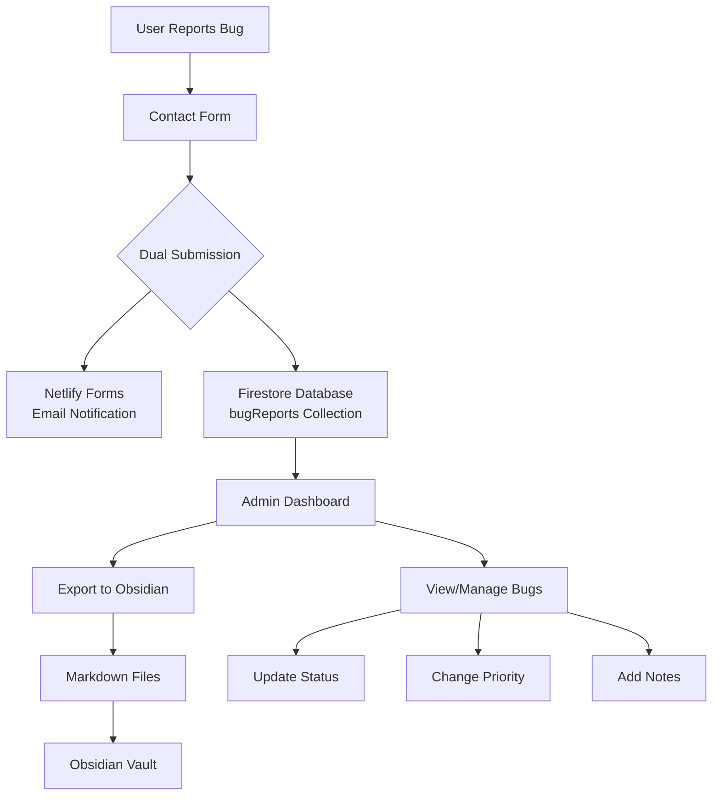

# Bug Tracking System Documentation

## Quick Start Guide for Developers

### 1. Submit a Bug Report (User Flow)
```bash
# Users can submit bugs via the contact form
https://doshisensei.com/contact?category=bug

# Or direct link from settings
Settings → Support & Feedback → Report Bug
```

### 2. View Bug Reports (Admin Flow)
```bash
# Access the admin dashboard
https://doshisensei.com/admin/bugs

# Or from admin home
Admin Dashboard → Quick Actions → Bug Reports (🐛)
```

### 3. Export to Obsidian
```bash
# Click "Export to Obsidian" button in admin dashboard
# Downloads markdown files for all unsynced bugs
```

## Architecture Overview



## System Components

### 1. Frontend Components

#### Contact Form (`/src/app/contact/ContactPage.tsx`)
- Captures user feedback with categories: bug, feedback, feature, support
- Pre-fills subject based on category
- Validates email and message length
- Dual submission to Netlify and Firestore

#### Admin Dashboard (`/src/app/admin/bugs/`)
- **BugsClient.tsx**: Main dashboard component
- Real-time bug listing with filters
- Status and priority management
- Export functionality
- Detailed bug view modal

### 2. Backend Services

#### Bug Tracking Service (`/src/services/bugTracking.ts`)
```typescript
class BugTrackingService {
  // Core methods
  createBugReport()      // Save new bug from contact form
  getBugReports()        // Fetch with filters
  updateBugReport()      // Update status/priority
  addAdminNote()         // Add internal notes
  exportToObsidianMarkdown() // Generate markdown
  markAsObsidianSynced() // Track export status
}
```

### 3. Data Model

#### Bug Report Structure
```typescript
interface BugReport {
  // Identification
  id: string;                // e.g., "BUG_20240115_A3F2"
  
  // User submitted data
  category: 'bug' | 'feedback' | 'feature' | 'support';
  title: string;
  description: string;
  userEmail: string;
  userName: string;
  
  // Auto-captured context
  url?: string;              // Page where bug was reported
  userAgent?: string;        // Browser information
  viewport?: string;         // Screen dimensions
  timestamp: Timestamp;
  
  // Management fields
  status: 'new' | 'investigating' | 'in-progress' | 
          'fixed' | 'wont-fix' | 'duplicate';
  priority: 'low' | 'medium' | 'high' | 'critical';
  assignee?: string;
  tags: string[];
  
  // Admin collaboration
  adminNotes: AdminNote[];
  
  // Obsidian sync tracking
  obsidianId?: string;
  obsidianSynced: boolean;
  obsidianLastSync?: Timestamp;
  
  // Metadata
  createdAt: Timestamp;
  updatedAt: Timestamp;
}
```

### 4. Database

#### Firestore Collection: `bugReports`
- Document ID: Auto-generated readable format
- Indexes configured for efficient queries:
  - `status + createdAt` (descending)
  - `priority + createdAt` (descending)
  - `category + createdAt` (descending)
  - `obsidianSynced + createdAt` (descending)

## Implementation Logic

### Bug Report Creation Flow

```typescript
// 1. User submits contact form
const handleSubmit = async (formData) => {
  // 2. Validate input
  if (!validateEmail(formData.email)) return;
  
  // 3. Submit to Netlify (for email notification)
  await fetch('/netlify-forms.html', {
    method: 'POST',
    body: new URLSearchParams(formData)
  });
  
  // 4. Save to Firestore (for tracking)
  if (['bug', 'feedback', 'feature', 'support'].includes(category)) {
    await bugTracker.createBugReport({
      ...formData,
      url: window.location.href,
      userAgent: navigator.userAgent
    });
  }
};
```

### Bug ID Generation
```typescript
// Format: CATEGORY_YYYYMMDD_XXXX
const timestamp = new Date().toISOString().split('T')[0].replace(/-/g, '');
const randomSuffix = Math.random().toString(36).substring(2, 6).toUpperCase();
const reportId = `${category.toUpperCase()}_${timestamp}_${randomSuffix}`;
// Example: BUG_20240115_A3F2
```

### Status Workflow
```
new → investigating → in-progress → fixed
                   ↓            ↓
                wont-fix    duplicate
```

### Priority Levels
- **Critical** 🔴: System breaking, affects all users
- **High** 🟠: Major feature broken, affects many users
- **Medium** 🟡: Minor feature issue, workaround available
- **Low** 🟢: Cosmetic issue, enhancement request

## Obsidian Integration

### Markdown Export Format
```markdown
---
id: BUG_20240115_A3F2
tags: [bug-report, bug, high-priority, investigating]
status: investigating
priority: high
reported: 2024-01-15
user: user@example.com
aliases: ["Button not working on mobile"]
---

# Button not working on mobile

## 📝 Description
The submit button on the practice page doesn't respond...

## 👤 Reporter Information
- **Name**: John Doe
- **Email**: user@example.com
- **Date**: 2024-01-15

## 🔍 Technical Details
- **URL**: https://doshisensei.com/practice/conjugation
- **User Agent**: Mozilla/5.0 (iPhone; CPU iPhone OS 17_0...)
- **Viewport**: 390x844

## 📊 Status
- **Current Status**: investigating
- **Priority**: high
- **Assigned To**: Unassigned

## ✅ Action Items
- [ ] Reproduce the issue
- [ ] Identify root cause
- [ ] Implement fix
- [ ] Test fix
- [ ] Deploy to production
- [ ] Notify user

## 🏷️ Tags
#bug-report #bug #high-priority #investigating
```

### Obsidian Vault Structure
```
📁 Bug Tracking/
  📁 New/           # Status: new
  📁 Investigating/ # Status: investigating  
  📁 In Progress/   # Status: in-progress
  📁 Fixed/         # Status: fixed
  📁 Archive/       # Status: wont-fix, duplicate
  📄 Dashboard.md   # Dataview queries
```

### Dataview Queries
```markdown
# Active Bugs
```dataview
table status, priority, user, date
from "Bug Tracking"
where status != "fixed" and status != "wont-fix"
sort priority desc, date desc
```

# Critical Bugs This Week
```dataview
list
from "Bug Tracking"
where priority = "critical" and date >= date(today) - dur(7 days)
```
```

## API Endpoints

### Current Implementation
- No dedicated API endpoints yet
- Bug creation happens via contact form
- Admin operations through Firebase SDK

### Future API Design
```typescript
// GET /api/admin/bugs
// List all bugs with optional filters
{
  status?: string;
  priority?: string;
  category?: string;
  limit?: number;
  offset?: number;
}

// GET /api/admin/bugs/:id
// Get single bug report

// PATCH /api/admin/bugs/:id
// Update bug status/priority
{
  status?: string;
  priority?: string;
  assignee?: string;
}

// POST /api/admin/bugs/:id/notes
// Add admin note
{
  note: string;
  author: string;
}

// GET /api/admin/bugs/export
// Export unsynced bugs as JSON/Markdown

// POST /api/admin/bugs/sync
// Mark bugs as synced with Obsidian
{
  bugIds: string[];
  obsidianIds: string[];
}
```

## Security Considerations

### Access Control
- Admin dashboard requires authentication
- Admin role checked via Firebase Auth
- No public API endpoints for bug data

### Data Privacy
- User emails stored but not exposed in exports
- Consider GDPR compliance for EU users
- Implement data retention policy (e.g., delete after 1 year)

### Rate Limiting
- Contact form has built-in Netlify spam protection
- Consider adding rate limiting for Firestore writes
- Implement CAPTCHA for repeated submissions

## Testing Guide

### Manual Testing
1. **Submit Bug Report**
   ```bash
   1. Go to /contact?category=bug
   2. Fill form with test data
   3. Submit and verify success message
   ```

2. **Verify in Admin**
   ```bash
   1. Login as admin
   2. Navigate to /admin/bugs
   3. Verify new bug appears
   4. Test filters and sorting
   ```

3. **Test Export**
   ```bash
   1. Click "Export to Obsidian"
   2. Verify markdown file downloads
   3. Check markdown formatting
   4. Import to Obsidian and verify
   ```

### Automated Testing
```typescript
// Example test cases
describe('Bug Tracking System', () => {
  test('creates bug report from contact form', async () => {
    const bugData = {
      category: 'bug',
      name: 'Test User',
      email: 'test@example.com',
      subject: 'Test Bug',
      message: 'This is a test bug report'
    };
    
    const bugId = await bugTracker.createBugReport(bugData);
    expect(bugId).toMatch(/^BUG_\d{8}_[A-Z0-9]{4}$/);
  });
  
  test('exports to Obsidian markdown format', () => {
    const bug = mockBugReport();
    const markdown = bugTracker.exportToObsidianMarkdown(bug);
    
    expect(markdown).toContain('---');
    expect(markdown).toContain(`id: ${bug.id}`);
    expect(markdown).toContain('## 📝 Description');
  });
});
```

## Deployment Checklist

- [ ] Deploy Firestore indexes: `firebase deploy --only firestore:indexes`
- [ ] Test contact form submission
- [ ] Verify admin dashboard access
- [ ] Test export functionality
- [ ] Set up Obsidian vault structure
- [ ] Configure Local REST API plugin (optional)
- [ ] Document admin credentials
- [ ] Train team on bug workflow

## Maintenance

### Regular Tasks
- Review and triage new bugs weekly
- Export to Obsidian for offline work
- Update bug status as fixes are deployed
- Archive old/resolved bugs quarterly

### Monitoring
```javascript
// Cloud Function for monitoring (future)
exports.monitorBugReports = functions.pubsub
  .schedule('every monday 09:00')
  .onRun(async () => {
    const newBugs = await bugTracker.getBugReports({
      status: 'new',
      limit: 100
    });
    
    if (newBugs.length > 10) {
      // Send alert to admin
      await sendSlackNotification({
        text: `⚠️ ${newBugs.length} new bug reports need attention`
      });
    }
  });
```

## Troubleshooting

### Common Issues

#### Bug not appearing in Firestore
- Check browser console for errors
- Verify Firebase configuration
- Check Firestore rules allow writes

#### Export not working
- Ensure bugs exist in database
- Check browser popup blocker
- Verify markdown generation

#### Obsidian sync issues
- Verify Local REST API is running
- Check authentication token
- Ensure correct vault path

## Future Enhancements

### Phase 2 Features
- [ ] Screenshot attachments for bug reports
- [ ] GitHub Issues integration
- [ ] Slack notifications for critical bugs
- [ ] Auto-assignment based on bug category
- [ ] Bug reproduction steps builder
- [ ] User notification when bug is fixed

### Phase 3 Features
- [ ] AI-powered bug categorization
- [ ] Duplicate detection
- [ ] Performance impact analysis
- [ ] Bug trends dashboard
- [ ] Integration with error tracking (Sentry)
- [ ] Automated regression testing

## Resources

- [Firestore Documentation](https://firebase.google.com/docs/firestore)
- [Obsidian Dataview Plugin](https://github.com/blacksmithgu/obsidian-dataview)
- [Obsidian Local REST API](https://github.com/coddingtonbear/obsidian-local-rest-api)
- [Netlify Forms](https://docs.netlify.com/forms/setup/)

## Support

For questions about the bug tracking system:
1. Check this documentation
2. Review the code in `/src/services/bugTracking.ts`
3. Contact the development team

---

*Last updated: January 2025*
*Version: 1.0.0*