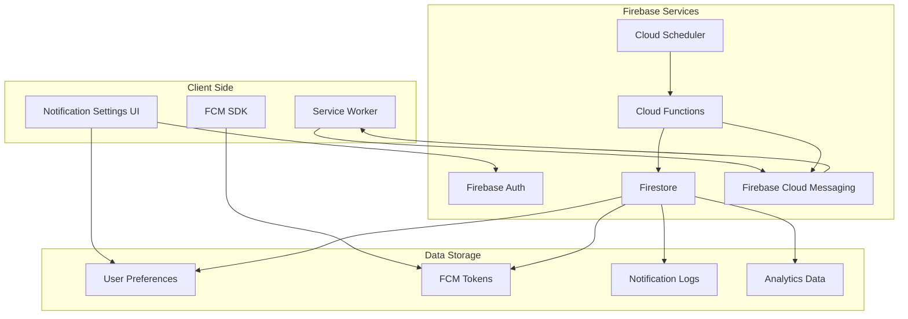

# Notification System Architecture

## System Design



## Data Flow

### 1. Notification Setup Flow
```
User enables notifications
    ↓
Request browser permission
    ↓
Generate FCM token
    ↓
Store token + preferences in Firestore
    ↓
Register scheduled functions
```

### 2. Notification Delivery Flow
```
Cloud Scheduler triggers function
    ↓
Query users due for notification
    ↓
Check user preferences & timezone
    ↓
Apply business logic (streak, quiet hours, etc.)
    ↓
Send via FCM
    ↓
Service Worker receives & displays
    ↓
Track delivery & engagement
```

### 3. User Interaction Flow
```
User clicks notification
    ↓
Service Worker handles click
    ↓
Open app to specific route
    ↓
Track engagement metric
    ↓
Update last activity timestamp
```

## Database Schema

### Collections

#### `notificationPreferences`
```typescript
{
  userId: string;
  fcmToken: string;
  timezone: string;
  enabled: boolean;
  preferences: {
    studyReminders: {
      enabled: boolean;
      times: string[];
      smartScheduling: boolean;
    };
    reviewReminders: {
      enabled: boolean;
      advanceNotice: number;
    };
    streakReminders: {
      enabled: boolean;
      time: string;
    };
  };
  quietHours: {
    enabled: boolean;
    start: string;
    end: string;
  };
  lastUpdated: Timestamp;
  createdAt: Timestamp;
}
```

#### `notificationLogs`
```typescript
{
  userId: string;
  notificationType: 'study' | 'review' | 'streak';
  sentAt: Timestamp;
  delivered: boolean;
  clicked: boolean;
  clickedAt?: Timestamp;
  payload: object;
  error?: string;
}
```

#### `notificationTokens`
```typescript
{
  token: string;
  userId: string;
  platform: 'web' | 'ios' | 'android';
  createdAt: Timestamp;
  lastUsed: Timestamp;
  active: boolean;
}
```

## Cloud Functions

### Scheduled Functions

#### `scheduledStudyReminder`
- **Schedule**: Every hour on the hour
- **Logic**:
  1. Query users with study reminders enabled
  2. Filter by timezone (is it their scheduled time?)
  3. Check if already studied today
  4. Send notification
  5. Log result

#### `scheduledReviewReminder`
- **Schedule**: Every 30 minutes
- **Logic**:
  1. Query users with reviews due soon
  2. Check advance notice preference
  3. Apply quiet hours
  4. Send notification with review count
  5. Update next check time

#### `scheduledStreakReminder`
- **Schedule**: Every hour 6 PM - 10 PM
- **Logic**:
  1. Query users with streaks > 0
  2. Check if studied today
  3. Filter by user's evening time
  4. Send motivational reminder
  5. Track effectiveness

### HTTP Functions

#### `updateNotificationPreferences`
- **Method**: POST
- **Auth**: Required
- **Body**: NotificationPreferences
- **Logic**:
  1. Validate preferences
  2. Update Firestore
  3. Reschedule notifications if needed
  4. Return success

#### `registerFCMToken`
- **Method**: POST
- **Auth**: Required
- **Body**: { token: string, platform: string }
- **Logic**:
  1. Validate token with FCM
  2. Check for existing token
  3. Store/update in Firestore
  4. Clean up old tokens
  5. Return success

#### `testNotification`
- **Method**: POST
- **Auth**: Required (Admin only)
- **Body**: { userId: string, type: string }
- **Logic**:
  1. Verify admin status
  2. Get user preferences
  3. Send test notification
  4. Return delivery status

## Security Considerations

### Token Management
- Rotate tokens every 30 days
- Validate tokens before each send
- Clean up invalid tokens automatically
- Encrypt tokens at rest

### Rate Limiting
- Max 10 notifications per user per day
- Exponential backoff on failures
- IP-based rate limiting on APIs
- Admin override capability

### Access Control
- Only authenticated users can register tokens
- Users can only modify their own preferences
- Admin functions require special claims
- Audit log for all operations

## Performance Optimization

### Batching
- Group notifications by timezone
- Batch FCM sends (up to 500)
- Aggregate analytics writes
- Delayed log processing

### Caching
- Cache user preferences (5 min TTL)
- Cache timezone calculations
- Reuse FCM connections
- Memoize frequently called functions

### Scaling
- Cloud Functions auto-scaling
- Firestore automatic sharding
- FCM handles millions of messages
- Cloud Scheduler reliability

## Error Handling

### Retry Strategy
```typescript
const retryConfig = {
  maxAttempts: 3,
  backoffMultiplier: 2,
  maxBackoffSeconds: 60,
  retryableErrors: [
    'UNAVAILABLE',
    'DEADLINE_EXCEEDED',
    'INTERNAL'
  ]
};
```

### Fallback Mechanisms
1. **FCM Failure**: Queue for retry
2. **Token Invalid**: Mark inactive, request new
3. **Quota Exceeded**: Defer to next window
4. **Function Timeout**: Break into smaller batches

### Monitoring & Alerts
- FCM delivery rates < 90%
- Function error rate > 5%
- Token refresh failures
- Unusual unsubscribe rates

## Testing Infrastructure

### Local Development
```bash
# Firebase emulators
firebase emulators:start --only functions,firestore,auth

# Test notification
npm run test:notification -- --user=test@example.com --type=study
```

### Staging Environment
- Separate FCM project
- Limited user pool
- Increased logging
- Shorter schedules for testing

### Production Safeguards
- Gradual rollout (1% → 10% → 100%)
- Feature flags for quick disable
- Rollback procedures documented
- On-call playbook ready