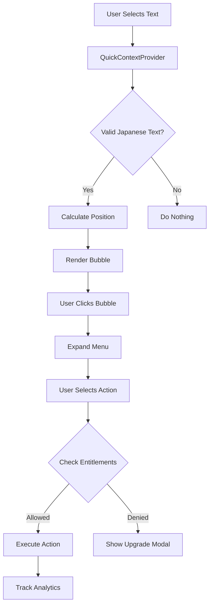

# QuickContext Architecture

## System Overview

QuickContext is built as a modular, provider-based system that integrates seamlessly with Doshi Sensei's existing architecture. It consists of two main components working together to provide context-aware learning assistance.

## Component Architecture

### 1. QuickContextProvider (`QuickContextProvider.tsx`)

The provider component handles all the heavy lifting of text selection detection and bubble management.

#### Key Responsibilities:
- **Text Selection Detection**: Monitors `mouseup` and `touchend` events
- **Japanese Text Validation**: Checks if selected text contains Japanese characters
- **Position Calculation**: Determines optimal bubble placement
- **State Management**: Controls bubble visibility and selected text
- **Element Filtering**: Only activates on specified selectors

#### Implementation Details:

```tsx
interface QuickContextProviderProps {
  children: React.ReactNode;
  enabled?: boolean;  // Allow disabling on specific pages
  selector?: string;  // Custom CSS selector for target elements
}
```

**Default Selectors:**
- `.japanese-text` - Standard Japanese text class
- `.font-ja` - Japanese font family class
- `[data-quickcontext="true"]` - Explicit opt-in attribute

**Event Flow:**
1. User selects text on page
2. Provider checks if selection is within target elements
3. Validates text contains Japanese characters (regex: `/[\u3040-\u309F\u30A0-\u30FF\u4E00-\u9FAF]/`)
4. Calculates position based on selection range
5. Renders bubble component via React Portal

### 2. QuickContextBubble (`QuickContextBubble.tsx`)

The floating UI component that provides the interactive interface.

#### Component States:
- **Collapsed**: Shows only Doshi mascot icon (48x48px)
- **Expanded**: Shows full action menu (280x200px)

#### Key Features:
- **Portal Rendering**: Renders directly to document.body for z-index management
- **Smart Positioning**: Adjusts position to avoid screen edges
- **Animation**: Smooth transitions using Framer Motion
- **Click Outside**: Closes when clicking outside bubble

#### Action Handlers:

```tsx
interface QuickContextActions {
  handleSave: () => Promise<void>;     // Save to study lists
  handleLookup: () => Promise<void>;   // Dictionary lookup
  handleListen: () => Promise<void>;   // TTS pronunciation
  handleAIExplain: () => Promise<void>; // AI explanation
}
```

## Data Flow



## Integration Points

### 1. SaveWordModal Integration
```tsx
import { SaveWordModal } from '@/components/drill/SaveWordModal';

// Creates word object if not found in dictionary
const wordToSave = wordData || {
  id: `quick_${Date.now()}`,
  kanji: isKanji ? selectedText : '',
  kana: !isKanji ? selectedText : '',
  // ... other fields
};
```

### 2. TTS System Integration
```tsx
import { useTTS } from '@/hooks/useTTS';

const { speak, stop, state } = useTTS();

// High-priority TTS playback
await speak(selectedText, {
  voice: 'female',
  context: 'quick_context',
  priority: 'high'
});
```

### 3. AI Explanation Integration
```tsx
import AIExplanationModal from '@/components/AIExplanation/AIExplanationModal';

// Passes context for better explanations
<AIExplanationModal
  text={selectedText}
  contextType={selectedText.length > 20 ? 'sentence' : 'word'}
  surroundingContext={surroundingContext}
  onClose={() => setShowAIModal(false)}
/>
```

### 4. Vocabulary Page Integration
```tsx
// Internal navigation, no external dependencies
const searchUrl = `/vocabulary?search=${encodeURIComponent(selectedText)}`;
window.location.href = searchUrl;
```

## Three-Pillar Architecture Compliance

### Feature Registry Entry
```typescript
'quick_context': {
  id: 'quick_context',
  name: 'QuickContext Assistant',
  description: 'Context-aware learning assistant for Japanese text selection',
  category: 'learning',
  icon: '🎯',
  limitType: 'daily',
  requiresAuth: false,
  requiresSubscription: false,
  status: 'active'
}
```

### Entitlement Rules
```typescript
// In entitlement rules
limits: {
  daily: {
    quick_context: 0,   // Guest
    quick_context: 10,  // Free
    quick_context: -1,  // Premium (unlimited)
  }
}
```

### Permission Mapping
```typescript
// In permission-map.ts
'quick_context': 'quick_context'
```

## Performance Considerations

### Optimization Strategies:
1. **Event Delegation**: Single listener at provider level
2. **Debounced Selection**: Prevents excessive triggers
3. **Lazy Component Loading**: Bubble only loads when needed
4. **Portal Rendering**: Avoids layout recalculation
5. **Memoized Callbacks**: Prevents unnecessary re-renders

### Memory Management:
- Event listeners cleaned up on unmount
- Modals unmount when closed
- No persistent state beyond session

## Security Considerations

### Access Control:
- Entitlement checks before every action
- Rate limiting through daily limits
- No bypass mechanisms

### Data Privacy:
- No external API calls for core features
- Selected text not persisted without user action
- Analytics respect user privacy settings

## Browser Compatibility

### Supported Browsers:
- Chrome 90+
- Firefox 88+
- Safari 14+
- Edge 90+

### Mobile Support:
- iOS Safari 14+
- Chrome Android 90+
- Touch event handling for mobile selection

## Testing Considerations

### Unit Tests:
- Text selection detection logic
- Position calculation algorithms
- Entitlement checking

### Integration Tests:
- Provider + Bubble interaction
- Modal integrations
- Navigation flows

### E2E Tests:
- Full user flow from selection to action
- Entitlement enforcement
- Mobile touch interactions

## Debugging

### Debug Mode:
```tsx
// Enable debug logging
localStorage.setItem('quickcontext_debug', 'true');
```

### Common Issues:
1. **Bubble not appearing**: Check selector matches
2. **Position incorrect**: Verify viewport calculations
3. **Actions failing**: Check entitlement limits
4. **Mobile issues**: Ensure touch events handled

## Future Architecture Considerations

### Planned Enhancements:
1. **Plugin System**: Allow custom actions
2. **Offline Mode**: Cache AI responses
3. **Batch Operations**: Multiple selections
4. **Keyboard Shortcuts**: Power user features
5. **Context Memory**: Remember previous selections

### Scalability:
- Component can handle multiple instances
- Provider supports nested contexts
- Action system is extensible