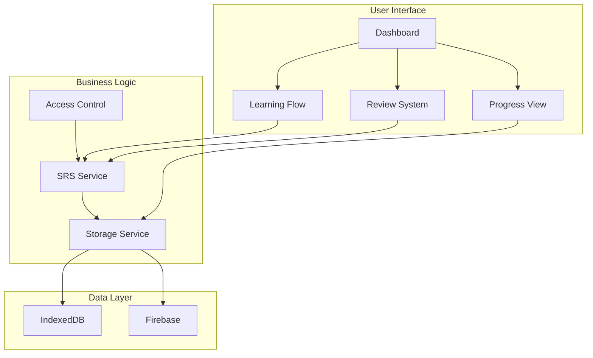

# 🏗️ Kanji Mastery Architecture

## Overview

The Kanji Mastery feature is built using a modular, scalable architecture that integrates seamlessly with Doshi Sensei's existing systems.



## Component Architecture

### 1. **Pages** (`/app/tools/kanji-mastery/`)

#### Dashboard (`page.tsx`)
- Entry point for the feature
- Session configuration
- Progress summary display
- Navigation to different modes

```typescript
// Key components
- StudySettings configuration
- KanjiProgressSummary
- Study mode selection
```

#### Learning Flow (`learn/page.tsx`)
- New kanji introduction
- Progressive information disclosure
- Session management

```typescript
// Key features
- Query parameter parsing
- Kanji data enrichment
- Session state management
- Progress tracking
```

#### Review System (`review/page.tsx`)
- SRS-based review sessions
- Rating interface
- Due kanji management

```typescript
// Key features
- Due kanji loading
- Review result processing
- Session completion handling
```

### 2. **Components** (`/components/`)

#### KanjiLearningCard
The main learning interface component with three tabs:

```typescript
interface KanjiLearningCardProps {
  kanji: KanjiWithExamples;
  isMarkedEasy: boolean;
  onMarkEasy: () => void;
}

// Features:
- Tabbed interface (Overview, Examples, Sentences)
- Stroke order integration
- Audio playback
- Easy marking system
```

#### KanjiReviewCard
Interactive review component with reveal/rate flow:

```typescript
interface KanjiReviewCardProps {
  kanji: KanjiWithProgress;
  onRate: (rating: number) => void;
  progress: KanjiProgress;
}

// Features:
- Question/answer reveal pattern
- 5-level rating system
- Progress indicators
- Audio support
```

#### KanjiProgressSummary
Real-time progress tracking component:

```typescript
// Displays:
- Kanji learned count
- Current streak
- Retention rate
- Reviews due
- Additional statistics
```

### 3. **Services** (`/services/kanji-mastery/`)

#### Spaced Repetition Service
Core SRS implementation using FSRS algorithm:

```typescript
class KanjiSpacedRepetitionService {
  // Core methods:
  - processReview(kanjiId, rating, mode)
  - getDueKanji(limit?)
  - getNewKanji(jlptLevel, limit)
  - getStats()
  
  // Features:
  - FSRS algorithm integration
  - Multi-mode support (recognition/production/writing)
  - Retention rate calculation
  - Streak tracking
}
```

#### Storage Service
Handles all data persistence:

```typescript
class KanjiStorageService {
  // Core methods:
  - saveProgress(progress)
  - getProgress(kanjiId)
  - getAllProgress()
  - recordStudySession(session)
  
  // Features:
  - IndexedDB for all users
  - Firebase sync for premium
  - Offline-first approach
  - Data migration support
}
```

## Data Models

### KanjiProgress
```typescript
interface KanjiProgress {
  id: string;              // Kanji character
  lastReviewed: Date;
  nextReview: Date;
  reviewCount: number;
  easeFactor: number;
  interval: number;
  difficulty: number;
  lapses: number;
  lastQuality: number;
  retentionRate: number;
  studyModes?: {
    recognition?: StudyModeStats;
    production?: StudyModeStats;
    writing?: StudyModeStats;
  };
  createdAt: Date;
  updatedAt: Date;
}
```

### StudySession
```typescript
interface StudySession {
  id?: string;
  date: Date;
  kanjiReviewed: number;
  newKanji?: number;
  averageQuality: number;
  timeSpent: number;
  jlptLevel?: string;
}
```

## Integration Points

### Three-Pillar Architecture

1. **Feature Registry**
```typescript
// /lib/features/registry.ts
'kanji_mastery': {
  id: 'kanji_mastery',
  name: 'Kanji Mastery',
  description: 'Learn and master kanji with spaced repetition',
  category: 'learning',
  icon: '🎯',
  limitType: 'daily',
  requiresAuth: false,
  requiresSubscription: false,
  status: 'active'
}
```

2. **Entitlement Rules**
```typescript
// /lib/entitlements/rules.ts
daily: {
  kanji_mastery: 5,  // Guest
  kanji_mastery: 10, // Free
  kanji_mastery: -1  // Premium (unlimited)
}
```

3. **Access Control**
```typescript
// /lib/access/index.ts
'kanji_mastery': 'learn_kanji' // Permission mapping
```

### External Dependencies

- **Kanji Data**: Loaded from `/kanji_data/` JSON files
- **Stroke Order**: Uses existing `StrokeOrderModal` component
- **Audio**: Integrates with `KanjiTTSButton` component
- **Storage**: Uses `EnhancedStorageManager` utility

## State Management

### Local State
- Session configuration (useState)
- Current kanji index
- Review results
- UI state (tabs, modals)

### Persistent State
- Learning progress (IndexedDB/Firebase)
- Study sessions
- User preferences
- Achievements

### Derived State
- Due kanji calculations
- Retention rates
- Streak calculations
- Progress statistics

## Performance Optimizations

1. **Lazy Loading**
   - Kanji data loaded on demand
   - Components code-split
   - Progressive enhancement

2. **Caching Strategy**
   - Kanji data cached in memory
   - Progress cached locally
   - Computed values memoized

3. **Render Optimization**
   - React.memo for expensive components
   - useCallback for event handlers
   - Virtualization for large lists (future)

## Security Considerations

1. **Access Control**
   - Feature limits enforced server-side
   - Usage tracking automatic
   - Premium features gated

2. **Data Validation**
   - Input sanitization
   - Type checking with TypeScript
   - API response validation

3. **Privacy**
   - Anonymous usage for guests
   - Encrypted data transmission
   - Local-first approach

## Scalability

The architecture supports:
- 10,000+ kanji
- Millions of review records
- Real-time sync
- Offline operation
- Multiple study modes
- Custom content (future)

## Error Handling

- Graceful degradation
- Offline fallbacks
- Error boundaries
- User-friendly messages
- Automatic retry logic

## Testing Strategy

- Unit tests for algorithms
- Integration tests for services
- Component testing with RTL
- E2E tests for critical paths
- Performance benchmarks

---

This architecture ensures the Kanji Mastery feature is maintainable, scalable, and provides an excellent user experience while integrating seamlessly with the existing Doshi Sensei platform.