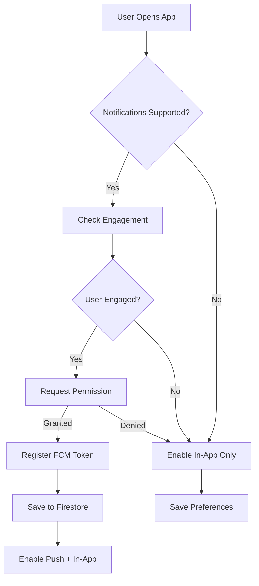
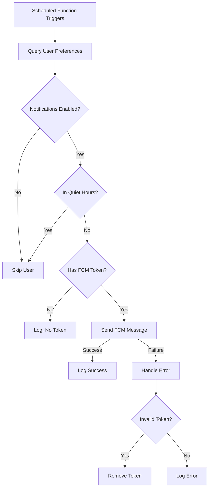

# 🔔 Doshi Sensei Notification System Architecture

## Executive Summary

The Doshi Sensei notification system is a comprehensive, multi-layered solution that provides users with timely reminders and updates about their Japanese learning progress. The system supports push notifications via Firebase Cloud Messaging (FCM), in-app toast notifications, and PWA-based notifications with graceful fallbacks and progressive enhancement.

**Last Updated**: January 2025  
**Status**: ✅ Fully Operational (with Email planned for future)  
**Architecture Pattern**: Progressive Enhancement with Multi-Channel Support

---

## 📊 System Overview

### Core Philosophy
The notification system follows a **"Progressive Enhancement"** approach:
1. **Zero Permission Required**: Start with in-app notifications
2. **User Consent**: Request push permissions only after engagement
3. **Graceful Degradation**: Fallback to simpler methods if advanced features unavailable
4. **User Control**: Granular preferences with easy opt-out

### Notification Channels

| Channel | Status | Permission Required | Fallback | Use Case |
|---------|--------|-------------------|----------|-----------|
| **In-App** | ✅ Active | No | N/A | Default for all users |
| **Push (FCM)** | ✅ Active | Yes (Browser) | In-App | Primary for reminders |
| **Email** | 🔄 Planned | No | Push/In-App | Future enhancement |
| **PWA** | ✅ Active | Yes (Install) | Standard notifications | Installed app users |

---

## 🏗️ Architecture Components

### 1. Frontend Services

#### **NotificationService** (`/src/services/notifications/NotificationService.ts`)
```typescript
class NotificationService {
  // Singleton pattern for global access
  static getInstance(): NotificationService
  
  // Core methods
  async initialize(userId: string): Promise<void>
  async requestPermission(): Promise<boolean>
  async getPreferences(): Promise<NotificationPreferences>
  async updatePreferences(preferences: Partial<NotificationPreferences>): Promise<void>
  async testNotification(type: string): Promise<void>
}
```

**Key Features:**
- Singleton pattern ensures single instance
- Handles FCM token registration
- Manages permission flow
- Falls back to in-app notifications gracefully
- Syncs preferences with Firestore

#### **Context Providers**

**1. NotificationServiceContext** (`/src/contexts/NotificationServiceContext.tsx`)
- Manages Firebase/push notifications
- Handles user preferences
- Provides permission management
- Integrates with authentication

**2. NotificationContext** (`/src/contexts/NotificationContext.tsx`)
- Manages in-app UI notifications
- Provides toast notification system
- Handles notification lifecycle
- Auto-dismissal with configurable duration

### 2. Backend Services (Firebase Functions)

#### **Scheduled Functions** (`/functions/src/notifications.ts`)

```typescript
// Runs every hour - checks for study reminder times
export const sendStudyReminders = onSchedule('0 * * * *', ...)

// Runs every 30 minutes - checks for due reviews
export const sendReviewReminders = onSchedule('*/30 * * * *', ...)

// Runs daily at 8 PM UTC - streak reminders
export const sendStreakReminders = onSchedule('0 20 * * *', ...)

// Weekly cleanup - removes old logs
export const cleanupNotificationLogs = onSchedule('0 0 * * 0', ...)
```

**Smart Features:**
- Timezone-aware scheduling
- Quiet hours respect
- Duplicate prevention (4-hour cooldown)
- Smart scheduling (skip if already studied)
- Invalid token cleanup

### 3. Data Models

#### **NotificationPreferences**
```typescript
interface NotificationPreferences {
  userId: string;
  enabled: boolean;
  fcmToken?: string;
  timezone: string; // IANA timezone
  preferences: {
    studyReminders: {
      enabled: boolean;
      times: string[]; // ["09:00", "19:00"]
      smartScheduling: boolean;
    };
    reviewReminders: {
      enabled: boolean;
      advanceNotice: number; // minutes
    };
    streakReminders: {
      enabled: boolean;
      time: string; // "20:00"
    };
  };
  quietHours: {
    enabled: boolean;
    start: string; // "22:00"
    end: string;   // "07:00"
  };
}
```

#### **Notification Types**
- `study_reminder` - Daily study prompts
- `review_reminder` - SRS review alerts
- `streak_reminder` - Streak maintenance
- `announcement` - System announcements
- `achievement` - Milestone celebrations

---

## 🔄 Data Flow

### Permission Request Flow


### Notification Delivery Flow


---

## 💾 Storage Architecture

### Firestore Collections

#### `/notificationPreferences/{userId}`
- User notification settings
- FCM tokens
- Timezone information
- Channel preferences

#### `/notificationLogs/{logId}`
- Notification send history
- Delivery status
- Click/dismiss tracking
- Error logging
- Auto-cleanup after 30 days

### Local Storage
- `pwa_last_install_prompt` - PWA prompt timing
- `pwa_last_update` - Update notification timing
- `doshi_notification_preferences` - Local preference cache

### Session Storage
- `session_start` - Engagement tracking
- `page_views` - User activity monitoring

---

## 🎯 Key Features

### 1. Progressive Enhancement Strategy

#### Stage 1: In-App Notifications (No Permission)
- Toast notifications within app
- No browser permissions required
- Available to all users immediately
- Uses React context for state management

#### Stage 2: Browser Push Notifications (Permission Required)
- Native browser notifications
- Works when app is in background
- Requires explicit user consent
- Falls back to Stage 1 if denied

#### Stage 3: PWA Notifications (App Installed)
- Enhanced notification capabilities
- Offline support
- Better engagement rates
- Native app-like experience

### 2. Smart Notification Timing

#### Engagement-Based Prompting
```javascript
// Only prompt after user engagement
const pageViews = parseInt(sessionStorage.getItem('page_views') || '0');
const sessionDuration = Date.now() - sessionStart;

if (pageViews < 3 && sessionDuration < TWO_MINUTES) {
  return; // Let them explore first
}
```

#### Timezone-Aware Scheduling
```javascript
// Convert UTC to user's local time
function getUserTime(timezone: string): Date {
  const now = new Date();
  const userTimeString = now.toLocaleString('en-US', { timeZone: timezone });
  return new Date(userTimeString);
}
```

#### Quiet Hours Respect
```javascript
// Check if in quiet hours (handles overnight periods)
function isInQuietHours(preferences, userTime): boolean {
  // Handles cases like 22:00 to 07:00 (overnight)
  if (startMinutes > endMinutes) {
    return currentTime >= startMinutes || currentTime < endMinutes;
  }
  return currentTime >= startMinutes && currentTime < endMinutes;
}
```

### 3. User Preference Management

#### Notification Settings UI Component
**Location**: `/src/components/unified-review/NotificationSettings.tsx`

**Features:**
- Master enable/disable toggle
- Channel selection (In-App, Push, Email)
- Custom reminder times with presets
- Quiet hours configuration
- Review threshold settings
- Test notification button
- Visual permission status indicators

#### Preference Persistence
- Firestore for cloud sync (authenticated users)
- Local storage for offline access
- Real-time updates via Firebase listeners
- Optimistic UI updates

### 4. Network & PWA Integration

#### Unified Notifications Hook
**Location**: `/src/hooks/useUnifiedNotifications.ts`

**Monitors:**
- Network connection status (online/offline/slow)
- PWA installation prompts
- Service worker updates
- Connection quality metrics

**Smart Features:**
- 30-second throttling for connection notifications
- 24-hour cooldown for install prompts
- 1-minute cooldown after updates
- Quality detection via ping latency

---

## 🔌 API Endpoints

### Notification Management APIs

| Endpoint | Method | Purpose | Authentication |
|----------|---------|---------|---------------|
| `/api/notifications/register-token` | POST | Register FCM token | Bearer token |
| `/api/notifications/preferences` | PUT | Update preferences | Bearer token |
| `/api/notifications/admin-broadcast` | POST | Admin broadcasts | Admin only |
| `/api/notifications/track-click` | POST | Analytics tracking | Bearer token |
| `/api/notifications/track-dismiss` | POST | Dismissal tracking | Bearer token |

### Request/Response Examples

#### Register Token
```typescript
// Request
POST /api/notifications/register-token
Authorization: Bearer {idToken}
{
  "token": "FCM_TOKEN_STRING"
}

// Response
{
  "success": true,
  "message": "Token registered successfully"
}
```

#### Update Preferences
```typescript
// Request
PUT /api/notifications/preferences
Authorization: Bearer {idToken}
{
  "enabled": true,
  "preferences": {
    "studyReminders": {
      "enabled": true,
      "times": ["09:00", "19:00"]
    }
  }
}

// Response
{
  "success": true
}
```

---

## 🎨 UI Components

### Core Components

#### 1. NotificationSettings Component
**Full-featured settings panel with:**
- Visual channel toggles
- Time picker for reminders
- Preset time buttons
- Advanced settings section
- Test notification functionality
- Save/cancel actions

#### 2. PWAUpdateNotification
**Handles app updates:**
- Detects new service worker
- Shows update prompt
- Manages refresh flow
- Prevents update loops

#### 3. Toast Notification System
**In-app notifications with:**
- Multiple types (success, error, warning, info)
- Auto-dismiss with duration
- Manual dismiss option
- Action buttons support
- Stacking for multiple notifications

---

## 📊 Analytics & Monitoring

### Tracked Metrics

#### Notification Logs
```typescript
interface NotificationLog {
  userId: string;
  notificationType: NotificationType;
  sentAt: Date;
  delivered: boolean;
  clicked: boolean;
  clickedAt?: Date;
  dismissedAt?: Date;
  payload: NotificationPayload;
  error?: string;
}
```

#### Key Performance Indicators
- **Delivery Rate**: Successfully sent notifications
- **Click-Through Rate**: User engagement with notifications
- **Opt-Out Rate**: Users disabling notifications
- **Token Validity**: Active vs expired FCM tokens
- **Error Rate**: Failed notification attempts

### Monitoring Dashboard
**Location**: `/admin/notifications`
- Real-time notification stats
- User preference distribution
- Error log viewer
- Broadcast tool for admins

---

## 🚀 Implementation Best Practices

### Do's ✅
1. **Always request permissions after user engagement**
2. **Provide clear value proposition before requesting**
3. **Implement graceful fallbacks**
4. **Respect quiet hours and user preferences**
5. **Test notifications work before enabling**
6. **Log all notification events for debugging**
7. **Clean up invalid tokens automatically**
8. **Use timezone-aware scheduling**

### Don'ts ❌
1. **Don't spam users with notifications**
2. **Don't request permissions immediately on load**
3. **Don't ignore user's quiet hours**
4. **Don't send duplicate notifications**
5. **Don't store sensitive data in notifications**
6. **Don't forget to handle token refresh**
7. **Don't bypass user preferences**

---

## 🔧 Troubleshooting Guide

### Common Issues

#### 1. Notifications Not Receiving
**Possible Causes:**
- Browser permissions denied
- FCM token expired/invalid
- User in quiet hours
- Notifications disabled in preferences
- Service worker not registered

**Solutions:**
- Check browser notification settings
- Re-register FCM token
- Verify timezone settings
- Review user preferences
- Check service worker status

#### 2. Duplicate Notifications
**Possible Causes:**
- Multiple tabs open
- Service worker and page both showing
- Missing deduplication logic

**Solutions:**
- Implement notification tags
- Use 4-hour cooldown period
- Check for existing notifications

#### 3. Wrong Timing
**Possible Causes:**
- Incorrect timezone setting
- Server/client time mismatch
- DST transitions

**Solutions:**
- Verify user's timezone
- Use IANA timezone strings
- Test across DST boundaries

### Debug Tools

#### Browser Console Commands
```javascript
// Check notification permission
Notification.permission

// Test notification
new Notification('Test', { body: 'Testing notifications' })

// Check service worker
navigator.serviceWorker.controller

// View FCM token
localStorage.getItem('fcm_token')
```

#### Firebase Console
- View notification logs
- Check user preferences
- Monitor delivery rates
- Debug token issues

---

## 🔮 Future Enhancements

### Planned Features

#### 1. Email Notifications
- **Status**: Backend ready, frontend planned
- **Features**: Daily digests, weekly reports
- **Integration**: SendGrid/Firebase Email

#### 2. Advanced Analytics
- A/B testing for notification content
- Optimal timing detection
- Engagement prediction models
- Personalized frequency adjustment

#### 3. Rich Notifications
- Action buttons in notifications
- Progress indicators
- Images and badges
- Quick reply functionality

#### 4. Smart Scheduling v2
- ML-based optimal timing
- User behavior pattern learning
- Adaptive frequency adjustment
- Context-aware notifications

### Removed Features

#### SMS Notifications (Removed)
- **Reason**: Low user demand, high complexity
- **Status**: UI removed, backend never implemented
- **Alternative**: Email notifications provide similar reach

---

## 🔒 Security & Privacy

### Security Measures
1. **Token-based authentication** for all API endpoints
2. **User-scoped data** isolation in Firestore
3. **Automatic token expiry** handling
4. **Rate limiting** on API endpoints
5. **Input validation** for all preferences

### Privacy Considerations
1. **Explicit consent** required for push notifications
2. **Granular control** over notification types
3. **Local-first** approach for preferences
4. **No tracking** without user consent
5. **Data retention** limits (30-day logs)

---

## 📝 Maintenance Notes

### Regular Tasks
1. **Weekly**: Review error logs for patterns
2. **Monthly**: Check token validity rates
3. **Quarterly**: Analyze engagement metrics
4. **Yearly**: Review and update notification content

### Monitoring Checklist
- [ ] FCM delivery success rate > 95%
- [ ] Token refresh working properly
- [ ] Quiet hours being respected
- [ ] No duplicate notifications reported
- [ ] Error rate < 1%

---

## 🎯 Conclusion

The Doshi Sensei notification system represents a mature, well-architected solution that prioritizes user experience through progressive enhancement and thoughtful design. With support for multiple channels, smart scheduling, and comprehensive preference management, it provides reliable reminders while respecting user autonomy.

The system's strength lies in its graceful degradation, ensuring all users receive notifications appropriate to their permission level and device capabilities. The removal of SMS notifications simplifies the system while maintaining full functionality through web-based channels.

---

*Document Version: 1.0*  
*Last Updated: January 2025*  
*Maintained by: Development Team*