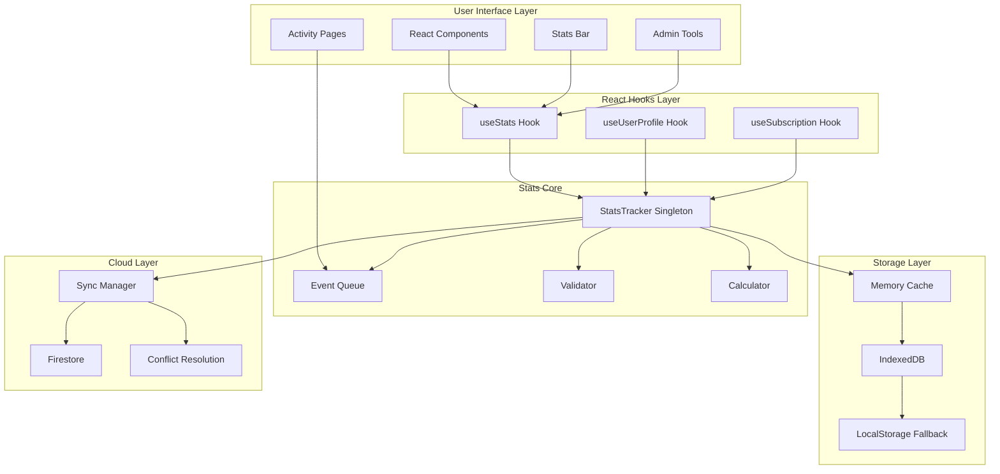

# 🏗️ Stats System Architecture

## System Overview



## Data Flow Architecture

### 1. Activity Tracking Flow

```
User Action
    ↓
Component Handler
    ↓
Tracking Function (trackDrillCompleted, etc.)
    ↓
Create ActivityEvent {
    id: unique-id,
    type: 'drill',
    timestamp: Date.now(),
    details: { ... }
}
    ↓
StatsTracker.trackActivity()
    ↓
Add to Pending Queue
    ↓
Process Activities (batch)
    ↓
Update Stats Object
    ↓
Save to IndexedDB
    ↓
Notify Subscribers
    ↓
UI Updates
```

### 2. Stats Loading Flow

```
App Initialization
    ↓
useStats Hook
    ↓
StatsTracker.initialize()
    ↓
Check Memory Cache ←─── Found ──→ Return Cached
    ↓ Not Found
Load from IndexedDB
    ↓
Premium User? ──Yes──→ Load from Firestore
    ↓ No                    ↓
    ↓                   Compare Timestamps
    ↓                       ↓
    ↓                   Use Newer Data
    ↓                       ↓
Validate & Fix Streak ←─────┘
    ↓
Update Memory Cache
    ↓
Return Stats
```

## Component Architecture

### StatsTracker Class Structure

```typescript
class StatsTracker {
  // Singleton Management
  private static instance: StatsTracker | null = null;
  static getInstance(): StatsTracker
  
  // State Management
  private currentUser: User | null
  private isPremium: boolean
  private stats: UserStatsV2 | null
  private activities: Map<string, DailyActivity>
  private pendingActivities: ActivityEvent[]
  
  // Subscription System
  private updateListeners: Set<StatsUpdateListener>
  subscribe(listener: StatsUpdateListener): UnsubscribeFn
  private notifyListeners(): void
  
  // Core Methods
  async initialize(user: User | null, isPremium: boolean): Promise<void>
  async trackActivity(type: ActivityType, details: any): Promise<void>
  getStats(): UserStatsV2
  
  // Processing Pipeline
  private async processPendingActivities(): Promise<void>
  private async processActivity(event: ActivityEvent): Promise<void>
  private updateDailySummary(daily: DailyActivity, event: ActivityEvent): void
  private updateOverallStats(event: ActivityEvent): void
  private updateStreak(activityDate: string): void
  
  // Storage Operations
  private async loadStats(): Promise<void>
  private async saveToIndexedDB(): Promise<void>
  private async loadFromCloud(): Promise<UserStatsV2 | null>
  private async saveToCloud(): Promise<void>
  
  // Sync Management
  private startSyncTimer(): void
  private stopSyncTimer(): void
  private async syncToCloud(): Promise<void>
  
  // Validation & Recovery
  private async validateAndFixStreak(): Promise<void>
  async resetStats(): Promise<void>
}
```

## Storage Architecture

### IndexedDB Schema

```typescript
// Database: DoshiSenseiDB (version 5)

// Store: statsV2
{
  id: 'userStats',          // Fixed ID
  currentStreak: number,
  longestStreak: number,
  totalDaysActive: number,
  lastActiveDate: string,   // YYYY-MM-DD
  firstActiveDate: string,  // YYYY-MM-DD
  // ... all other stats fields
  lastUpdated: number,      // Unix timestamp
  version: '2.0'
}

// Store: dailyActivities
{
  id: '2024-01-15',         // Date as ID
  date: '2024-01-15',       // YYYY-MM-DD
  activities: [             // Array of all activities
    {
      id: 'activity-uuid',
      type: 'drill',
      timestamp: 1705334400000,
      details: { ... }
    }
  ],
  summary: {                // Pre-calculated summary
    totalActivities: 15,
    drillsCompleted: 5,
    storiesRead: 2,
    // ... other counts
  }
}
```

### Memory Cache Structure

```typescript
class MemoryCache {
  // Current session stats (always fresh)
  private stats: UserStatsV2 | null
  
  // Recent activities (LRU cache)
  private activities: Map<string, DailyActivity>
  private maxActivities = 30  // Keep 30 days
  
  // Pending updates
  private pendingActivities: ActivityEvent[]
  private pendingSync: boolean
}
```

## Cloud Sync Architecture

### Firestore Structure

```
firestore-root/
├── userStats/
│   └── {userId} (document)
│       ├── currentStreak: number
│       ├── longestStreak: number
│       ├── totalDaysActive: number
│       ├── lastActiveDate: string
│       ├── firstActiveDate: string
│       ├── totalActivities: number
│       ├── ... (all stats fields)
│       └── lastUpdated: serverTimestamp
│
└── userStats/{userId}/dailyActivities/
    └── {date} (documents)
        ├── date: string
        ├── activities: array
        └── summary: object
```

### Sync Strategy

```typescript
// Sync Timing
- Immediate: Save to IndexedDB on every activity
- Debounced: Sync to cloud every 30 seconds (if changes)
- On Demand: forceSync() for immediate cloud sync
- Background: Sync when page becomes visible

// Conflict Resolution
if (localStats.lastUpdated > cloudStats.lastUpdated) {
  use localStats
} else if (cloudStats.lastUpdated > localStats.lastUpdated) {
  use cloudStats
} else {
  merge stats (take higher values)
}
```

## Event System Architecture

### Event Types & Processing

```typescript
// Event Priority Queue
class EventQueue {
  high: ActivityEvent[]    // Immediate processing
  normal: ActivityEvent[]  // Batch processing
  low: ActivityEvent[]     // Background processing
}

// Event Processing Pipeline
1. Validation → Ensure event has required fields
2. Enrichment → Add metadata (user, timestamp)
3. Calculation → Update metrics
4. Persistence → Save to storage
5. Broadcasting → Notify subscribers
```

### Event Batching Strategy

```typescript
// Batch Configuration
const BATCH_CONFIG = {
  maxBatchSize: 50,        // Process max 50 events
  batchInterval: 1000,     // Process every second
  priorityEvents: ['drill', 'game']  // Process immediately
}

// Batching Logic
if (isPriorityEvent || batchSize >= maxBatchSize) {
  processBatch()
} else {
  queueForBatch()
  scheduleBatchProcessing()
}
```

## Performance Architecture

### Optimization Strategies

1. **Lazy Loading**
   ```typescript
   // Only load stats when needed
   const statsPromise = new Promise(resolve => {
     if (cachedStats) return resolve(cachedStats)
     loadStats().then(resolve)
   })
   ```

2. **Debounced Updates**
   ```typescript
   const debouncedNotify = debounce(notifyListeners, 100)
   ```

3. **Selective Sync**
   ```typescript
   // Only sync changed dates
   const changedDates = getChangedDates(lastSync)
   await syncDates(changedDates)
   ```

4. **Memory Management**
   ```typescript
   // Clear old activities from memory
   if (activities.size > MAX_CACHED_DAYS) {
     const oldest = getOldestActivity()
     activities.delete(oldest.date)
   }
   ```

## Security Architecture

### Data Protection

```typescript
// Client-side validation
function validateActivity(event: ActivityEvent): boolean {
  // Prevent tampering
  if (event.timestamp > Date.now()) return false
  if (event.details.score < 0) return false
  if (event.details.correct > event.details.total) return false
  return true
}

// Server-side rules (Firestore)
match /userStats/{userId} {
  allow read: if request.auth.uid == userId;
  allow write: if request.auth.uid == userId
    && request.resource.data.lastUpdated == request.time;
}
```

### Privacy Considerations

- Stats are user-specific and isolated
- No cross-user data access
- Local storage encrypted by browser
- Cloud data protected by Firebase Auth

## Scalability Architecture

### Growth Handling

```typescript
// Automatic data pruning
class DataPruning {
  // Keep last 90 days of detailed activities
  async pruneOldActivities() {
    const cutoff = Date.now() - (90 * 24 * 60 * 60 * 1000)
    await removeActivitiesBefore(cutoff)
  }
  
  // Archive yearly summaries
  async archiveYearlyStats(year: number) {
    const yearlyStats = calculateYearlySummary(year)
    await saveYearlyArchive(yearlyStats)
    await removeDetailedDataForYear(year)
  }
}
```

### Performance Targets

| Operation | Target | Current |
|-----------|--------|---------|
| Stats Load | < 100ms | ~50ms |
| Activity Track | < 50ms | ~20ms |
| UI Update | < 16ms | ~10ms |
| Cloud Sync | < 2s | ~1.5s |
| Memory Usage | < 10MB | ~5MB |

## Future Architecture Considerations

### Planned Enhancements

1. **WebWorker Processing**
   - Move calculations off main thread
   - Parallel activity processing

2. **GraphQL Integration**
   - Efficient data fetching
   - Real-time subscriptions

3. **Edge Computing**
   - Process stats at CDN edge
   - Reduce latency globally

4. **Machine Learning**
   - Predict learning patterns
   - Personalized insights

### Scaling Preparations

```typescript
// Sharding strategy for millions of users
interface ShardedStats {
  shardId: string  // Based on userId hash
  userId: string
  stats: UserStatsV2
}

// Event streaming for real-time analytics
interface EventStream {
  subscribe(userId: string): Observable<ActivityEvent>
  process(event: ActivityEvent): void
  aggregate(events: ActivityEvent[]): AggregatedStats
}
```