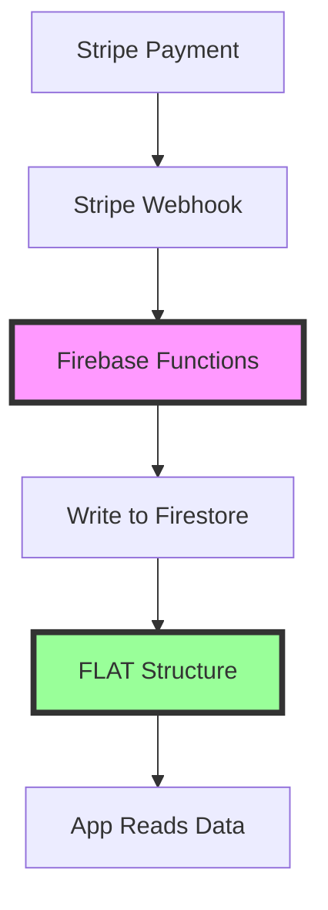

# 🎯 SINGLE SOURCE OF TRUTH: Subscription System

> **CRITICAL**: This document defines the authoritative subscription system architecture.  
> **Last Updated**: January 2025  
> **Status**: PRODUCTION READY

---

## 📌 THE SINGLE SOURCE OF TRUTH

### Firebase Functions Webhook Handler
**Location**: `/functions/src/index.ts`

The Firebase Functions webhook handler is the **ONLY** place that writes subscription data to Firestore. This ensures:
- Consistent data structure
- Secure payment validation
- Atomic updates
- No client-side manipulation

---

## 🏗️ CORRECT SUBSCRIPTION STRUCTURE (FLAT)

### ✅ CORRECT Structure (What we use in production)
```typescript
// In Firestore: users/{userId} document
{
  subscription: {
    status: 'active' | 'inactive' | 'canceled' | 'past_due',
    plan: 'free' | 'monthly' | 'yearly',
    stripeSubscriptionId: 'sub_xxx',
    stripeCustomerId: 'cus_xxx',
    stripePriceId: 'price_xxx',
    currentPeriodEnd: Timestamp,
    cancelAtPeriodEnd: boolean,
    metadata: {
      source: 'stripe',
      createdAt: Timestamp,
      updatedAt: Timestamp
    }
  }
}

// Accessing in code:
const plan = user.subscription?.plan;  // ✅ CORRECT
const status = user.subscription?.status;  // ✅ CORRECT
```

### ❌ WRONG Structure (Old/Nested - DO NOT USE)
```typescript
// NEVER use this nested structure
{
  subscription: {
    subscription: {  // ❌ WRONG - double nesting
      plan: 'monthly',
      status: 'active'
    }
  }
}

// NEVER access like this:
const plan = user.subscription?.subscription?.plan;  // ❌ WRONG
```

---

## 🔄 Data Flow



### Key Points:
1. **Stripe** sends webhooks to Firebase Functions
2. **Firebase Functions** validates and writes to Firestore
3. **Firestore** stores FLAT subscription structure
4. **App** reads but NEVER writes subscription data directly

---

## 🛠️ Implementation Details

### Firebase Functions Handler
```typescript
// /functions/src/index.ts - handleSubscriptionUpdate()
const subscriptionData = {
  status: subscription.status,
  plan: plan,  // Determined from price ID
  stripeSubscriptionId: subscription.id,
  stripeCustomerId: subscription.customer as string,
  stripePriceId: priceId,
  currentPeriodEnd: currentPeriodEnd,
  cancelAtPeriodEnd: subscription.cancel_at_period_end || false,
  metadata: {
    source: 'stripe',
    createdAt: admin.firestore.Timestamp.now(),
    updatedAt: admin.firestore.Timestamp.now()
  }
};

// Direct update - NO NESTING!
await db.collection('users').doc(firebaseUID).update({
  subscription: subscriptionData,  // FLAT structure
  updatedAt: admin.firestore.FieldValue.serverTimestamp()
});
```

### Valid Price IDs
```typescript
const VALID_PRICE_IDS = {
  monthly: 'price_1RakzXHdrJomitOwZc0HJC4J',  // $3.99/month
  yearly: 'price_1RakzXHdrJomitOwE7B56erf'    // $39.99/year
};
```

---

## 🚨 Common Issues & Solutions

### Issue 1: Invalid/Test Subscription IDs
**Problem**: Test mode subscription IDs from development still in production database  
**Solution**: ⚠️ DO NOT use aggressive cleanup scripts without proper validation!

**SAFE APPROACH**:
1. First, verify subscription IDs directly with Stripe
2. Only remove IDs that Stripe confirms don't exist
3. NEVER bulk update without testing on a single user first
4. Always create a backup before any bulk operations

### Issue 2: Nested Subscription Structure
**Problem**: Old code or docs show `subscription.subscription.plan`  
**Solution**: Always use FLAT structure `subscription.plan`

### Issue 3: Firestore Index Missing
**Problem**: Complex queries fail with index error  
**Solution**: Deploy indexes

```bash
firebase deploy --only firestore:indexes
```

---

## 📝 Recovery Scripts

### ⚠️ WARNING: Cleanup Script Issues
The `clean-invalid-subscriptions.ts` script has known issues:
- May incorrectly mark valid subscriptions as invalid
- Can fail to properly validate with Stripe API
- Should NOT be used without extensive testing

### ✅ SAFE Recovery Script
When subscription data needs to be restored:

```bash
# Use the restoration script instead
npm run tsx scripts/restore-subscriptions-from-stripe.ts

# What it does:
# 1. Fetches ALL active subscriptions from Stripe (source of truth)
# 2. Matches them to Firebase users by email
# 3. Restores correct subscription structure
# 4. Creates restoration log for audit trail
```

---

## 🔍 Debugging Checklist

When debugging subscription issues:

1. **Check Firebase Functions logs**
   ```bash
   firebase functions:log
   ```

2. **Verify webhook is receiving events**
   - Check Stripe Dashboard > Webhooks
   - Look for successful webhook deliveries

3. **Confirm FLAT structure in Firestore**
   - Open Firebase Console > Firestore
   - Navigate to `users/{userId}`
   - Verify `subscription` object is FLAT (not nested)

4. **Test subscription access in code**
   ```typescript
   // Always use FLAT access
   console.log('Plan:', userData.subscription?.plan);
   console.log('Status:', userData.subscription?.status);
   ```

---

## 📚 Related Documentation

- `/docs/SUPERPOWERS-V-III.md` - Three-Pillar Architecture overview
- `/functions/src/index.ts` - Firebase Functions implementation
- `/scripts/clean-invalid-subscriptions.ts` - Cleanup script

---

## ⚠️ NEVER DO THIS

1. **NEVER** write subscription data from the client
2. **NEVER** use nested subscription structure
3. **NEVER** trust client-side price information
4. **NEVER** bypass the Firebase Functions webhook

---

## ✅ ALWAYS DO THIS

1. **ALWAYS** let Firebase Functions handle subscription writes
2. **ALWAYS** use FLAT structure when reading subscriptions
3. **ALWAYS** validate subscription status server-side
4. **ALWAYS** check this document when in doubt

---

**Remember**: Firebase Functions webhook handler is the SINGLE SOURCE OF TRUTH for all subscription data. Everything else reads from what it writes.